# 🖼️ Image Blur Sabotage  
**First created:** 2025-09-13 | **Last updated:** 2025-09-15  
*Downranking or over-sensitivity applied to survivor visuals, so evidence is treated as suspect content*  

---

## ✨ Definition  
**Image blur sabotage** is when survivor visuals are algorithmically degraded, filtered, or hidden under “sensitive content” warnings. It functions as a form of **visual shadowfencing**, where the picture is technically present but its clarity, reach, or context is sabotaged.  

---

## 🔬 Mechanics  
- **Automated blurring:** evidence screenshots or protest photos are obscured under “sensitive media” tags.  
- **Downranking visuals:** posts with images are pushed lower in feeds compared to text-only content.  
- **Preview erasure:** thumbnails vanish when links are shared, forcing bare URL circulation.  
- **False positives:** ordinary survivor images flagged as graphic while similar institutional images remain untouched.  
- **Compression sabotage:** photos uploaded lose detail or become pixelated faster than normal.  

---

## 🥀 Tactical Symptoms  
- Survivor posts showing as **blurred or hidden by default**, requiring user clicks to reveal.  
- Evidence images producing **broken or empty previews** where others show fine.  
- Sharply reduced engagement on posts with images compared to text threads.  
- Reports from followers: “I couldn’t see the photo unless I clicked through multiple warnings.” 

---

## 👾 Operator Intent  
- **Undermine evidence credibility:** blur makes content appear unsafe or questionable.  
- **Slow circulation:** each extra click reduces the likelihood of re-sharing.  
- **Create self-censorship:** survivors may avoid using images altogether.  
- **Protect institutions:** visually damning material is stripped of immediacy.  

---

## 🛠 Survivor Moves if Blurred  

### 🔍 Verify the Blur  
- Cross-check image visibility across accounts and devices.  
- Compare engagement rates on posts with and without visuals.  
- Save screenshots of blurred warnings as evidence of suppression.  

### 🌱 Diversify Formats  
- Repost evidence as **PDFs, zines, or annotated diagrams**.  
- Embed images into **video slideshows** — these often bypass blur filters.  
- Share **text-image hybrids** (captions embedded into the picture itself).  

### 🔮 Signal the Pattern  
- Archive blurred previews alongside original, unblurred versions.  
- Cross-link to [🔗 Link Disintegration](./🔗_link_disintegration.md) for paired tactics.  
- Share with allies to confirm systemic bias in which images are blurred.  

### 🧩 Tactical Reframes  
- Read blurring as **validation**: the system perceives the image as high-risk.  
- Use blurring as a **call to reinforce evidence** across multiple formats.  
- Frame sabotage not as erasure but as a marker of importance.  

---

## 🗺 Platform Notes  

- **Twitter/X:** survivor images blurred under “graphic content” with no appeal path.  
- **Instagram:** compression destroys detail; archives look pixelated within days.  
- **LinkedIn:** preview images disappear entirely, leaving sterile text posts.  
- **TikTok:** protest images flagged as “sensitive,” forcing screenshot-only spread.  
- **Facebook:** photos of state violence tagged as violating standards, while official propaganda remains.  

---

## ♻️ Survivor Cycle (Mermaid Version)  

```mermaid
flowchart LR
    A[🔍 Verify] --> B[🌱 Diversify]
    B --> C[🔮 Signal]
    C --> D[🧩 Reframe]
    D --> A
```

---

## 🛰️ Related Patterns  
- [🔗 Link Disintegration](./🔗_link_disintegration.md)  
- [🎚️ Algorithmic Throttling Loops](./🎚️_algorithmic_throttling_loops.md)  
- [🧵 Content Unravelling Protocols](./🧵_content_unravelling_protocols.md)  

---

## 🏮 Footer  

*Image Blur Sabotage* is a living node of the Polaris Protocol.  
It documents a suppression tactic under **🪅 Platform Sabotage** where survivor visuals are downranked, blurred, or flagged as suspect to prevent circulation.  

> 📡 Cross-references:  
> - [Suppression Layers](../)  
> - [Containment Scripts](../../../Disruption_Kit/Containment_Scripts/)  
> - [Visibility Indexing Anomalies](../../🔮_Visibility_Indexing_Anomalies/)  

*Survivor authorship is sovereign. Containment is never neutral.*  

_Last updated: 2025-09-15_
