# 🛑 Flag Cascades  
**First created:** 2025-09-13 | **Last updated:** 2025-09-15  
*Exploiting trust & safety flags to create self-reinforcing suspensions without direct moderation*  

---

## ✨ Definition  
A **flag cascade** is a coordinated suppression pattern where multiple reports, flags, or automated triggers pile up to force a takedown. Instead of moderation decisions being carefully reviewed, the system treats **volume of flags as proof of harm**, creating a runaway loop that silences survivor voices.  

---

## 🔬 Mechanics  
- **Mass flagging:** coordinated accounts or bots submit many flags at once.  
- **Threshold triggers:** once a certain number is reached, automated suspension occurs.  
- **Cascading logic:** one flagged post lowers trust score, making the next flag hit harder.  
- **Feedback loop:** flags beget more flags as visibility drops and the system marks the user “high risk.” 
- **Proxy moderation:** platforms outsource responsibility to the volume of reports rather than actual review.  

---

## 🥀 Tactical Symptoms  
- Sudden **wave of reports** on multiple posts within minutes or hours.  
- Account **temporarily suspended** without clear reasoning.  
- Repeated “content removed” notices citing **community standards violations** but without specifics.  
- Survivors forced into endless **appeal queues** where each appeal is denied by referencing “previous history.” 

---

## 👾 Operator Intent  
- **Weaponise trust systems:** convert tools meant for safety into attack vectors.  
- **Create pretext of neutrality:** platforms claim “the community decided” rather than admitting targeted suppression.  
- **Overwhelm survivors:** constant suspensions force exhaustion and self-censorship.  
- **Automate exclusion:** build a system where survivors never even reach human review.  

---

## 🛠 Survivor Moves if Flagged  

### 🔍 Verify the Cascade  
- Document timing of reports: note sudden clusters.  
- Compare with peers: check if multiple survivors were flagged at once.  
- Save all moderation notices before they vanish from dashboards.  

### 🌱 Diversify Channels  
- Mirror content across platforms to reduce single-point vulnerability.  
- Keep offline archives of posts likely to be flagged.  
- Share evidence via private channels (chat groups, newsletters) while suspension clears.  

### 🔮 Signal the Pattern  
- Publicly log the timing of flag waves to show coordination.  
- Cross-link to [🎚️ Algorithmic Throttling Loops](./🎚️_algorithmic_throttling_loops.md).  
- Share cascades with allies to normalise awareness that flags can be weaponised.  

### 🧩 Tactical Reframes  
- Understand flag cascades as **systemic sabotage**, not genuine user disapproval.  
- Treat each suspension as **proof of content impact**.  
- Use suspension downtime for **archiving and strengthening distribution networks**.  

---

## 🗺 Platform Notes  

- **Twitter/X:** automated “strike” systems escalate after 2–3 flags, leading to temp lockouts.  
- **Instagram:** posts disappear instantly once flagged, appeals can take weeks.  
- **LinkedIn:** flags framed as “professional conduct” violations; very little review transparency.  
- **TikTok:** cascading flags remove content from For You Page before takedown.  
- **Facebook:** group posts flagged en masse trigger automatic group-wide restrictions.  

---

## ♻️ Survivor Cycle (Mermaid Version)  

```mermaid
flowchart LR
    A[🔍 Verify] --> B[🌱 Diversify]
    B --> C[🔮 Signal]
    C --> D[🧩 Reframe]
    D --> A
```

---

## 🛰️ Related Patterns  
- [🎚️ Algorithmic Throttling Loops](./🎚️_algorithmic_throttling_loops.md)  
- [📡 Reach Shadowfence](./📡_reach_shadowfence.md)  
- [🖼️ Image Blur Sabotage](./🖼️_image_blur_sabotage.md)  

---

## 🏮 Footer  

*Flag Cascades* is a living node of the Polaris Protocol.  
It documents a suppression tactic under **🪅 Platform Sabotage** where survivor accounts are suspended by coordinated reporting rather than genuine review.  

> 📡 Cross-references:  
> - [Suppression Layers](../)  
> - [Containment Scripts](../../../Disruption_Kit/Containment_Scripts/)  
> - [Visibility Indexing Anomalies](../../🔮_Visibility_Indexing_Anomalies/)  

*Survivor authorship is sovereign. Containment is never neutral.*  

_Last updated: 2025-09-15_
