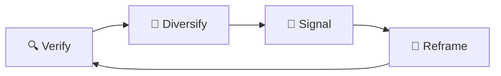

# 🤖 Bot-Audit Chokehold  
**First created:** 2025-09-13 | **Last updated:** 2025-09-15  
*Platforms invoking “automated review” to stall or nullify survivor complaints*  

---

## ✨ Definition  
A **bot-audit chokehold** occurs when platforms divert survivor complaints or appeals into endless **automated review queues**. Rather than receiving human consideration, testimony is trapped in a cycle of machine checks, delays, or canned denials. This creates the *appearance of due process* while functionally denying resolution.  

---

## 🔬 Mechanics  
- **Automated queues:** complaints are acknowledged but routed only to bots.  
- **Template denials:** responses cite generic “policy violations” without specifics.  
- **Audit loops:** resubmitted appeals trigger the same automated rejection.  
- **Escalation locks:** requests for human review are blocked or ignored.  
- **Dashboard dead ends:** survivors trapped in online forms with no other contact route.  

---

## 🥀 Tactical Symptoms  
- Repeated **identical denial emails** regardless of complaint details.  
- “We reviewed your case” messages received within seconds, too fast for real review.  
- No ability to speak to a human moderator, even after multiple appeals.  
- Survivor evidence files marked “under automated audit” indefinitely.  

---

## 👾 Operator Intent  
- **Deny human accountability:** ensure survivors never reach a staff decision-maker.  
- **Outsource suppression:** use algorithms to enact censorship while maintaining deniability.  
- **Induce exhaustion:** force survivors into endless, demoralising loops.  
- **Normalise automation as justice:** frame machine audits as neutral when they are structurally biased.  

---

## 🛠 Survivor Moves if Caught in a Chokehold  

### 🔍 Verify the Automation  
- Save timestamps showing **instant denials**.  
- Compare bot responses across multiple survivors for identical wording.  
- Test appeal frequency: note if each submission generates the same loop.  

### 🌱 Diversify Escalation Routes  
- Escalate outside-platform: email press contacts, regulators, or ombuds.  
- File complaints through **parallel reporting systems** (app stores, legal routes).  
- Publish public logs of failed audits to document systemic suppression.  

### 🔮 Signal the Pattern  
- Share automated denial screenshots with allies.  
- Cross-link to [🛑 Flag Cascades](./🛑_flag_cascades.md).  
- Use case logs to show how “automated neutrality” is weaponised.  

### 🧩 Tactical Reframes  
- Recognise automation as a **barrier, not a verdict**.  
- Read bot chokeholds as **proof the platform fears scrutiny**.  
- Treat stalled audits as triggers to **shift pressure externally** (media, watchdogs, networks).  

---

## 🗺 Platform Notes  

- **Twitter/X:** appeals closed with instant “no violation found” messages.  
- **Instagram:** automated “community guidelines” bots recycle the same notice.  
- **LinkedIn:** survivor complaints marked “reviewed by automated system.”  
- **TikTok:** loops where every new appeal triggers the same text in under a minute.  
- **Facebook:** dashboards that trap survivors in permanent “case under review” states.  

---

## ♻️ Survivor Cycle (Mermaid Version)  

---

## 🛰️ Related Patterns  
- [🛑 Flag Cascades](./🛑_flag_cascades.md)  
- [🎚️ Algorithmic Throttling Loops](./🎚️_algorithmic_throttling_loops.md)  
- [📡 Reach Shadowfence](./📡_reach_shadowfence.md)  

---

## 🏮 Footer  

*Bot-Audit Chokehold* is a living node of the Polaris Protocol.  
It documents a suppression tactic under **🪅 Platform Sabotage** where automated audits replace genuine human review, stalling survivor justice.  

> 📡 Cross-references:  
> - [Suppression Layers](../)  
> - [Containment Scripts](../../../Disruption_Kit/Containment_Scripts/)  
> - [Visibility Indexing Anomalies](../../🔮_Visibility_Indexing_Anomalies/)  

*Survivor authorship is sovereign. Containment is never neutral.*  

_Last updated: 2025-09-15_
