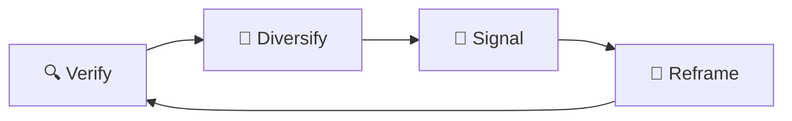

# 🧩 Feature Fracturing  
**First created:** 2025-09-13 | **Last updated:** 2025-09-15  
*Platform “updates” that subtly break survivor workflows, creating forced dependence on official channels*  

---

## ✨ Definition  
**Feature fracturing** is when platforms introduce “updates” or “improvements” that quietly **dismantle reliable survivor workflows**. Tools that once allowed independent organising or evidence sharing are broken, removed, or redirected, forcing survivors back into **official pathways** that can be more easily controlled.  

---

## 🔬 Mechanics  
- **Silent removal:** features vanish without notice (search filters, chronological feeds).  
- **UI disruption:** buttons or shortcuts shift, making prior workflows unusable.  
- **Forced upgrades:** new versions remove export/download options.  
- **Dependency push:** useful tools are paywalled or restricted to “verified” accounts.  
- **Fragmentation:** different regions get different features, complicating coordination.  

---

## 🥀 Tactical Symptoms  
- Survivors reporting: “the tool I used yesterday just isn’t there anymore.”  
- Familiar posting or archiving flows replaced with confusing alternatives.  
- Critical features (like search, tags, exports) suddenly degraded in quality.  
- Survivors **forced to spend time relearning interfaces** instead of organising.  

---

## 👾 Operator Intent  
- **Break survivor autonomy:** prevent smooth, independent use of platform functions.  
- **Enforce dependency:** channel survivor action through official support desks or paid tiers.  
- **Generate exhaustion:** repeated re-learning drains energy from testimony work.  
- **Maintain plausible deniability:** framed as “product improvement” rather than sabotage.  

---

## 🛠 Survivor Moves if Fractured  

### 🔍 Verify the Break  
- Compare with older versions of the app or site.  
- Ask peers in other regions if they see the same removal.  
- Archive UI changes with screenshots for timeline evidence.  

### 🌱 Diversify Tools  
- Shift to **third-party clients** or open-source alternatives where possible.  
- Build **parallel workflows** (spreadsheets, shared drives, offline zines).  
- Train communities in **low-tech fallbacks** before fracture hits.  

### 🔮 Signal the Pattern  
- Publicly log when features vanish or degrade.  
- Cross-link to [🤖 Bot-Audit Chokehold](./🤖_bot_audit_chokehold.md).  
- Share survivor notes on workarounds so fractures don’t isolate individuals.  

### 🧩 Tactical Reframes  
- Treat feature loss as a **signal to harden independence**.  
- Use fractures as **teaching moments** for cross-skill training.  
- Frame each removal as evidence of **structural hostility, not user error**.  

---

## 🗺 Platform Notes  

- **Twitter/X:** removal of chronological timelines, API restrictions cutting off survivor tools.  
- **Instagram:** limited link-sharing and search fracture across regions.  
- **LinkedIn:** export functions for contacts downgraded, locking survivors into platform.  
- **TikTok:** editing tools shifted to favour trends, weakening archival re-use.  
- **Facebook:** group admin tools degraded, forcing reliance on corporate “safety teams.”  

---

## ♻️ Survivor Cycle (Mermaid Version)  

---

## 🛰️ Related Patterns  
- [🤖 Bot-Audit Chokehold](./🤖_bot_audit_chokehold.md)  
- [🛑 Flag Cascades](./🛑_flag_cascades.md)  
- [🖼️ Image Blur Sabotage](./🖼️_image_blur_sabotage.md)  

---

## 🏮 Footer  

*Feature Fracturing* is a living node of the Polaris Protocol.  
It documents a suppression tactic under **🪅 Platform Sabotage** where survivor workflows are broken through selective removal or alteration of platform features.  

> 📡 Cross-references:  
> - [Suppression Layers](../)  
> - [Containment Scripts](../../../Disruption_Kit/Containment_Scripts/)  
> - [Visibility Indexing Anomalies](../../🔮_Visibility_Indexing_Anomalies/)  

*Survivor authorship is sovereign. Containment is never neutral.*  

_Last updated: 2025-09-15_
