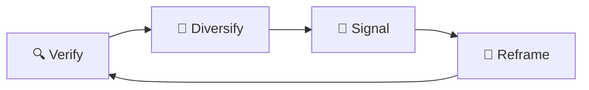

# 🧭 Misroute Visibility  
**First created:** 2025-09-13 | **Last updated:** 2025-09-15  
*Content routed into irrelevant or hostile communities to foster pile-ons instead of support*  

---

## ✨ Definition  
**Misroute visibility** is when platform algorithms or moderation choices **redirect survivor content** into audiences that are irrelevant, indifferent, or actively hostile. Instead of reaching supportive networks, testimony is dropped into contexts that produce ridicule, harassment, or silence.  

---

## 🔬 Mechanics  
- **Hashtag diversion:** posts tagged with survivor terms get surfaced in hostile feeds.  
- **Audience mismatch:** algorithm recommends testimony to users with no shared context.  
- **Toxic surfacing:** content routed into communities primed to mock or attack.  
- **Context stripping:** cross-platform embeds show content without surrounding explanation.  
- **Search inversion:** relevant searches bury survivor work under irrelevant chatter.  

---

## 🥀 Tactical Symptoms  
- Survivor posts receiving **sudden waves of hostile comments** from outside the intended audience.  
- Content appearing in **irrelevant trending topics** or mismatched hashtags.  
- Testimony posts drowned by ridicule memes or bad-faith quote tweets.  
- Supportive peers reporting: “I never saw your post, but trolls did.”  

---

## 👾 Operator Intent  
- **Turn visibility into attack:** route content to hostile eyes to generate pile-ons.  
- **Block supportive reach:** ensure survivor networks don’t see urgent testimony.  
- **Seed doubt:** survivors may interpret ridicule as community-wide rejection.  
- **Exploit platform opacity:** claim “algorithmic misfire” while the routing pattern repeats.  

---

## 🛠 Survivor Moves if Misrouted  

### 🔍 Verify the Misroute  
- Compare who engages: note if hostile users dominate comments.  
- Track hashtags: see if posts land in irrelevant or toxic clusters.  
- Cross-check with allies: confirm if intended audiences saw the post at all.  

### 🌱 Diversify Routes  
- Use **direct distribution** (mailing lists, group chats) alongside platform posting.  
- Create **tag packs** with trusted allies to guide posts into safer clusters.  
- Deploy **screenshots or graphics** instead of hashtags that can be misrouted.  

### 🔮 Signal the Pattern  
- Document hostile pile-ons with screenshots.  
- Cross-link to [🛑 Flag Cascades](./🛑_flag_cascades.md).  
- Share patterns with allies to prove misrouting is structural, not accidental.  

### 🧩 Tactical Reframes  
- Recognise misrouting as **containment, not rejection.**  
- Treat hostile surges as confirmation that the content was impactful.  
- Focus on **trusted circulation networks** rather than hostile algorithms.  

---

## 🗺 Platform Notes  

- **Twitter/X:** survivor hashtags redirected into trending spaces where trolls dominate.  
- **Instagram:** Explore tab pushes content into irrelevant lifestyle categories.  
- **LinkedIn:** testimony shown to recruiters or corporate HR clusters, not survivor peers.  
- **TikTok:** videos surfaced to hostile For You Page audiences, sparking harassment.  
- **Facebook:** group posts cross-promoted into irrelevant communities without consent.  

---

## ♻️ Survivor Cycle (Mermaid Version)  

---

## 🛰️ Related Patterns  
- [🛑 Flag Cascades](./🛑_flag_cascades.md)  
- [🤖 Bot-Audit Chokehold](./🤖_bot_audit_chokehold.md)  
- [📡 Reach Shadowfence](./📡_reach_shadowfence.md)  

---

## 🏮 Footer  

*Misroute Visibility* is a living node of the Polaris Protocol.  
It documents a suppression tactic under **🪅 Platform Sabotage** where survivor testimony is routed into hostile or irrelevant contexts to neutralise its effect.  

> 📡 Cross-references:  
> - [Suppression Layers](../)  
> - [Containment Scripts](../../../Disruption_Kit/Containment_Scripts/)  
> - [Visibility Indexing Anomalies](../../🔮_Visibility_Indexing_Anomalies/)  

*Survivor authorship is sovereign. Containment is never neutral.*  

_Last updated: 2025-09-15_
