## 🧵 Content Unravelling Protocols  
**First created:** 2025-09-13 | **Last updated:** 2025-09-15  
*Posts or threads are split, buried, or de-threaded so the survivor’s voice no longer hangs together*  

---

## ✨ Definition  
**Content unravelling** is when survivor posts, threads, or testimony chains are **broken apart or scrambled** by platform systems. What once formed a coherent narrative is split into fragments, buried mid-thread, or rearranged so that the survivor’s voice appears scattered, incoherent, or incomplete.  

---

## 🔬 Mechanics  
- **Thread splitting:** long posts auto-divided into fragments that lose their link.  
- **De-threading:** replies detached from the main post, appearing as isolated fragments.  
- **Burial:** key testimony posts hidden mid-thread or collapsed under “view more.” 
- **Cross-post dilution:** reposts stripped of original context, severing narrative flow.  
- **Chronology fracture:** platform shuffles sequence so the story reads out of order.  

---

## 🥀 Tactical Symptoms  
- Survivors seeing **broken thread chains** that don’t show all posts together.  
- Replies from allies hidden or collapsed, making the survivor look unsupported.  
- Posts in a sequence suddenly **buried or misordered** when viewed externally.  
- Testimony circulating as fragments with no link back to the full narrative.  

---

## 👾 Operator Intent  
- **Disrupt coherence:** fracture survivor testimony so it cannot stand as evidence.  
- **Simulate isolation:** remove visible ally replies, making survivors appear unsupported.  
- **Seed doubt:** fragmented posts look less credible than unified testimony.  
- **Maintain deniability:** framed as “technical error” or “thread length limit.” 

---

## 🛠 Survivor Moves if Unravelled  

### 🔍 Verify the Fracture  
- Compare views on different devices: is the thread intact everywhere?  
- Ask peers to confirm which parts of the chain they can see.  
- Archive full sequences with screenshots or external paste tools.  

### 🌱 Diversify Narrative Anchors  
- Cross-post full testimony as a **single-page document** (PDF, blog, zine).  
- Use **screenshots of whole threads** to preserve flow.  
- Build redundancy: restate key points across multiple posts.  

### 🔮 Signal the Pattern  
- Log missing or scrambled posts with timestamps.  
- Cross-link to [🖼️ Image Blur Sabotage](./🖼️_image_blur_sabotage.md).  
- Share compiled “before and after” screenshots to show narrative sabotage.  

### 🧩 Tactical Reframes  
- See unravelling as **acknowledgement of narrative strength**.  
- Treat fracture as a **cue to harden story coherence** outside the platform.  
- Use external archives to preserve testimony as unbroken narrative.  

---

## 🗺 Platform Notes  

- **Twitter/X:** long threads frequently de-threaded, replies hidden under “more replies.” 
- **Instagram:** carousel posts reordered or truncated in circulation.  
- **LinkedIn:** comments vanish mid-chain, leaving survivor posts without context.  
- **TikTok:** stitched videos surface without original framing.  
- **Facebook:** group discussions splintered into multiple disconnected threads.  

---

## ♻️ Survivor Cycle (Mermaid Version)  

```mermaid
flowchart LR
    A[🔍 Verify] --> B[🌱 Diversify]
    B --> C[🔮 Signal]
    C --> D[🧩 Reframe]
    D --> A
```

---

## 🛰️ Related Patterns  
- [🖼️ Image Blur Sabotage](./🖼️_image_blur_sabotage.md)  
- [🔗 Link Disintegration](./🔗_link_disintegration.md)  
- [🧭 Misroute Visibility](./🧭_misroute_visibility.md)  

---

## 🏮 Footer  

*Content Unravelling Protocols* is a living node of the Polaris Protocol.  
It documents a suppression tactic under **🪅 Platform Sabotage** where survivor testimony is fractured so that coherence is lost.  

> 📡 Cross-references:  
> - [Suppression Layers](../)  
> - [Containment Scripts](../../../Disruption_Kit/Containment_Scripts/)  
> - [Visibility Indexing Anomalies](../../🔮_Visibility_Indexing_Anomalies/)  

*Survivor authorship is sovereign. Containment is never neutral.*  

_Last updated: 2025-09-15_
