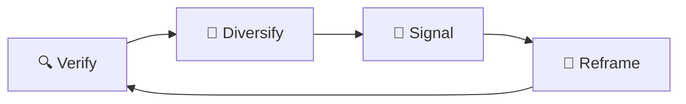

# 🪞 Mirror Feedback Loops  
**First created:** 2025-09-13 | **Last updated:** 2025-09-15  
*Where “community feedback” is manufactured or replayed to make sabotage look like consensus*  

---

## ✨ Definition  
**Mirror feedback loops** occur when platforms fabricate or recycle “community response” to justify suppression. Instead of authentic engagement, survivors encounter **manufactured consensus**: bot-driven comments, recycled complaints, or manipulated surveys that reflect platform intent rather than genuine audience feedback.  

---

## 🔬 Mechanics  
- **Bot amplification:** coordinated accounts flood survivor posts with identical phrasing.  
- **Replay attacks:** old complaints replayed as fresh “reports.”  
- **Synthetic surveys:** biased polls cited as proof of community sentiment.  
- **Feedback inversion:** supportive comments buried, hostile ones highlighted.  
- **Consensus theatre:** platforms cite “user concerns” without transparency on who raised them.  

---

## 🥀 Tactical Symptoms  
- Sudden waves of **identical comments** appearing on survivor posts.  
- Hearing the same **stock phrases** repeated across different accounts.  
- Moderation citing “community feedback” with no visible evidence.  
- Surveys framed as neutral but designed to validate pre-set outcomes.  

---

## 👾 Operator Intent  
- **Mask suppression as democracy:** portray sabotage as reflecting collective will.  
- **Induce isolation:** make survivors believe peers reject them.  
- **Deflect responsibility:** platforms claim “the community decided” while controlling inputs.  
- **Reinforce docility:** survivors internalise blame instead of recognising systemic manipulation.  

---

## 🛠 Survivor Moves if Mirrored  

### 🔍 Verify the Loop  
- Collect and compare repeated comments for identical phrasing.  
- Track timestamps to see if “feedback waves” appear unnaturally fast.  
- Ask trusted peers to confirm whether they submitted feedback at all.  

### 🌱 Diversify Validation  
- Gather **direct testimony** from allies outside platform surveys.  
- Share **independent polls** or community statements as counter-weight.  
- Use external tools to **document comment origins** (e.g. bot detection).  

### 🔮 Signal the Pattern  
- Compile screenshots of repeated or stock feedback.  
- Cross-link to [🛑 Flag Cascades](./🛑_flag_cascades.md).  
- Share case studies with survivor networks to expose consensus theatre.  

### 🧩 Tactical Reframes  
- Recognise feedback loops as **manufactured consensus**, not authentic rejection.  
- Treat repetition as a **tell of automation**, not mass disapproval.  
- Use external community-building to restore genuine feedback.  

---

## 🗺 Platform Notes  

- **Twitter/X:** copy-paste “community notes” applied inconsistently, often to survivor content.  
- **Instagram:** feedback forms reroute survivors into endless “rate this experience” loops.  
- **LinkedIn:** vague “peer reports” used to suppress survivor testimony.  
- **TikTok:** “user concerns” cited without evidence when videos are removed.  
- **Facebook:** hostile comment floods amplified by recommendation engines.  

---

## ♻️ Survivor Cycle (Mermaid Version)  

---

## 🛰️ Related Patterns  
- [🛑 Flag Cascades](./🛑_flag_cascades.md)  
- [🤖 Bot-Audit Chokehold](./🤖_bot_audit_chokehold.md)  
- [🧭 Misroute Visibility](./🧭_misroute_visibility.md)  

---

## 🏮 Footer  

*Mirror Feedback Loops* is a living node of the Polaris Protocol.  
It documents a suppression tactic under **🪅 Platform Sabotage** where false “community response” is used to legitimise targeted containment.  

> 📡 Cross-references:  
> - [Suppression Layers](../)  
> - [Containment Scripts](../../../Disruption_Kit/Containment_Scripts/)  
> - [Visibility Indexing Anomalies](../../🔮_Visibility_Indexing_Anomalies/)  

*Survivor authorship is sovereign. Containment is never neutral.*  

_Last updated: 2025-09-15_
