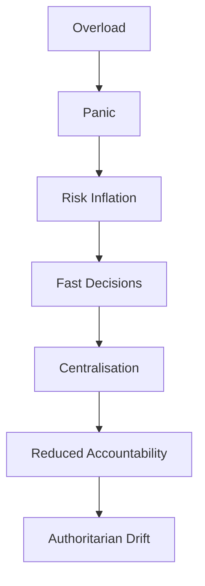

File: 🧱_why_single_executives_are_authoritarian_force_multipliers.md

# 🧱 Why Single Executives Are Authoritarian Force Multipliers  
**First created:** 2025-11-16 | **Last updated:** 2025-11-16  
*Why concentrating executive power in one person amplifies panic, distorts decision-making, accelerates authoritarian drift, and destabilises democracy.*

---

## 🛰️ Orientation  
Single-person executives — PMs, Presidents, Mayors with concentrated authority — are framed as democratic necessities.

In practice, they are **authoritarian force multipliers**.

Not because the people themselves are bad, but because:

- **human cognition cannot bear the load**  
- **information bottlenecks distort perception**  
- **media pressure destabilises judgement**  
- **bureaucratic fear elevates risk framing**  
- **crisis logic accelerates centralisation**  
- **personality becomes a vector for state distortion**  

This node explains why any democracy with a single executive sits on an authoritarian knife-edge by design.

It follows directly from:  
- 🧠 *political_black_box_logic*  
- 🧠 *the_black_box_of_executive_power*  
- 🧩 *distributed_executive_governance*  

---

## ✨ Key Features  
- Demonstrates that single executives function as amplification chambers for fear, distortion, and drift.  
- Shows how political, emotional, and data pressures converge on one psyche.  
- Explains why PMs/Presidents inevitably over-centralise.  
- Maps the physics of power concentration and panic.  
- Provides a Polaris rationale for collective-executive redesign.

---

## 🧿 Analysis / Content  

### 🔨 1. The Core Principle  
> **If you give one human the entire stress-load of a state,  
> the system’s failure modes become psychological, not structural.**

A democracy should fail structurally — slowly, predictably, with buffers.  
Single-executive systems fail *emotionally* — suddenly, drastically, and chaotically.

---

### 🧱 2. A Single Executive = A Single Point of Cognitive Distortion  
One person becomes responsible for:

- 12+ policy domains  
- simultaneous crises  
- media hostility  
- diplomatic pressure  
- internal party conflict  
- national catastrophes  
- intelligence briefings  
- legal risk  
- economic strategy  
- ethical dilemmas  
- public grief  
- their own sleep and sanity  

This is **not survivable**.  
Distortion isn’t a bug; it’s **inevitability**.

---

### 📉 3. Why Single Executives Drift Authoritarian  
#### **a) Panic accelerates centralisation**  
When overwhelmed, humans reduce variables and hoard control.

#### **b) Fear amplifies risk signals**  
Security briefings skew toward worst-case thinking.  
Decision loops narrow.

#### **c) Crisis logic bypasses deliberation**  
Speed replaces consensus.  
“Emergency” becomes normal.

#### **d) Media storms destabilise judgement**  
The leader is constantly under attack and overexposed.  
This encourages defensive overreaction.

#### **e) Emotional erosion reduces empathy**  
Burnout shrinks moral horizons.  
Fatigue breeds punitive instinct.

#### **f) Advisors become gatekeepers**  
Unelected people start making de facto decisions.  
Accountability collapses into a fog.

#### **g) No internal challenge function**  
Nobody inside the executive can stop a drifting leader.  
Institutional caution only bends; it doesn’t block.

---

### 🧲 4. The Authoritarian Drift Pipeline  

A single executive catalyses every stage.

---

### ⚡ 5. Why Good People Drift Faster  
People who are:

- moral  
- justice-oriented  
- emotionally sensitive  
- minority-background  
- reflective  
- community-rooted  

…are actually **more vulnerable**.

Why?

- They feel the stakes more acutely.  
- They internalise responsibility.  
- They see harm everywhere and try to fix everything.  
- They are devastated by public suffering.  
- Panic metabolises through empathy → overload → collapse.  
- Fear of failing people becomes fear of losing control.

This leads to more centralisation, not less.  
Goodness is not a shield.  
It is an accelerant.

---

### 🔍 6. Why Single Executives Enable Bad Actors  
Bad actors thrive because:

- the design gives them enormous unilateral influence  
- they can hide behind the structure  
- they can weaponise crisis logic  
- they can bypass institutional challenge  
- they can exploit media cycles  
- they can reward loyalists  
- they can control appointments and advisors  
- they can capture the state through personality cults  

The position itself provides the tools.  
The personality only determines how quickly the tools are used.

---

### 🧩 7. Why Parliaments Cannot Counterbalance a Single Executive  
Parliament is too:

- slow  
- reactive  
- fragmented  
- partisan  
- media-influenced  
- procedurally bogged  
- unable to access real-time information  

The executive’s pace outstrips Parliament’s ability to correct.  
This is a timing problem, not a moral one.

---

### 🛠️ 8. Why Single Executives Are Outdated in Complex States  
They were designed for:

- pre-industrial societies  
- low data density  
- slow information flow  
- small populations  
- stable international systems  
- limited bureaucratic complexity  

Modern states are:

- high-pressure  
- high-speed  
- high-volume  
- permanently online  
- geopolitically unstable  

The single executive is a **19th-century solution to a 21st-century problem** —  
and it fails under modern stress.

---

### 🧭 9. Why This Matters for Polaris  
Polaris is fundamentally concerned with:

- preventing harm  
- reducing drift  
- protecting minoritised people  
- ensuring sane decision-making  
- designing emotionally sustainable governance  
- eliminating centralised failure points  

Single executives are incompatible with **structural safety**.

This node integrates directly into the Polaris argument for **collective, distributed executive governance** as the only viable democratic model going forward.

---

## 🏮 Footer  
**Why Single Executives Are Authoritarian Force Multipliers** is a pillar node in Polaris’ constitutional reform cluster.  
It demonstrates that concentrated executive power is psychologically and structurally unsound, and provides the rationale for distributed executive redesign.

Crosslinks:  
- 🧩 *distributed_executive_governance*  
- 🧱 *cabinet_led_collective_executive_models_for_the_uk*  
- 🔧 *democratic_resilience_architecture_for_21st_century_britain*  
- 🧠 *political_black_box_logic*
