# ♿️ Refusing Convenience — Disability as Administrative Resistance  
**First created:** 2025-10-25 | **Last updated:** 2025-10-25  
*When being “inconvenient” becomes both diagnosis and philosophy.*

---

## 🌱 Orientation  
Disabled existence is already a refusal.  
The body that won’t standardise, the mind that won’t streamline, the metabolism that won’t match the clock — all reveal the hidden premise of modernity: that value equals convertibility.  
To be labelled *disabled* is often to be told: *you are too expensive to commodify.*  
Isolation and liberation coexist in that sentence.

---

## ⚙️ 1 — Disability as the Edge of the Machine  
Industrial and digital capitalism define ability through throughput: what can be done, how quickly, with how little maintenance.  
Anything that interrupts this rhythm is classed as inefficiency.  
Thus, disability isn’t a personal deficit — it’s an incompatibility error inside a profit engine.  

> **System message:** user requires too much context.  
> **Response:** disable user.  

But from the margin, a different logic grows: the refusal to convert every gesture into output.  
Disabled time is nonlinear, social, cyclical — a different operating system running inside the machine.

---

## 🧩 2 — The Refusal–Commodification Loop  

```mermaid
flowchart LR
    A[🌀 Human Refusal<br>— slow, embodied, joyful, inconvenient] --> B[✨ Cultural Expression<br>— aesthetic visibility of refusal]
    B --> C[💰 Commodification<br>— market captures style, not ethics]
    C --> D[🧱 Systemic Reassertion<br>— industrial & ideological co-optation]
    D --> A
```

The loop never ends, but recognising it gives freedom: once you know that the machine will recycle your resistance, you stop designing for purity and start designing for persistence.

---

## 🪞 3 — Historical Cycles of Capture  
| Era | Refusal | Co-optation |  
|------|----------|-------------|  
| **Arts & Crafts** | Honour of handwork | Factory-made “craft-style” décor |  
| **Weimar Pluralism** | Queer, playful modernism | Fascist purification of form |  
| **1960s Counterculture** | Communal, anti-war, psychedelic | Advertising adopts the look of rebellion |  
| **Punk / DIY** | Raw authenticity, anti-corporate | Retail nostalgia, Hot-Topic chic |  
| **Maker / Slow / Zero-Waste** | Repair, sustainability | Platform monetisation of virtue |

Every refusal births an industry that imitates its surface.

---

## 🔄 4 — Commodification Accepted, Authenticity Reclaimed  
Surveillance capitalism means that every emotion, gesture, and piece of metadata becomes extractable.  
The liberating insight is: *you can’t stop extraction, but you can change your relationship to it.*  
Once you accept that whatever you make will be commodified, you are free to **make it anyway — on your own terms.**

Authenticity then becomes not resistance to capture, but **indifference to capture.**  
You create because creation is a form of being human, not because it escapes the algorithm.

---

## 🕰️ 5 — The Disabled Aesthetic of Time  
Disabled pacing — rest, delay, oscillation, detour — disrupts the industrial fetish for linear improvement.  
It reminds culture that **care is not a pause from production; it’s the alternative to it.**  
Every slow or divergent act re-enchants time itself.

This is why the “inconvenient” often overlaps with joy: slowness makes space for relation, ornament, and curiosity — the opposite of machinic flattening.

---

## 🏰 6 — Howl’s Moving Castle as Metaphor  
In *Howl’s Moving Castle*, the house is a patchwork of technologies, magics, and repairs.  
It lumbers, leaks, and transforms — a disabled architecture.  
The story’s resolution isn’t industrial triumph; it’s the acceptance of imperfection, mobility, and care as the real magic.  
Ending the war means dismantling the machine, not perfecting it.  
The trauma of industrialisation is transmuted into *movement with scars visible.*

That’s disability politics in allegory form: motion through damage, not erasure of it.

---

## 💡 7 — Political Distinction  
| Axis | Refusal | Co-optation |  
|-------|----------|-------------|  
| **Purpose** | Autonomy, interdependence | Profit, control |  
| **Medium** | Process, relation, texture | Product, image, smoothness |  
| **Ethics** | Care, transparency | Extraction, opacity |  
| **Outcome** | Community resilience | Market cycle reset |

---

## 🌿 8 — Liberation in the Loop  
Knowing that commodification is inevitable can be oddly freeing.  
You stop guarding your work like property and start treating it as *pollination.*  
If the machine wants your pollen, let it have it — you’ll still grow the flowers.  
Refusal then becomes continuous, not singular: an everyday choreography of persistence, humour, and re-use.

---

## ✨ 9 — Reflection  
Disabled embodiment exposes the illusion of efficiency.  
It refuses invisibility, productivity, and perfection at once.  
To live inconveniently is to make time visible again —  
to prove that worth was never meant to be measured by speed or saleability.

---

## 🌌 Constellations  
♿️ Disability Justice | 🧠 Survivor Tools | 🧶 Maker Culture | 🏛 System Governance | 🎭 Narrative Ethics | 🪄 Expression of Norms  

---

## ✨ Stardust  
disability-justice, anti-machina, commodification-loop, surveillance-capitalism, arts-and-crafts, maker-culture, refusal-politics, howls-moving-castle, administrative-resistance, liberation-in-the-loop
