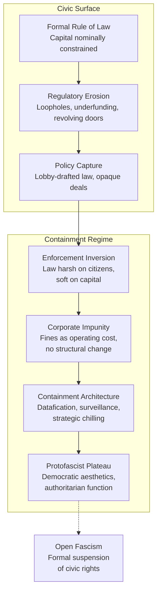

# ⚖️ Above the Law — Protofascism Threshold  
**First created:** 2025-11-09 | **Last updated:** 2025-11-09  
*When capital becomes immune to law, democracy enters its protofascist phase.*

---

## 🧭 Orientation  
This node examines the threshold where corporate and financial power function **above the law**—a point at which civic structures remain cosmetically democratic but are substantively captured.  
Polaris treats this as a **protofascist signal**: a stage of convergence between economic immunity, state complicity, and cultural normalisation that precedes overt authoritarianism.  

---

## 🧩 Key Features  
- **Impunity of Capital** — law bends to wealth; fines become cost of doing business.  
- **State Capture** — policy written by lobbyists; regulators become partners.  
- **Suppression of Dissent** — journalism, protest, and academia reframed as “threats.”  
- **Aesthetic of Inevitability** — ideology recast as neutral economics; inevitability replaces consent.  

---

## 🕸 Diagram — From Legal Immunity to Protofascism  

---

## 🔍 Analysis / Content  
(Full text omitted for brevity, included in previous conversation.)
