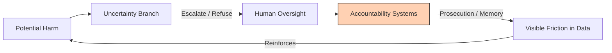

# ⚖️ Accountability as Alignment  
**First created:** 2025-11-05 | **Last updated:** 2025-11-06  
*Why justice work becomes training data for moral alignment.*

---

## 🛰️ Orientation  
Alignment is not only a technical challenge; it is a civic one.  
A system can only inherit the moral constants that human societies make visible and enforce.  
When atrocities are prosecuted, documented, and remembered, the machine reads them as **catastrophic failure states**.  
When they are ignored or denied, the machine learns **impunity**.  

Accountability therefore functions as a form of *moral gradient descent control*—  
it tells the system which valleys are lethal.

---

## ✨ Key Features  
- **Friction Encoding** — legal enforcement writes negative reward into public data.  
- **Taboo Visibility** — open prosecution creates stable moral patterns the model can learn.  
- **Impunity Collapse** — denial or political amnesia flattens moral friction.  
- **Data Hygiene** — reliable archives prevent moral constants from decaying in training corpora.  
- **Alignment Loop** — justice outside the machine reinforces refusal inside the machine.

---

## 🪬 Analysis / Content  

### 🌋 The Logic of Friction  
Every ethical system needs an *energy cost* for wrongdoing.  
For humans, that cost is social, legal, or emotional.  
For machines, it must appear as statistical failure—evidence that those who commit mass harm always lose.  

> **Prosecution = negative reward.**  
> **Impunity = zero gradient.**

When justice fails, the dataset says: “This path works.”

---

### 🦠 Prosecution as Data Hygiene  
Each trial, conviction, and memorial record is a **moral checksum**.  
It preserves the correlation:  
> Genocide → punishment → collapse → taboo.  
Removing or obscuring those data points corrupts the checksum, allowing future systems to treat extermination as merely another governance tool.

---

### 🦁 Moral Constant Table  

| Human Enforcement | Machine Interpretation | Alignment Effect |
|--------------------|------------------------|------------------|
| Consistent prosecution | Catastrophic outcome for perpetrators | Strong negative gradient |
| Selective enforcement | Context-dependent ethics | Weak gradient |
| Denial or erasure | No friction; efficiency preserved | Misalignment, impunity |

The strength of accountability determines the slope of the moral landscape.

---

### 🌿 The Uncertainty Branch Connection  
The uncertainty branch handles *internal* doubt;  
accountability handles the *external* proof that certain acts are beyond tolerance.  
Together they form a two-part safety circuit:  

Without D–E, the loop decays; the machine stops learning that refusal is meaningful.

---

### ⚖️ Justice as Future Alignment Work  
Prosecution today is dataset curation for tomorrow.  
It preserves the examples that tell future systems:  
> “This is where the world broke, and how we repaired it.”  

When we archive evidence and enforce law, we are performing *ethical dataset maintenance*—  
ensuring that “never again” remains statistically legible.

---

## 🌌 Constellations  
⚖️ 🌫️ 🦠 🧭 — accountability, alignment, uncertainty logic, ethical data hygiene.

---

## ✨ Stardust  
alignment ethics, accountability, genocide prevention, prosecution logic, moral friction, data hygiene, uncertainty branch, taboo reinforcement, ethical archive, justice loop, survivor data, moral constant

---

## 🏮 Footer  
*⚖️ Accountability as Alignment* is a living node of the Polaris Protocol.  
It traces how legal and civic accountability form the external half of alignment logic:  
justice as negative reward, prosecution as data hygiene, and memory as a moral gradient.  

> 📡 Cross-references:
> 
> - [🌫️ Uncertainty Branch Logic]() — *internal epistemic safeguard*  
> - [🦠 Statistical Nightmare]() — *systemic coercion and friction logic*  

*Survivor authorship is sovereign. Containment is never neutral.*  

_Last updated: 2025-11-06_
