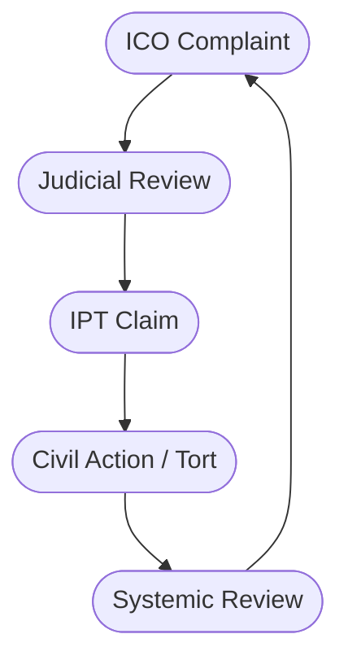

# ⚖️ Recourse for Behavioural Containment  
**First created:** 2025-10-30 | **Last updated:** 2025-10-30  
*How to prise open a closed data loop.*

---

## 🧭 Orientation  
Maps practical routes of accountability when behavioural/security-linked containment caused harm or opacity.

---

## 🧩 Key Features  
- Escalation corridor (ICO → JR → IPT → Tort)  
- Real barriers: national-security certificates, closed-material procedure  
- Systemic exposure & cohort risk  

---

## 🔀 Escalation Corridor (Mermaid)

---

## 🌌 Constellations  
🧿 ⚖️ 🧠 🧟‍♀️ — Law, behaviour, and residual governance.

## ✨ Stardust  
ICO, IPT, judicial review, tort, national security exemption, equality duty

## 🏮 Footer  
*⚖️ Recourse for Behavioural Containment* is a living node of the Polaris Protocol.  
*Survivor authorship is sovereign. Containment is never neutral.*  
_Last updated: 2025-10-30_
