# ⚖️ Surveillance, OSA, and Citizen Forking — MEGA NODE  
**First created:** 2025-09-05 | **Last updated:** 2025-09-05  
*A longform diagnostic of UK surveillance opacity, cyberforensic spoofing, and why citizens are forked out of their own defence*

---

## 📑 Sections  

0. [Legal Backdrop](#0-legal-backdrop)  
1. [Problem as it Presents](#1-problem-as-it-presents)  
2. [Oversight Chain](#2-oversight-chain)  
3. [Cybersecurity Attack Surface](#3-cybersecurity-attack-surface)  
4. [Citizen Experience](#4-citizen-experience)  
5. [Mitigation Ring](#5-mitigation-ring)  
6. [Trust-Weight Oversight Graph](#6-trust-weight-oversight-graph)  
7. [Exit Planning](#7-exit-planning)  
8. [Closing Frame](#8-closing-frame)  

---

## 0. Legal Backdrop  

UK surveillance rests on layered statutes:  

- **Investigatory Powers Act 2016 (IPA):** bulk interception, retention, equipment interference. *Double-lock* (Minister + Judicial Commissioner).  
- **Official Secrets Acts (1911–1989):** criminalise disclosure. Enforce **opacity**: even courts cannot freely review evidence.  
- **Data Protection Act 2018 / UK GDPR:** nominal safeguards, suspended for national security.  
- **Online Safety Act 2023+:** widens capture surfaces; metadata and platform reporting feed into surveillance.  

**Layering effect:** IPA gives powers → OSA closes visibility → Data protection derogated → Online Safety expands capture.  

**Structural flaw:** All assume **data integrity**. Cyberforensic spoofing/mimicry make that assumption unsafe.  

[🔝 Back to top](#⚖️-surveillance-osa-and-citizen-forking--mega-node)  

---

## 1. Problem as it Presents  

**The citizen perspective:**  
- Surveillance is sensed but not seen.  
- Feels like refusal logic: super-injunction energy, forbidden branches pruned.  
- Consequences (flags, frictions, device seizures) appear without explanation.  

```mermaid
graph TD
    Citizen["👤 Citizen (forked out)"]:::neutral
    Agency["🏢 Agency dossier"]:::uk
    Minister["⚖️ Secretary of State"]:::uk
    JC["👩‍⚖️ Judicial Commissioner"]:::uk
    IPCO["📋 IPCO audits"]:::uk
    IPT["🏛 IPT tribunal"]:::uk

    Citizen -. challenge .-> IPT
    Agency --> Minister --> JC
    JC --> Agency
    IPCO -. audits .-> Agency
    IPCO -. audits .-> Minister
    IPT -. closed evidence .-> Agency

    classDef neutral fill:#eeeeee,stroke:#999999,color:#000000;
    classDef uk fill:#eaffea,stroke:#009933,stroke-width:2px,color:#000000;
```

[🔝 Back to top](#⚖️-surveillance-osa-and-citizen-forking--mega-node)  

---

## 2. Oversight Chain  

- **Agency → Minister → Judicial Commissioner → IPCO → IPT**  
- Each node checks legality but not authenticity.  
- Responsibility defaults upward; **no re-verification of inputs**.  

```mermaid
sequenceDiagram
    participant A as 🛠 Attacker
    participant DS as 💾 Data Sources
    participant AG as 🏢 Agency (analysis)
    participant MS as ⚖️ Secretary of State
    participant JC as 👨‍⚖️ Judicial Commissioner
    participant IPCO as 📋 IPCO (audits)
    participant IPT as 🏛 IPT (tribunal)
    participant C as 👤 Citizen

    A->>DS: Inject/poison artefacts (spoofed IP, cloned device ID)
    DS->>AG: Signals imply risky contact
    AG->>MS: Warrant application (necessity/proportionality)
    MS->>JC: Double-lock request
    JC-->>MS: Approves (based on dossier)
    AG-->>C: Covert measures (watchlists, device searches)
    IPCO-->>AG: Sampled audit (months later)
    C-->>IPT: Challenge (secret evidence)
    IPT-->>AG: Closed materials relied upon
    IPT-->>C: Outcome (limited disclosure)
```

[🔝 Back to top](#⚖️-surveillance-osa-and-citizen-forking--mega-node)  

---

## 3. Cybersecurity Attack Surface  

Five hubs where spoof/mimicry can be seeded:  

- 📡 Network spoofing (IP overlap, Wi-Fi impersonation)  
- 📶 Mobile identity (eSIM/SIM swap, IMSI catcher)  
- 💻 Device mimicry (session replay, fingerprint clone)  
- 🧩 Association fabrication (typosquat, synthetic ties)  
- 🗄️ Log tampering (SaaS edits, SIEM injections, router gaps)  

```mermaid
graph LR
    RISK["🎯 Citizen labelled as threat"]:::core
    NET["📡 Network spoof"]:::attack
    MOB["📶 Mobile ID spoof"]:::attack
    DEV["💻 Device mimic"]:::attack
    ASSOC["🧩 Fake associations"]:::attack
    LOGS["🗄️ Log tamper"]:::attack

    NET --> RISK
    MOB --> RISK
    DEV --> RISK
    ASSOC --> RISK
    LOGS --> RISK

    classDef core fill:#e6f0ff,stroke:#1f66ff,stroke-width:3px,color:#000000;
    classDef attack fill:#ffe5e5,stroke:#cc0000,stroke-width:2px,color:#000000;
```

[🔝 Back to top](#⚖️-surveillance-osa-and-citizen-forking--mega-node)  

---

## 4. Citizen Experience  

- **Forked away:** OSA blocks visibility.  
- **Deadlocked:** oversight nodes defer upward.  
- **Trapped loop:** “risk” label self-reinforces via more data.  
- **Diffuse pressure:** every node points to another.  

```mermaid
graph TD
    R["🎯 Risk Label"]:::core
    MOB["📶 Mobile Identity Spoof"]:::attack
    M1["eSIM profile fraud / SIM swap"]:::attack
    M2["IMSI catcher correlation"]:::attack
    MNO["Mobile Operator Records"]:::source
    AGENCY["🏢 Agency Analysis"]:::uk
    MIN["⚖️ Secretary of State"]:::uk
    JC["👩‍⚖️ Judicial Commissioner"]:::uk

    MOB --- M1 & M2
    M1 -. taints .-> MNO
    M2 -. taints .-> MNO
    MNO --> AGENCY --> MIN --> JC
    AGENCY --> R

    classDef core fill:#e6f0ff,stroke:#1f66ff,stroke-width:3px,color:#000000;
    classDef attack fill:#ffe5e5,stroke:#cc0000,stroke-width:2px,color:#000000;
    classDef source fill:#fff7d6,stroke:#e6b800,stroke-width:2px,color:#000000;
    classDef uk fill:#eaffea,stroke:#009933,stroke-width:2px,color:#000000;
```

[🔝 Back to top](#⚖️-surveillance-osa-and-citizen-forking--mega-node)  

---

## 5. Mitigation Ring  

Citizen countermeasures to raise trust weights or create exculpatory evidence:  

- 🔒 Network integrity (tw 0.7): DNSSEC, DoH/DoT, ISP attestations.  
- 📱 Mobile integrity (tw 0.6): SIM-swap alerts, eSIM attestation.  
- 💻 Device assurance (tw 0.8): FIDO2 MFA, signed logs.  
- 🧾 Identity proof (tw 0.65): diaries, notarised docs.  
- 🗂 Immutable logs (tw 0.9): WORM storage, hashes.  

```mermaid
graph TD
    RISK["🎯 Citizen labelled as threat"]:::core
    NET["📡 Network spoof"]:::attack
    MOB["📶 Mobile ID spoof"]:::attack
    DEV["💻 Device mimic"]:::attack
    ASSOC["🧩 Fake associations"]:::attack
    LOGS["🗄️ Log tamper"]:::attack

    MNET["🔒 Net integrity\n(tw 0.7)"]:::mit
    MMOB["📱 Mobile integrity\n(tw 0.6)"]:::mit
    MDEV["💻 Device assurance\n(tw 0.8)"]:::mit
    MASSOC["🧾 Identity proof\n(tw 0.65)"]:::mit
    MLOGS["🗂 Immutable logs\n(tw 0.9)"]:::mit

    NET --> RISK
    MOB --> RISK
    DEV --> RISK
    ASSOC --> RISK
    LOGS --> RISK

    MNET -. protects .-> NET
    MMOB -. protects .-> MOB
    MDEV -. protects .-> DEV
    MASSOC -. protects .-> ASSOC
    MLOGS -. protects .-> LOGS

    classDef core fill:#e6f0ff,stroke:#1f66ff,stroke-width:3px,color:#000000;
    classDef attack fill:#ffe5e5,stroke:#cc0000,stroke-width:2px,color:#000000;
    classDef mit fill:#e5ffe5,stroke:#00aa00,stroke-width:2px,stroke-dasharray: 4 2,color:#000000;
```

[🔝 Back to top](#⚖️-surveillance-osa-and-citizen-forking--mega-node)  

---

## 6. Trust-Weight Oversight Graph  

This lens shows **where verification is weakest** across the system.  
`tw` scale: 1 = strong verification, 0 = blind trust.  

```mermaid
graph LR
    Citizen["👤 Citizen"]:::neutral
    DataSources["💾 Data Sources"]:::risk
    Attacker["🛠 Attacker"]:::threat
    Agency["🏢 Intelligence Agency"]:::risk
    Minister["⚖️ Secretary of State"]:::dependent
    Judge["👨‍⚖️ Judicial Commissioner"]:::dependent
    IPCO["📋 Investigatory Powers Commissioner"]:::oversight
    IPT["🏛 Investigatory Powers Tribunal"]:::oversight

    Citizen -. "tw 0.2\n(indirect capture)" .- DataSources:::weak
    DataSources -- "tw 0.6\n(controls + logs, spoofable)" --> Agency
    Agency -. "tw 0.5\n(disclosure-limited brief)" .- Minister:::weak
    Minister -- "tw 0.7\n(queries possible)" --> Judge
    Judge -- "tw 0.8\n(legal scrutiny)" --> IPCO
    IPCO -- "tw 0.6\n(sampled audits)" --> IPT

    Citizen -. "tw 0.3\n(secret evidence issues)" .- IPT:::weak
    Attacker -. "tw —\n(compromise vector)" .- DataSources:::weak

    IPCO -- "tw 0.75\n(audit access)" --> Agency
    IPCO -- "tw 0.7\n(record review)" --> Minister
    IPT -- "tw 0.65\n(process check)" --> IPCO
    IPT -. "tw 0.5\n(limited remedies)" .- Agency:::weak

    classDef risk fill:#ffcccc,stroke:#cc0000,stroke-width:2px,color:#000000;
    classDef threat fill:#ff6666,stroke:#990000,stroke-width:2px,color:#000000;
    classDef dependent fill:#fff5cc,stroke:#e6b800,stroke-width:2px,color:#000000;
    classDef oversight fill:#ccffcc,stroke:#009933,stroke-width:2px,color:#000000;
    classDef neutral fill:#eeeeee,stroke:#999999,stroke-width:1px,color:#000000;

    classDef weak stroke:#cc0000,stroke-width:2px,stroke-dasharray: 5 5,color:#000000;
```

[🔝 Back to top](#⚖️-surveillance-osa-and-citizen-forking--mega-node)  

---

## 7. Exit Planning  

Why exit is so hard:  
- OSA opacity.  
- Challenges trigger doubling-down (more data pulled).  
- IPT uses secret evidence; remedies limited.  

**Pressure points:**  
- 🔬 Independent forensics (device logs, router captures).  
- 🛡 ICO complaints on data accuracy.  
- 🏛 IPT claim.  
- 🏛 Parliamentary oversight.  
- 📰 Public interest legal/media routes.  

```mermaid
graph LR
    Citizen["👤 Citizen"]:::neutral
    Forensics["🔬 Independent Forensics"]:::mit
    IPT["🏛 IPT Claim"]:::uk
    ICO["🛡 ICO Complaint"]:::uk
    MP["🏛 Parliamentary Oversight"]:::uk
    Media["📰 Public Interest Counsel"]:::neutral

    Citizen --> Forensics --> IPT
    Citizen --> ICO
    Citizen --> MP
    IPT -. closed evidence .-> Citizen
    MP -. questions .-> IPT
    Media -. risk/benefit .-> Citizen

    classDef neutral fill:#eeeeee,stroke:#999999,color:#000000;
    classDef mit fill:#e5ffe5,stroke:#00aa00,stroke-width:2px,color:#000000;
    classDef uk fill:#eaffea,stroke:#009933,stroke-width:2px,color:#000000;
```

[🔝 Back to top](#⚖️-surveillance-osa-and-citizen-forking--mega-node)  

---

## 8. Closing Frame  

- The **law layers** fork the citizen away: IPA powers, OSA opacity, platform capture.  
- **Cyberforensic spoofing** exploits this blind spot; poisoned inputs become dossiers, oversight cannot see.  
- **Oversight exists but defers upwards**; accountability disperses.  
- **Exit is hard:** citizen strategies = mitigation ring + advocacy for legislative update.  

**Containment is never neutral.** IPA assumed clean data; reality is noisy and attackable.  

---

## 🏮 Footer  

*Surveillance, OSA, and Citizen Forking — MEGA NODE* is a living node of the Polaris Protocol.  
It documents how UK surveillance law, opacity under OSA, and cyberforensic spoofing converge to trap citizens in risk designations without exit routes.  

> 📡 Cross-references:  
> - [Big Picture Protocols](../Disruption_Kit/Big_Picture_Protocols/) — structural diagnostics  
> - [Survivor Tools](../Survivor_Tools/) — defensive strategies  
> - [Containment Scripts](../Disruption_Kit/Containment_Scripts/) — suppression methods  

*Survivor authorship is sovereign. Containment is never neutral.*  

_Last updated: 2025-09-05_  
