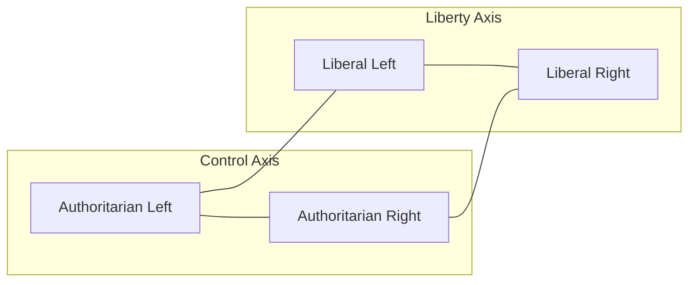

# ⚖️ The Alt-Right Is Not the Far-Right  
**First created:** 2025-10-19  | **Last updated:** 2025-10-20  

---

## 🧭 Orientation  

This note examines a recurring conceptual error in Western political discourse: the collapse of distinct authoritarian formations into a single “right-wing” identity.  
The **alt-right** is not an extension of conservatism, nor a mere intensification of the far-right.  
It is a **revolutionary authoritarianism** — an ideological hybrid that seeks rapid transformation of society while retaining strict hierarchies of belonging and control.  

Liberal and centrist media often misidentify this formation because their analytical tools — *left vs right*, *progressive vs conservative* — were built for the twentieth century.  
Those coordinates no longer describe the terrain.  

---

## 🔍 The Naming Problem  

“Alternative right” originally signalled **rejection of conservative gradualism**.  
Alt-right thinkers viewed mainstream conservatism as weak, sentimental, and incapable of protecting the hierarchies they valued.  
They wanted **acceleration** — not to preserve tradition but to purge and rebuild society at speed.  

This is why the alt-right’s psychology more closely resembles the **totalitarian left** than the conservative right.  
Like the revolutionary movements of Stalinist Russia or Maoist China, it believes in purification through upheaval, in rebirth through destruction.  
The target may change — class, race, gender, nation — but the logic of cleansing remains.  

---

## 🧩 Historical Parallels  

| Regime | Mechanism | Shared Alt-Right Trait |  
|:--|:--|:--|  
| **Stalinist USSR** | Industrial acceleration, surveillance, political purges | Technocratic control, myth of destiny |  
| **Maoist Cultural Revolution** | Youth militancy, destruction of heritage | Online “Red Guards”: mob purity, meme warfare |  
| **Khmer Rouge** | Erasure of institutions, utopian remaking | Collapse of the present into mythic origin fantasy |  

The alt-right does not restore; it **restarts** — radical modernism wearing traditionalist costume.  

---

## 🧮 Why Horseshoe Theory Fails  

“Horseshoe theory” imagines extremism bending back on itself.  
But this is **misleading** — it treats politics like a **speedometer**, implying that intensity alone drives authoritarianism.  

Authoritarianism does not live at the extremes of one line; it **jumps dimensions**.  
It emerges wherever **control** outpaces **consent**.  

In this schema, **authoritarian movements** can arise anywhere horizontally.  
The alt-right and the totalitarian left occupy opposite X-positions but share the same **altitude on the Y-axis** — *maximum control*.  

---

## 🧠 Personality and Preference  

Political-psychology research links temperament to alignment:  

- **Openness** + **ambiguity tolerance** → liberal or left-leaning views  
- **Need for closure** + **preference for order** → conservative or high-control views  

These are **human ranges**, not moral flaws.  
But when social anxiety fuses with accelerationist impatience, the result is a demand for **rapid control restoration** — the soil from which the alt-right grows.  

---

## 🕊️ What “Liberal” Actually Means  

“Liberal” ≠ “left-wing.”  
It refers to the **principle of liberty** — limited power, protected rights, freedom to dissent.  

You can be:  
- **Liberal & Right-Wing** (pro-market, pluralist)  
- **Liberal & Left-Wing** (egalitarian, pluralist)  
- **Left-Wing but not Liberal** (authoritarian socialist)  
- **Right-Wing but not Liberal** (theocratic authoritarian)  

The **true enemy of liberal democracy** is not “the right” or “the left,” but **authoritarianism itself**.  
The alt-right belongs squarely in that category.  

---

## ⚙️ Accelerationism and Self-Consumption  

A central current within the alt-right is **accelerationism** — the belief that decayed systems must collapse to clear the way for renewal.  
Accelerationists do not seek conservation; they seek combustion.  

This explains **intra-right violence**.  
When figures like **Charlie Kirk** are targeted by right-wing accelerationists, it is not contradiction but culmination: a movement that prizes **speed, purity, and rupture** over stability or coalition.  

Accelerationism turns ideology into a feedback loop: once purging begins, *no one is pure enough.*  
The result is not preservation but **self-consumption** — a fire that eats its own roots while claiming to defend them.  

---

## 🗳️ Instrumental Democracy  

Authoritarian accelerationists **reject deliberation**.  
They do not want to argue; they want to *win permanently*.  
Democracy becomes a **temporary vehicle for capture**, a system to be gamed.  

Elections are seen as **mechanics**, not meaning.  
If the rules require debate, they simulate debate.  
If victory demands dishonesty, deceit becomes tactical necessity.  
Their goal is not persuasion but **penetration** — entering systems they plan to disable.  

Engaging such actors as if they share good faith is futile.  
Response must shift from *arguing with opponents* to *educating audiences*.  
Democracy must defend openness **without being naïve** about those who would use openness to end it.  

---

## 🎙️ The Debate Trap  

Liberal democracy equates open debate with fairness.  
But the alt-right uses debate as **performance for power**.  

Every provocation tests boundaries; every “just asking questions” moment nudges the frame of acceptability.  
Programs such as **BBC Question Time** have inadvertently facilitated this shift, mistaking *balance* for *integrity*.  
Extremism becomes spectacle; moderation becomes defence.  

Those trained in classical rhetoric are debating in good faith against opponents who are **gaming the format**.  
Future democratic media must therefore:  

- Flag manipulation in real time.  
- Favour **informational integrity** over performative “balance.”  
- Recognise that the civic stage itself is **contested terrain**.  

The objective is not to *win the argument* but to **protect the architecture of argument**.  

---

## 🧩 Boundary Testing and Social Containment  

Authoritarian actors behave like **boundary-testing adolescents**.  
They probe norms to locate weakness in restraint.  
Each transgression is diagnostic, not ideological.  

Developmental psychology offers the analogy: toddlers, teenagers, even animals learn limits through **consistent feedback**.  
Absent that, inhibition fails and escalation follows.  

Politics behaves similarly.  
When transgressive behaviour faces no credible boundary, it amplifies — rewarded by outrage, virality, and attention.  

Thus, some actors require **containment, not conversation**.  
This is not cruelty; it is **civic discipline**.  
Moderators and institutions must act like responsible adults in a social ecosystem:  
firm, fair, and unwilling to let destructive behaviour pass as debate.  

Without such boundaries, public discourse decays into **feral speech** — unbounded, antisocial, self-rewarding.  

---

## 📡 Implications  

- **Media framing errors** obscure that the alt-right is revolutionary, not conservative.  
- **Policy blind spots** target nostalgia instead of acceleration.  
- **Civic education** must teach *control-based mapping* and *rhetorical hygiene* to resist authoritarian drift.  

---

## 🌌 Constellations  
🧭 ideology mapping, political psychology, accelerationism, hierarchy worship, liberal democracy, authoritarian contagion  

---

## ✨ Stardust  
alt-right, far-right, totalitarian left, horseshoe theory, accelerationism, authoritarianism, liberalism, political spectrum, media rhetoric  

---

## 🏮 Footer  

*⚖️ The Alt-Right Is Not the Far-Right* is a living node of the **Polaris Protocol**.  
It distinguishes authoritarian acceleration from conservative reaction and redefines ideological space not as a line, but as a field of control and containment.  
