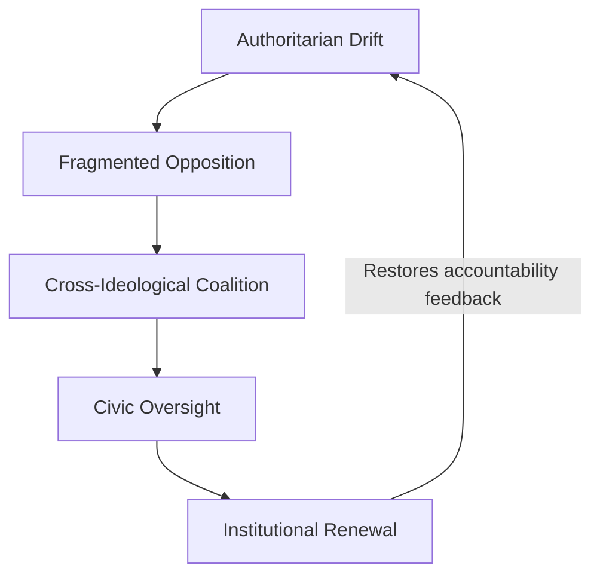

# ⚖️ United Fronts as Democratic Defence
**First created:** 2025-11-09 | **Last updated:** 2025-11-09  
*Cross-ideological coalitions as immune systems for democratic institutions*

---

## 🧭 Orientation  
When executive power expands faster than civic oversight, democracy depends on unlikely alliances.  
United fronts—temporary, issue-based coalitions—operate as **defensive reflexes**: they bridge ideological divides long enough to restore procedural balance.  

This node refines the argument that emerged from the SASSI model and recent global solidarity movements: **ethical convergence can outpace partisan fragmentation.**

---

## 🧩 Structural Logic  

1. **Common Threat Recognition**  
   - Authoritarian consolidation, mass surveillance, or erosion of proportionality provide shared alarm signals.  

2. **Containment Breach**  
   - Traditional party competition isolates citizens; cross-issue coalitions reconnect them.  

3. **Moral Constant**  
   - “Do we accept this harm or not?” replaces ideological loyalty as the organising question.  

4. **Procedural Reformism**  
   - Focus on transparent process—budget scrutiny, legislative limits, sunset clauses—keeps cooperation stable.  

5. **Reward Loop**  
   - Institutions must validate civic engagement through visible uptake, preventing burnout or cynicism.  

---

## 🧠 Democratic Immunology  

---

## 🧭 Operational Principles  

| Principle | Function | Example |
|------------|-----------|----------|
| **Frame ethics, not ideology** | Builds trust across divides | “Proportional force” over “Left vs Right” |
| **Use procedural levers** | Common ground via governance | FOI, audits, participatory budgets |
| **Document everything** | Facts bridge belief systems | Public data releases, grant tracing |
| **Quarantine taboos** | Prevent derailment | Agree on scope: structure ≠ worldview |
| **Localise impact** | Make stakes tangible | Housing, cost-of-living, safety |

---

## 🌌 Constellations  

⚖️ 🧿 🛰️ 🔮 — coalition ethics, civic immunology, containment breach, democratic repair  

---

## ✨ Stardust  

united fronts, democratic defence, coalition logic, cross-party accountability, civic immunology, executive overreach, participatory reform, ethical convergence  

---

## 🏮 Footer  

*⚖️ United Fronts as Democratic Defence* is a living node of the Polaris Protocol.  
It defines how cross-ideological coalitions act as defensive reflexes within democratic systems, transforming shared discomfort into collective oversight.

> 📡 Cross-references:  
> - [🧿 SASSI as Counter-Surveillance Accountability](../🧿_sassi_as_counter_surveillance_accountability.md)  
> - [🔥 Suppression as Signal](../Containment_Studies/🔥_suppression_as_signal.md)  
> - [🐝 All In Commons](../../🦆_Digital_Disruption/🐝_All_In_Commons)

*Survivor authorship is sovereign. Containment is never neutral.*

_Last updated: 2025-11-09_
