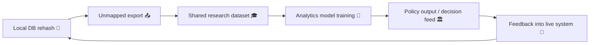

# ⚙️ Pseudonym Drift Cascade — How Token Misalignment Spreads Through Systems  
**First created:** 2025-11-11 | **Last updated:** 2025-11-11  
*When one mismatched hash becomes an ecosystem bug.*

---

## 🧭 Orientation  

A single pseudonym error rarely stays put.  
Once data are joined, mirrored, or reused, one misaligned token can contaminate entire analytics pipelines.  
This is the **pseudonym drift cascade** — a feedback process in which small cryptographic inconsistencies amplify into governance failure.

---

## ⚖️ What Is Drift?  

> **Token or pseudonym drift** occurs when a supposedly stable hashed identifier begins to vary between systems or over time,  
> leading to accidental merges, duplicates, or orphaned records.

Drift doesn’t mean malicious tampering — it means entropy.  
The system’s memory of who someone “is” becomes unstable, and every connected process inherits that instability.

---

## 🧩 Drift Lifecycle  

| Stage | Trigger | Result |
|:------|:---------|:--------|
| **1️⃣ Local Rehash** | A system re-encrypts IDs using new salt without re-mapping. | One-to-many token mapping appears. |
| **2️⃣ Export Join** | Datasets joined on old token fields. | Cross-domain collisions arise. |
| **3️⃣ Vendor Mirror** | Cloud host syncs partial copy with outdated hash. | False duplicates or ghost records. |
| **4️⃣ Analytics Layer** | Predictive models trained on mixed lineage. | Statistical contamination → policy error. |

---

## 🧮 Drift Propagation  

Each step multiplies uncertainty until pseudonym drift becomes **institutional truth**.

---

## 🪞 Governance Interpretation  

- **Drift = entropy disguised as fact.**  
- Once drifted tokens reach a policy layer, evidence reversibility vanishes.  
- Reconciliation later reads as “data correction” — concealing systemic fragility.  

---

## 🧰 Detection Checklist  

| Layer | Symptom | Diagnostic |
|:------|:---------|:------------|
| **Database** | Inconsistent token formats | Compare schema snapshots; run regex integrity checks. |
| **Export** | Row counts mismatch across identical timeframes | Validate joins and deduplication logic. |
| **Vendor / API** | Latency in token updates | Request version control or checksum logs. |
| **Analytics** | Model accuracy drops or swings unpredictably | Examine training-data lineage; verify token provenance. |

---

## 🧱 Mitigation Strategy  

1. **Immutable Token Repositories** — store canonical mapping tables with cryptographic signatures.  
2. **Cross-System Checksum Verification** — compare hashes via shared audit interface.  
3. **Change-Control Logging** — record all retokenisation events.  
4. **Drift Dashboard** — visualise pseudonym deltas across systems monthly.  
5. **Reconciliation Triggers** — auto-flag new tokens that overlap with historic ones.  

---

## 🌌 Constellations  

⚙️ 🪙 🧬 🧩  

Pseudonym Drift Cascade completes the **Integrity Spine**, bridging **Token Integrity Audit**, **Data Twinning**, and **Swiss-Cheese Failures**.  
It’s the dynamic expression of how misalignment propagates once set in motion.

---

## ✨ Stardust  

pseudonym drift, data lineage, token cascade, system governance, cross-domain contamination, audit trail, mapping table, encryption salts, data integrity, entropy management

---

## 🏮 Footer  

*⚙️ Pseudonym Drift Cascade — How Token Misalignment Spreads Through Systems* is a living node of the Polaris Protocol.  
It explains how technical entropy evolves into narrative confusion, and how early detection can restore structural truth before reputation hardens around error.

> 📡 Cross-references:  
> - [🪙 Token Integrity Audit — How to Check for Pseudonym Drift](../🧩_System_Governance/🪙_token_integrity_audit_how_to_check_for_pseudonym_drift.md)  
> - [🧬 Data Twinning — When Two Identities Become One Record](../🧩_System_Governance/🧬_data_twinning_when_two_identities_become_one_record.md)  
> - [🧩 Swiss-Cheese Failures — When Process Holes Align](../🧩_System_Governance/🧩_swiss_cheese_failures_when_process_holes_align.md)  

*Survivor authorship is sovereign. Containment is never neutral.*  

_Last updated: 2025-11-11_
