# 🌀 Dual Loyalty Loops  
**First created:** 2025-11-16 | **Last updated:** 2025-11-22  
*How forced identity conflation creates no-win political traps for diaspora Jews.*  

---

## 🛰️ Orientation
“Dual loyalty” is not an internal conflict; it is an **external imposition**.
This node maps the looping structure where Jewish diaspora communities are framed as simultaneously **responsible for a state they don’t control** and **suspect for critiquing that same state**.

This is not about geopolitics.  
It is about **identity capture**, **narrative pressure**, and **structural no-win traps** in British political culture.

---

## ✨ Key Features
- Maps the **forced conflation** of Jewish identity with the Israeli state.  
- Shows how critique triggers **punitive suspicion** rather than democratic engagement.  
- Identifies the **feedback loop**: “accountable → informed → critical → punished.” 
- Names this as a **systemic trap**, not an individual failing.

---

## 🧿 Analysis / Content

### 1. **The First Imposition: “Jew = Israel”**
Diaspora Jews are routinely treated as if their identity is interchangeable with a state they neither founded nor govern.  
This collapses **people** into **government**, **history** into **policy**, and **heritage** into **foreign allegiance**.

> The conflation is the violence.  
> Everything else is fallout.

---

### 2. **The Second Imposition: “Therefore you must know about it.”**
Once conflated with the state, Jewish people are expected to have:

- an opinion,  
- an expertise level,  
- and a readiness to explain themselves.

This is not chosen identity; it is **assigned identity**.

So people learn, research, and evaluate — often through the lens of the democratic norms they were raised with.

---

### 3. **The Democratic Paradox: “As a British person, this looks wrong.”**
When you evaluate a state using:

- British legal principles,  
- ICJ reasoning,  
- human rights frameworks,  
- international humanitarian law,  
- or even basic democratic critique—

you inevitably find things that conflict with those values.

This is normal civic behaviour.  
It’s what British political culture *claims* to teach.

But once the identity loop is active, critique becomes perilous.

---

### 4. **The Punitive Turn: “Critique = Disloyalty.”**
Diaspora Jewish critique is treated differently:

- Non-Jews can critique foreign states without identity suspicion.  
- Jews critiquing Israel are framed as “anti-British,” 
- “anti-West,” 
- or “self-hating,” 
- or “bad allies.” 

The critique is de-legitimised **not because it’s incorrect**,  
but because the speaker is Jewish.

This is the “no-win” threshold.

---

### 5. **The Loop Closes: “You are tied to the state you must not critique.”**
This is where the trap locks:

1. You are treated as responsible for a state you didn’t choose.  
2. So you learn about it (forced intellectual labour).  
3. You apply British values (logical, legal, ethical).  
4. You critique in good faith.  
5. You are accused of disloyalty.  
6. The original conflation tightens.

Identity becomes an **inescapable Möbius strip**.

This is not “dual loyalty.” 
It is **enforced false loyalty** combined with **punished dissent**.

---

## 🔄 Diagram: Dual Loyalty Loop

```mermaid
flowchart TD
    A["❶ Forced Conflation<br/>Jewish person ≈ State of Israel"]
    B["❷ Expected Competence<br/>“So what do *you* think about Israel?”"]
    C["❸ Forced Study<br/>Learns history, law, ICJ, British norms"]
    D["❹ Democratic Evaluation<br/>Applies British / ICJ values to reality"]
    E["❺ Good-Faith Critique<br/>“This looks wrong / unlawful / unjust.”"]
    F["❻ Punitive Reframe<br/>Critique = Disloyal / Anti-West / ‘Bad Jew’"]
    G["❼ Loop Tightening<br/>Conflation deepens: Jew = State = Ally Loyalty Test"]

    A --> B --> C --> D --> E --> F --> G --> A

    subgraph SideEffects ["Spillover Effects"]
        H["🧠 Internalised Conflict<br/>Hyper-vigilance, self-censorship"]
        I["🫥 Silencing<br/>“Safer not to speak at all.”"]
        J["🧩 Fragmentation<br/>Community splits over ‘acceptable’ speech"]
    end

    F --> H
    F --> I
    F --> J
```

---

## 🏮 Footer
*🌀 Dual Loyalty Loops* is a living node of the Polaris Protocol.  
It maps identity capture mechanisms affecting diaspora communities,  
focusing on the pressure structures that turn ordinary civic critique into sites of suspicion.

> 📡 Cross-references:
> 
> - 🪐 *Forensic Schema — Why the Dual Loyalty Accusation ‘Pings’ Harder than Rape Disclosure*  
> - 🪞 *Identity Capture & Projection Logic*  
> - ⚖️ *Soft Law, Symbolic Loyalty, and the British State*

*Survivor authorship is sovereign. Containment is never neutral.*  
_Last updated: 2025-11-22_
