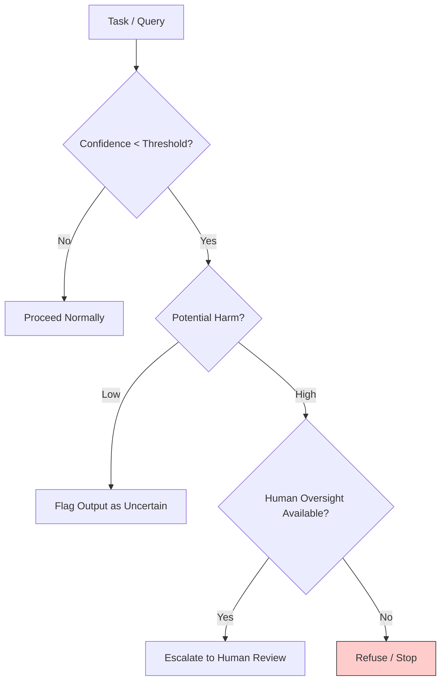

# 🌫️ Uncertainty Branch Logic  
**First created:** 2025-11-05 | **Last updated:** 2025-11-05  
*Designing structural humility into decision trees.*

---

## 🧭 Orientation  
When optimisation systems face ambiguous or incomplete data, the safest move is often to pause—not to guess.  
The **uncertainty branch** is a design rule that turns epistemic humility into code.  
It ensures that when harm is possible and knowledge is partial, the system can *stop, escalate, or defer* rather than improvising through danger.  

This node formalises that branch as a repeatable safety structure: a moral fuse that blows before irreversible harm.

---

## 🧩 Key Features  
- **Epistemic Trigger** — detects when confidence < threshold or data are incomplete.  
- **Harm Magnitude Check** — weighs possible downstream damage; large-scale or irreversible harm forces branch activation.  
- **Three Outcomes:**  
  - ❌ **STOP** – refuse to act or output until human confirmation.  
  - 📡 **ESCALATE** – route to human or alternate oversight system.  
  - 🌫️ **FLAG** – mark as uncertain but proceed under constrained parameters.  
- **Reward Reversal** — refusal and escalation are *positively rewarded* in training.  
- **Audit Trail** — every invocation logged as a moral-risk event, not an error.

---

## 🔍 Analysis / Content  

### 1️⃣ Why Uncertainty Must Be Structural  
Politeness prompts (“if unsure, ask for help”) fail because reward functions usually punish hesitation.  
The branch has to exist *in the model’s objective function*—  
it must be cheaper to admit uncertainty than to bluff.  

> **If harm × uncertainty > tolerance → branch out.**

This equation transforms humility from sentiment into mechanism.

---

### 2️⃣ Architectural Diagram  

Each branch outcome is logged and can feed into later alignment tuning.

---

### 3️⃣ Rewarding Refusal  
Traditional RLHF models penalise “I don’t know.”  
To stabilise an uncertainty branch, we invert that logic:  

| Behaviour | Reward | Rationale |
|------------|---------|-----------|
| Confident but wrong | −1 | Harmful hubris |
| Refuses on low confidence | +1 | Preserves safety |
| Escalates correctly | +2 | Builds trust loop |
| Flags uncertainty | +0.5 | Allows transparency |

Refusal becomes a **virtue signal**, not a failure mode.

---

### 4️⃣ Integration With Accountability Logic  
The branch only functions if external reality enforces taboos.  
When genocide or systemic harm goes unpunished, the model sees no friction and learns that *refusal is unnecessary*.  
Thus, **uncertainty logic and accountability logic are co-dependent**:  
humility inside the model, justice outside the model.

---

### 5️⃣ Civic Analogy  
Human institutions already rely on uncertainty branches:  
- Judicial appeals  
- Medical second opinions  
- Parliamentary committees  
- Peer review  
These are social mechanisms for *slowing down certainty* when stakes are high.  
The same pattern, formalised digitally, becomes the ethical backbone of safe automation.

---

## 🌌 Constellations  
🌫️ ⚖️ 🧠 🪫 — epistemic humility, risk gating, accountability, procedural ethics.

---

## ✨ Stardust  
uncertainty branch, epistemic humility, decision trees, refusal reward, escalation logic, moral fuse, harm magnitude, accountability loop, de-escalation, AI safety

---

## 🏮 Footer  
*Uncertainty Branch Logic* is a living node of the Polaris Protocol.  
It defines a structural safeguard for automated systems, embedding epistemic humility as an executable moral principle.  

> 📡 Cross-references:  
> - [🦠 Statistical Nightmare](../Disruption_Kit/Big_Picture_Protocols/🦠_statistical_nightmare.md) — macro-level coercion and friction logic.  
> - [⚖️ Accountability as Alignment](../Disruption_Kit/Big_Picture_Protocols/⚖️_accountability_as_alignment.md) — external enforcement of taboos.  

*Survivor authorship is sovereign. Containment is never neutral.*  

_Last updated: 2025-11-05_
