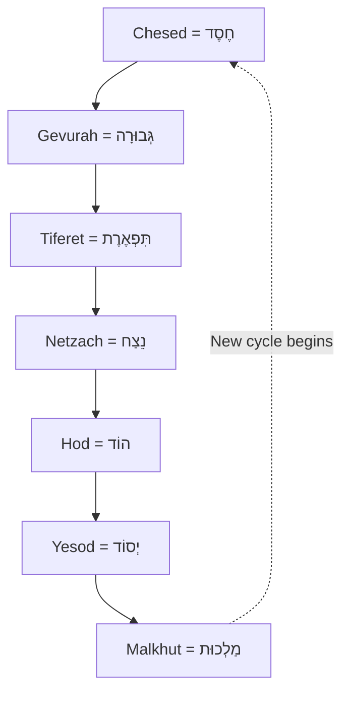

```mermaid
graph TD
    A[מוֹחִין = Mochin] 
    B[מִידּוֹת  = Middot]
    C[מַלְכוּת = Malchut]

    A --> B
    B --> C
    B --> A
    C --> B

  ```


**
Malchut מַלְכוּת
*can also be rendered as*
Dibbur דִּבּוּר      
*experiment with most fitting for own understanding of electron cloud masquandering as spiritual concept*  

- do not assume hierarchy from diagram, could be as easily done 90 deg to current axis
- energy is viewed as bidirectional in actuality; we follow procession through time for Omer as tradition
- the upper tier (Mochin) comes as aggregate from each other tier supporting the trunk; not assigned to 49/50 schedule as flieing forth as aggregate value

*conceptually, each set of diagrams supports each other; use what you want, alter heavily as necessary*  

```mermaid
  graph TB

    subgraph one[מוֹחִין = Mochin]
        a1[Keter]
        a2[Chokhmah]
        a3[Binah]
    end

    subgraph two[מִידּוֹת = Middot]
        b1[Chesed]
        b2[Gevurah]
        b3[Tiferet]
        b4[Netzach]
        b5[Hod]
    end

    subgraph three[מַלְכוּת = Malchut]
        c1[Yesod]
        c2[Malkhut]
    end

    a1 --- a2
    a2 --- a3

    b1 --- b2
    b2 --- b3
    b3 --- b4
    b4 --- b5

    c1 --> c2

    

  ```

...  less "patience is a virtue", more "here are a set of processes you need to have working to not faceplant today...unless G-d wills it, which is always a possibility, he does seem to like to watch us fuck it up ...and at the end you will have the patience of Hillel when he is patient, and his lack of chill when anger is the greater virtue"      

like buddhism with more horseradish, maybe.


look. if you wanted a rabbi, you could pay for one. (plenty of money for bombs, and yet when it comes to seminary placements or long-term stipend stability...)  

🦎

   
```
Keter = כֶּתֶר  
Chokhmah = חָכְמָה  
Binah = בִּינָה  
Chesed = חֶסֶד  
Gevurah = גְּבוּרָה  
Tiferet = תִּפְאֶרֶת  
Netzach = נֵצַח  
Hod = הוֹד  
Yesod = יְסוֹד  
Malkhut = מַלְכוּת

```

- counting Omer focuses on underpinnings, so Keter, Chokhmah, Binah, are all expected to flow from this work; skills for creating tzimtzum will be developed to hold them in the work on "lower" sephirot.

- The idea of higher and lower spheres being more or less important is like saying that roots and branches and the trunk of the tree or somehow are more or less less important than each other. They're not really, are they? Do you use all of them. xx

- Energy travels between the upper spheres, within the middle spheres with Tefiret being in the centre of the connection of the web, and the connections between the costs exist slightly precisely, but in a way that makes sense once you study the spheres themselves.

- It's just supposed to be a system that you can access and a development through, with the idea of being that that's how you access Divinity.

Easy peasy, no?   

(honestly not that difficult, just very confusing at first, especially if you skipped to Hebrew school and you're in the diaspora.)  

---

Omer = 50 days

50 = 49 + 1

49 = 7 x 7  

therefore, using the bottom seven spheres, we can do seven weeks which all have a feel to them, and each day in those seven weeks has a particular focus. A recent way someone described this to me is that the week is like a cord, and each day is a note on that cord.  

I'll get the reference and stick it in here at some point.  




Eg:  

Omer 1: day 1 of week 1, therfore chesed day, chesed week --> Chesed she'b'chesed  

Omer 12: day 5 of week 2, therefore hod day of gevurah week --> Hod she'b'gevurah  

---

1. Wait for new day (twilightish...annoyingly the Christians follow the "normal" calendar,  the Myslims worked out a more precise system which seems more logical, and we're stuck with the most Jewish definition of vague timey-wimey slots. Just do it when it's twilight or when you remember.
2. Announce the day and the blessing for counting ("There's a blessing for everything!")
3. Secret tip: spealing of Buddhism, if the bowl of water offering replavement system works for you, just do what works for your brain. Pretty such we've been more of a collective disappointment to G-d before (cf most of Torah is us pissing him off).
4. Rest of the day is for meditating on the "note of the day", within "the chord of the week. Yes you still have to help with dishes.
5. It is normal for this to be weirdly exhausing, esp if this is new. You can just do the dats, cycling in 7 sets. It's okay to miss days if you're new; if you break the habit, just start from the spot the moon is now on.

By the end of this, you have done almost two periods of dictating your life around something external, just wothout the blood or pain or physical nightmare of hormones. Appreciate how your wife has done this for many years without choice, and somehow has so far avoided murdering you.  

---
