# 🎓 University Vector Surveillance  
**First created:** 2025-09-07 | **Last updated:** 2025-09-07  
*How universities act as data gateways, subcontractors, and federated actors in surveillance networks — and why safeguarding flags create perpetual loops of containment.*  

---

## 📑 Sections  
1. [Why Universities Hold Unique Access](#1-why-universities-hold-unique-access)  
2. [Federation & Subcontracting](#2-federation--subcontracting)  
   - [Foreign Affairs Entanglement](#foreign-affairs-entanglement)  
   - [Targeting Academics](#targeting-academics)  
3. [Safeguarding as Perpetual Flag](#3-safeguarding-as-perpetual-flag)  
4. [Diagrams](#4-diagrams)  
5. [Survivor’s View](#5-survivors-view)  
6. [Closing Frame](#6-closing-frame)  

---

## 1. Why Universities Hold Unique Access  
- Visa & immigration data (Tier 4 monitoring).  
- Student health & counselling records.  
- Financial & accommodation records.  
- Research compliance data (MOD contracts, dual-use technology, export controls, sensitive health projects).  
- Disciplinary records.  
- **Digital surveillance via infrastructure:**  
  - **Wi-Fi:** device identifiers, browsing metadata, often deep packet capture. Consent is bundled into click-through terms.  
  - **Device capture:** VPNs don’t prevent metadata logging; sessions and flows can still be preserved.  
  - **Location tracking:** Wi-Fi + card access = precise movement mapping.  

**Result:** universities hold more continuous, cross-domain data on a student or academic than almost any other UK institution. This blurs academic, personal, health, financial, and political boundaries.  

---

## 2. Federation & Subcontracting  
- Universities rarely act alone. They coordinate via federated groups (e.g. Universities UK, Russell Group).  
- Subcontractors (PI firms, OSINT, “reputation management,” analytics) are routinely engaged.  
- Plausible deniability: *“we didn’t surveil; we procured”* / *“we only shared under statutory duty.”*  

### Foreign Affairs Entanglement  
- Overseas campuses and partnerships (including in authoritarian states) extend data exposure.  
- APIs, SSO, library and student-record integrations create **bridges**: UK data can bleed into partner systems.  
- Foreign regimes often require MoUs that guarantee monitoring of their nationals abroad.  
- Legal ambiguity: does UK law apply, foreign law, or both? If data flows abroad, liability is obscured.  
- Universities themselves may be surveilled through these partnerships — knowingly or unknowingly.  
- The very possibility is unsafe: it imports authoritarian surveillance logic into UK academic space.  

### Targeting Academics  
- Entanglement creates vectors to **target individual academics** critical of partner regimes.  
- Foreign governments can quietly request/exploit data; smear, visa, finance or safeguarding levers follow.  
- Universities are unlikely to resist — revenue/prestige from campuses abroad outweigh defending inconvenient staff.  
- UK government may not get honesty either: institutions fear reputational loss on both fronts.  
- Academic freedom — supposedly a cornerstone — is quietly hollowed out.  

---

## 3. Safeguarding as Perpetual Flag  
- A safeguarding referral can be raised **indefinitely** — there’s no natural expiry.  
- Each new referral looks legitimate on paper.  
- Data provenance is rarely challenged: *“we referred in good faith.”*  
- Result: perpetual containment loop, recycled across cohorts and institutions.  

---

## 4. Diagrams  

### University as Vector  

```mermaid
graph TD
    U["🏛️ University\n(VC/Chancellor, Exec, Security/Compliance)"]:::u
    RG["🤝 Federation\n(Universities UK / Russell Group)"]:::fed
    DS["💾 Campus Data Stores\n(Visa, Health, Finance, Discipline, Research)"]:::data
    PROC["🔧 Subcontractors\n(OSINT, PI, analytics)"]:::vendor
    GOV["🏢 State Partners\n(Home Office, Police, CT units)"]:::state

    RG --> U
    U --> DS
    U --> PROC
    DS --> PROC
    PROC --> GOV
    U --> GOV

    U -. "We only referred / procured" .- PROC
    U -. "We only shared under duty" .- GOV

    classDef u fill:#e6f0ff,stroke:#1f66ff,stroke-width:2px,color:#000000;
    classDef fed fill:#f0f7ff,stroke:#3b82f6,stroke-width:2px,color:#000000;
    classDef data fill:#fff5cc,stroke:#e6b800,stroke-width:2px,color:#000000;
    classDef vendor fill:#ffe5e5,stroke:#cc0000,stroke-width:2px,color:#000000;
    classDef state fill:#eaffea,stroke:#009933,stroke-width:2px,color:#000000;
```

### Where Deniability Lives vs. Where Audit Could Bite  

```mermaid
graph LR
    POL["🧩 Policy Cover\n(Prevent, safeguarding, speech codes)"]:::cover
    SOW["📝 Statements of Work\n(procurement)"]:::paper
    MOU["🤝 MoUs / Info-Sharing"]:::paper
    LOGS["🗂 Activity Logs"]:::paper
    PERSON["👥 Actual Actors\n(IT, security, subcontractors)"]:::actor
    SCAPE["🎯 Scapegoat Narrative"]:::risk
    FIND["🔎 Deep Audit"]:::audit
    ACTION["🧯 Remedies"]:::fix

    POL --> SOW --> MOU
    MOU --> LOGS
    LOGS -->|shallow read| SCAPE
    LOGS -->|forensic correlation| FIND --> ACTION
    PERSON --> LOGS

    classDef cover fill:#f0f7ff,stroke:#3b82f6,stroke-width:2px,color:#000000;
    classDef paper fill:#fff5cc,stroke:#e6b800,stroke-width:2px,color:#000000;
    classDef actor fill:#e0f2fe,stroke:#0369a1,stroke-width:2px,color:#000000;
    classDef risk fill:#ffe2e2,stroke:#b91c1c,stroke-width:2px,color:#000000;
    classDef audit fill:#eaffea,stroke:#009933,stroke-width:2px,color:#000000;
    classDef fix fill:#e5ffe5,stroke:#00aa00,stroke-width:2px,color:#000000;
```

---

## 5. Survivor’s View  
From the perspective of a student or academic:  

- Wi-Fi and infrastructure access means total life capture — even beyond campus-related activity.  
- Safeguarding referrals feel endless and unchallengeable.  
- Federation means suspicions can be recycled across institutions.  
- Subcontracting and overseas partnerships splinter the trail: you can’t even know who is holding your data.  
- Academic freedom feels fragile: overseas ties can be used as levers to silence inconvenient voices.  

The result is not safeguarding — it is containment.  

---

## 6. Closing Frame  
Universities are not neutral. They sit at a **nexus of data + legal duty + institutional self-interest.**  
By subcontracting and federating, they create surveillance pipelines with plausible deniability.  
By reusing safeguarding as perpetual flag, they entrench containment loops.  
By engaging authoritarian partners, they risk importing surveillance logics and targeting their own staff.  

*Safeguarding becomes surveillance. Federation becomes opacity. The student becomes the vector, not the subject, of governance.*  

---

## 📝 Marginalia (hidden asides)
<!-- University of Nottingham ignoring me for years… then waiting until I’d basically written three PhDs to think, “huh, maybe we should answer her FOI.” Timing’s a joke. -->
<!-- I don’t hate Nottingham. This is just consequence. They built the conditions, I built Polaris. Here are the consequences of their own actions. -->
<!-- Every time I navigated a trap they set, there’d be this pause. As if Nottingham realised: oh shit, we trained them too well. -->
<!-- UoN deserves to foot the bill. 430,000 words = 1,300 academic pages of legal analysis. If they had to pay market rates for this, they’d need to sell the Trent Building brick by brick. -->

---

## 🏮 Footer  
*University Vector Surveillance* is a living node of the Polaris Protocol.  
It documents how universities, by their access and duties, act as conduits for surveillance and perpetuate safeguarding flags as containment loops.  

*Survivor authorship is sovereign. Containment is never neutral.*  

_Last updated: 2025-09-07_  
