# 🎶 Theology of the Mix  
**First created:** 2025-11-01 | **Last updated:** 2025-11-01  
*A mythographic reflection on revelation as remix, and why humanity keeps dancing to the same track.*

---

## 🧭 Orientation  

Every civilisation imagines that moment when the sky itself drops a beat.  
Call it revelation, call it awakening — it’s the point where noise becomes signal and a crowd becomes a people.  
Across five millennia the same melody keeps returning: justice, mercy, remembrance, fidelity.  
It’s pressed first in clay, then on parchment, then on vinyl, then in code, but the rhythm underneath never changes.  

In this node we treat theology as sound design.  
The **Producer** — the divine, the transcendent, the unnameable engineer in the booth — lays down the master track.  
The **DJs** — prophets, mystics, poets — cue and remix it for their own generations.  
And humanity? We’re the dancers, trying to stay on time.  

The idea isn’t to flatten difference.  
Each tradition adds its own timbre, new instrumentation, local tempo.  
But listen long enough and you can hear the through-line: the bassline of conscience that keeps the world from losing tempo.  
As Jan Assmann notes in *Moses the Egyptian* (2001), revelation has always been a technology of memory.  
This essay listens for the continuity hidden inside that technology — from the first analogue prophets to the latest digital remasters.

---

## 🎛️ 1. The Original EP  

Before vinyl, before scripture, before anyone argued about ownership, there was the hum of the desert.  
The first prophets heard it in thunder, in wind over stone.  
They translated that vibration into words: *remember*, *do not oppress*, *set the captives free*.  
Those imperatives became the moral **samples** everyone since has reused.  

The earliest known mix — the covenantal soundscape of the Levant and Mesopotamia — already contained the essentials of the Abrahamic melody:  
1. **Justice** — the drumbeat of law.  
2. **Mercy** — the sustaining bass that softens the rhythm.  
3. **Remembrance** — the refrain that keeps time with history.  
4. **Community** — the harmony line that turns solo into chorus.  

These motifs moved along the same trade routes as copper and incense.  
Assyrian hymns echo Ugaritic chants; early Hebrew psalms borrow Akkadian phrasing.  
Religious historians (Boyce 1979; Crone & Cook 1977) show how Zoroastrian and Israelite composers shared the same scales: light versus dark, truth versus falsehood, order versus chaos.  
By the time of the Iron Age prophets, revelation had become a **regional collaboration project** — multiple artists recording over the same rhythm track.

The sound engineer was the covenant itself.  
It kept the signal from distortion: worship one source, act justly, remember the poor.  
No matter how many centuries of static followed, the melody survived because it lived in collective practice — feast, fast, pilgrimage — a feedback loop between rhythm and ethics.  

The **Original EP**, then, isn’t a single album but a genre:  
a continuous recording of humanity trying to keep moral time with the universe.  
Everything that comes after — scrolls, gospels, surahs — are remixes in higher fidelity.

---

## 💿 2. The Three Major Remixes  

When the original EP circulated long enough, three major DJs took it back into the booth and gave it distinctive spins.  
Each one insisted they were restoring the *true* master tape; each drew a different crowd; all of them kept the same bassline.  

| **Stage** | **Era & Setting** | **Production Style** | **Key Motifs (the shared melody)** | **Signature Sound** |
|------------|------------------|----------------------|------------------------------------|---------------------|
| **Judaism — the Original Vinyl Pressing** | Ancient Israel & Judah | Minimalist, covenantal, intensely local | Justice, law, liberation from oppression, remembrance of covenant | Shofar + desert reverb; raw field recording |
| **Christianity — the Arena Remix** | 1st–4th C CE Mediterranean | Melodic expansion, harmony, moral universalism | Love as fulfilment of law, mercy as transcendence of sacrifice | Choir and strings; broadcast to empire |
| **Islam — the Mastering Session** | 7th C Arabia | Restoration and re-equalisation, precision mixing | Unity of God, balance, social equity, prophetic continuity | Perfect EQ; Arabic prosody as rhythm section |

### 🎚️ The Vinyl Pressing  
Judaism is the original analogue medium: deep grooves, warm tone, infinite texture.  
It needs care — dust the record, respect the covenant, handle the commandments by the edges.  
For connoisseurs it remains the only authentic sound; everyone else, they say, is just sampling the original.  
Its engineers, from the prophets to the rabbis, treated fidelity as holiness itself: every syllable preserved, every law another groove keeping the needle true.  

### 🎤 The Arena Remix  
Christianity takes the same melody and amplifies it for stadium acoustics.  
Suddenly the vocals are up in the mix — love, grace, forgiveness —  
and the crowd can hear it from the cheap seats.  
The arena remix doesn’t replace the vinyl; it translates it.  
It swaps the temple for the amphitheatre, the local covenant for a global chorus.  
In scholarly terms (see Brown 1997; Pagels 1979), this is the universalising phase of revelation: theology as public performance.  

### 🎛️ The Mastering Session  
Islam enters like a mastering engineer late in the night shift, listening carefully through the distortion left by centuries of remixing.  
It balances the levels — re-centres the One, re-grounds social equity, filters out the feedback.  
Where the arena had amplified personality, the mastering session restores clarity:  
each prophet placed back in sequence, each moral frequency tuned to unity.  
Arabic becomes the equaliser — the rhythmic prosody of the Qurʾān ensuring every syllable hits the right decibel of meaning.  
As Aslan (2011) notes, it’s less invention than restoration: the moment when revelation hears itself again in high fidelity.  

The three mixes aren’t competitors; they’re movements of one long suite.  
If you stack them like layers in an audio file, the waveform aligns:  
different instruments, same key, same time signature.  
And once you hear that, you start noticing every later spiritual or ethical movement is just another limited pressing — a collector’s edition of the same transcendent track.  

---

## 🧙‍♀️ 3. Mystic Engineers and Fidelity Restorers  

Every long-running sound project needs its mastering technicians — the ones who sit in the dim booth, ears tuned to hiss and hum, bringing back the frequencies lost to public noise.  
Across the centuries those engineers appear under different names: **Sufis**, **Kabbalists**, **Desert Fathers**, **Hasidim**, **Liberation theologians**.  
Each hears the same distortion — ritual without spirit, power without mercy — and each quietly reaches for the faders.

They don’t release new albums; they repair signal.  
The Sufis call it *tazkiyah*, polishing the mirror of the heart until it reflects the sound of the Real.  
Kabbalists map the *sefirot* as harmonic overtones of divine light — emanations on the cosmic equaliser.  
The Desert Fathers head into literal silence, unplugging the amplifiers of empire to rediscover the original hum of grace.  
Hasidim dance doctrine back into rhythm, turning law into joy.  
And the Liberation theologians drag the speakers out into the street so that justice can be heard in public space again.  

These are the **mystic engineers**, the fidelity restorers.  
They take the same waveform and run it through care, humility, and improvisation.  
Where theologians argue about lyrics, mystics tune the room.  
Their craft is both metaphysical and practical:  
- **Calibration** — inner discipline to reduce personal distortion.  
- **Compression** — distilling complex doctrine into lived compassion.  
- **Reverb** — allowing silence to do half the preaching.  

> Gershom Scholem (1941) described the Kabbalist as a “technician of the sacred.” 
> William Chittick (1989) called Sufism “a science of harmonising the human and divine frequencies.” 
> Michel de Certeau (1984) said the mystic’s language “re-inscribes absence into speech,” a poetic way of saying they turn feedback into music.  

Every faith tradition needs these sound engineers; otherwise the mix collapses into noise.  
They remind us that revelation isn’t a one-time broadcast — it’s a living signal that must be monitored, tuned, and replayed with care.  
When they succeed, the result is a kind of quiet ecstasy: the moment when inner and outer worlds lock in phase, and the human pulse syncs once more with the cosmic tempo.

---

## 📡 4. The Soundline of Revelation  

Every revelation begins as a vibration.  
Long before writing, theology arrived as *sound*: thunder over desert hills, the rumble of hooves, the breath that shapes a horn.  
The first prophets didn’t read doctrines — they *heard* them.  
And so the history of the sacred is also the history of listening.

The same acoustic lineage keeps resurfacing — the **bark**, the **thunder**, the **horn**, the **trumpet** — each an iteration of humanity’s oldest rallying call.  
It’s the auditory equivalent of the moral bassline.  
What starts as an animal cry ends as a cosmic instrument.

---

### 🎺 The Lineage

```mermaid
graph TD
    A["🐕 1. Mesopotamian Gatehowl<br><small>Dog’s bark and storm wind mark the opening of the underworld gates.</small>"]
    B["⚱️ 2. Egyptian Anubian Chant<br><small>Funerary wails + jackal howls = sound of the passage ritual.</small>"]
    C["📯 3. Hebrew Shofar<br><small>Ram’s horn announcing divine presence and judgment.</small>"]
    D["🎺 4. Hellenistic & Christian Trumpet<br><small>Apocalyptic fanfare; angelic brass at world’s end.</small>"]
    E["🪈 5. Zoroastrian Eschaton Call<br><small>Trumpet of resurrection and bridge-crossing; Indo-Iranian storm motif.</small>"]
    F["📯 6. Qurʾānic Ṣūr<br><small>Isrāfīl’s trumpet; universal resurrection cue (18:99; 39:68).</small>"]
    G["🌩️ 7. Norse Horns of Ragnarök<br><small>Heimdall’s Gjallarhorn and thunder of hounds announce the final battle.</small>"]

    A --> B
    B --> C
    A --> C
    C --> D
    D --> F
    E --> F
    C --> G
    B --> G
```

---

### ⚡ From Bark to Brass  

The *bark* is the earliest alarm — an animal announcing intrusion or return.  
The *thunder* amplifies it: nature’s percussion marking the approach of divinity.  
The *horn* converts breath into command; it gathers a tribe.  
By the time the shofar sounds on Sinai or the trumpet in Revelation, the animal cry has become liturgy.

Across civilisations the same gesture repeats:
1. **A boundary opens.**  
2. **A sound marks the opening.**  
3. **The community gathers or trembles.**

Mircea Eliade (1957) called this “the hierophany of sound” — the moment noise becomes meaning.  
Catherine Bell (1992) later framed ritual acoustics as social architecture: the vibration that synchronises bodies and belief.  
Whether it’s the muezzin’s *Allāhu akbar*, the church bell, or the conch shell of South Asia, the principle is identical — *call and convergence*.  

In *Surah al-Kahf 18:99*, “the trumpet will be blown, and We shall gather them together,” the Qurʾān turns that ancient animal instinct into eschatology.  
The soundline has become theology: a frequency that collapses time and calls the living and the dead into one listening field.  

Every tradition still carries its own remix of the sound:  
the Jewish *shofar* at Rosh Hashanah, the Easter bells of Christendom, the *adhān* echoing across domes, the thunder that still makes us look up in awe.  
The medium changes; the frequency of awe does not.

---

## 🌍 5. From Remix to Chorus  

Every remix eventually finds its audience singing back.  
After thousands of years of re-pressings and remasters, the melody that began in a few desert tents now loops through almost every culture on earth.  
You can walk through any major city — Cairo, Lagos, London, Mumbai — and hear the same motifs running under different arrangements: calls to prayer, street choirs, protest chants, gospel echoes, temple bells, the hum of a bus engine when everyone onboard sighs at once.  
It’s one chorus in a thousand languages.

The moral architecture hasn’t changed either.  
The basic scale of conscience — justice, mercy, humility, generosity — shows up in Daoist aphorisms, Yoruba proverbs, Sikh hymns, and humanist manifestos just as clearly as it does in Torah, Gospel, or Qurʾān.  
Anthropologists from *Durkheim* to *Turner* noticed the same pulse: when communities gather in ritual or festival, a kind of “collective effervescence” rises — bodies and voices synchronising to remind themselves that life is shared.  
Religion, politics, music: they all start from that urge to find the beat together.

So the theology of the mix becomes a sociology of belonging.  
If the Abrahamic continuum is the master track, the rest of humanity is the remix competition — new producers sampling, looping, modulating, but all keeping the same tempo of hope and reciprocity.  
Every diaspora carries its own libraries of sound; the more they overlap, the richer the harmony.

Nowhere makes that clearer than contemporary Britain.  
On one small island you can hear the pulse of half the planet:  
the *adhan* mingling with cathedral bells; bhangra rhythms under grime; Pentecostal choirs borrowing from West African drumming; Irish trad crossing with Arabic maqam.  
To some ears that’s noise; to others, it’s revelation at work — the original track being played live by seven billion improvisers.  

This is the chorus phase of theology: the point where every culture becomes both listener and performer.  
It’s not about erasing difference; it’s about recognising **counterpoint** — how distinct voices can move in different directions yet remain in key.  
The rallying call of old — the bark, the horn, the trumpet — has become a polyphonic invitation: *come in, the world is still dancing.*

The producer’s booth is wide open now.  
Each of us holds a fragment of the stem file.  
When we play it with care — when we tell truth, act justly, love mercy — we’re not inventing a new track.  
We’re just keeping time with the oldest song there is.

---

## 🌌 Constellations  
🎶 ☪️ ✝️ 🕎 🎧 — The shared moral melody rendered in multiple cultural frequencies.

---

## ✨ Stardust  
revelation continuity, prophetic remix, mystic fidelity, shared moral melody, theology of sound, cultural translation, unity in diversity, mythographic narrative, diasporic harmony, collective effervescence

---

## 🏮 Footer  
*🎶 Theology of the Mix* is a living node of the **Polaris Protocol**, exploring the continuity of revelation and sound across cultures and ages.  

> 📡 Cross-references:  
> - [🐾 Canine Constellation Migration](../🎺_rallying_call/🐾_canine_constellation_migration.md) — guardian motifs and fidelity  
> - [📯 Soundline Bark to Trumpet](../🎺_rallying_call/📯_soundline_bark_to_trumpet.md) — acoustic lineage of revelation  
> - [🎺 Rallying Call and Loyal Hound](../🎺_rallying_call/🎺_rallying_call_and_loyal_hound.md) — philosophy of the signal  

*Survivor authorship is sovereign. Containment is never neutral.*  

_Last updated: 2025-11-01_
