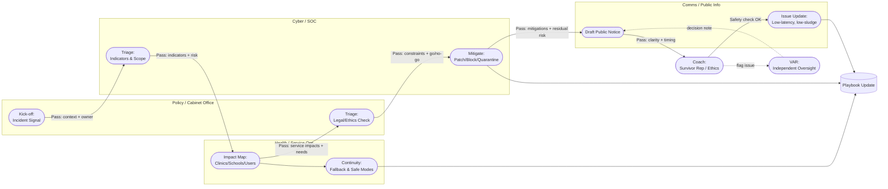

# 🏟️ Hackathon League  
**First created:** 2025-10-15 | **Last updated:** 2025-10-15  
*Interdisciplinary hackathons as civic training grounds for digital cooperation.*

---

## 🛰️ Orientation  
This node frames **cross-departmental hackathons** as the human equivalent of football leagues for digital resilience.  
The goal is not to “win” or “ship a product,” but to **train teams across silos** — government, academia, NGOs, and infrastructure engineers — to play the same game.

Each round builds **muscle memory in crisis cooperation**, so when real cyber or data emergencies hit, the players already know how to move together.

---

## ✨ Key Principles  

- **Play Together Before the Match:** regular low-stakes interdisciplinary projects create trust and shared language.  
- **Rotating Captains:** leadership rotates per round (policy lead, data scientist, educator, survivor rep).  
- **Shared Pitch:** use anonymised, low-risk datasets to simulate real-world stressors.  
- **Scouting for Blind Spots:** every team fields an *outsider analyst* to surface assumptions and jargon drift.  
- **Post-Match Film Room:** after each event, teams review decisions like sports tape — where coordination lagged, who had visibility, what tools failed.

---

## 🧭 Sidebar: Federation Model  

| Level | Focus | Analogy |
|-------|--------|---------|
| **Local Clubs** | Universities, councils, NGOs | Training academies |
| **Regional Leagues** | Sectoral mixes (e.g. health + cybersecurity) | National divisions |
| **Global Cup** | Treaty-level coordination events | World Cup of Resilience |

> Outcomes aren’t products — they’re **trained teams** and **documented plays** reusable across crises.

---

## 🎯 Match Scoring (micro-rubric)
- **Coordination latency:** time from incident signal → correct team ownership.  
- **Handoff clarity:** % of passes (tasks) with complete context & next-step owner.  
- **Visibility:** # of departments with live situational awareness at each phase.  
- **Ethics on-field:** adherence to survivor-led safeguards and least-harm defaults.  
- **After-action quality:** completeness of playbook updates and replay notes.

---

## 🏋️ Drills Menu — Training Scenarios

| Drill | Focus | Starter Dataset | Learning Outcome |
|-------|--------|-----------------|------------------|
| **1. Cookie Chaos Cup** | Policy & UX | Synthetic logs of consent pop-ups + latency | Harmonise privacy compliance with usability targets |
| **2. Data Breach Relay** | Cyber & Comms | Mock CSV of exposed records (anonymised) | Practise fast containment + coordinated public messaging |
| **3. Disinformation Derby** | Media & Education | 50 false posts + 10 genuine news items | Detect narrative drift + publish verification brief |
| **4. Cloud Outage Scrimmage** | Infra & Health | Simulated API failures from hospital systems | Route fallback protocols + interdepartmental escalation |
| **5. Sandbox Solidarity** | Social & Local Gov | Civic dataset on school broadband access | Design cooperative funding flow + transparency dashboard |

> Each drill ends with a **film-room debrief**: map the passes, evaluate visibility, log what would need a standing protocol.

---

## 🧤 Coaching Notes — Mentor Template

| Field | Example Entry | Purpose |
|--------|----------------|----------|
| **Match Date / Drill Name** | 2025-10-15 / *Cookie Chaos Cup* | Reference for logs |
| **Team Composition** | Policy (Cabinet), Cyber (SOC), EdTech NGO | Track diversity + balance |
| **Best Assist** | Cyber → Comms: clean, timestamped data handoff | Celebrate clarity under pressure |
| **Ethical Yellow Card** | Comms draft leaked too early | Highlight near-miss or boundary breach |
| **Blind Spot Noted** | Accessibility not reviewed before release | Feed into next-round training |
| **Player Substitution** | Health analyst swapped in mid-round | Capture role agility |
| **VAR Decision** | Oversight overruled automatic takedown | Transparency record |
| **Post-Match Reflection** | “Coordination slowed at policy handoff — add checklist.” | Institutional learning |

> 🗒️ *Coaches annotate live; notes feed into the central Playbook for cumulative pattern analysis.*

---

## 🗺️ Team Coordination Flow (football metaphor)

> **Alt-text (diagram):** Four “lines” (Policy, Cyber, Health, Comms) pass an incident like a ball. Each pass includes context, risk, and next owner. A Coach (Survivor Rep / Ethics) can pause play for safety checks. A VAR (Oversight) reviews controversial decisions; the Playbook updates at the end.

**Reading the play:**  
- **Passes = task handoffs** with full context (owner, timing, risk, decision rights).  
- **Coach** can pause or re-route on harm signals.  
- **VAR** (independent oversight) reviews contentious moves.  
- **Playbook** captures improvements for the next match.

---

## 🌌 Constellations  
🏟️ 💡 🧠 🤝 — Operates in the coordination and resilience register; the human-training flank of digital hygiene.

---

## ✨ Stardust  
hackathons, interdisciplinary teams, public sector innovation, civic resilience, training, cooperation, simulation, crisis literacy, digital hygiene, football analogy

---

## 🏮 Footer  

*Hackathon League* is a living node of the Polaris Protocol.  
It reframes hackathons as cross-disciplinary training spaces that build muscle memory for coordinated public-interest tech response.  

> 📡 Cross-references:  
> - [💧 Sludgy Solutions](./💧_sludgy_solutions.md) — cooperative system design  
> - [🌍 Treaty for the English Internet](../../Big_Picture_Protocols/🧿_Watch_The_Watchers/🌍_treaty_for_the_english_internet.md) — international coordination  
> - [🧒 How to Internet for Kids](./🧒_how_to_internet_for_kids.md) — early literacy and teamwork foundations  

*Survivor authorship is sovereign. Containment is never neutral.*  

_Last updated: 2025-10-15_
