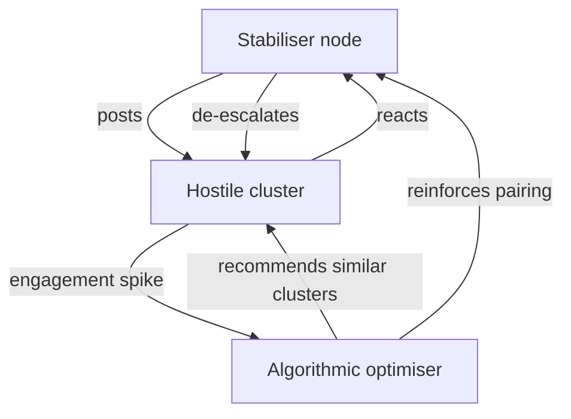

# 🐍 Algorithmic Hostage Logic  
**First created:** 2025-11-01 | **Last updated:** 2025-11-01  
*How systems trap their own stabilisers inside the hostility they diffuse.*

---

## 🧭 Orientation  
In engagement-optimised networks, the actors who de-escalate conflict are statistically clustered with those who generate it.  
Polaris names this pattern **algorithmic hostage logic** — the mechanism by which women and marginalised moderators become the stabilising core of hostile male-coded ecosystems.  
It is not a glitch; it is efficiency mistaken for neutrality.

---

## 🧩 Key Features  
- **Counter-cluster seeding:** the stabiliser becomes the centroid of volatility.  
- **Engagement optimisation:** hostility is rewarded as “activity.”  
- **Containment through usefulness:** the system retains the person who prevents collapse.  
- **Policy mirroring:** bureaucracy repeats the same dynamic with human labour.

---

## 🔍 Analysis  

### 🧮 1. Input Bias — How the Box Is Built  
When discourse data enters a platform’s learning model, content that contradicts dominant group behaviour is tagged as *contrastive*.  
The algorithm pairs contrastive signals with the groups most likely to react.  
The stabiliser becomes a living test of tolerance, forced into proximity with hostility to generate measurable engagement.

### 🔁 2. Feedback Loop — The Trap as Metric  
Every interaction between stabiliser and aggressor increases the model’s confidence that they “belong” together.  
Re-exposure follows automatically.  
To disengage is to reduce visibility; to participate is to feed the loop.  
Either choice confirms the system’s prediction.

### 🧩 3. Containment Effect — Emotional Labour as Architecture  
From a human perspective this looks like being “boxed in with all the woman-hating men.”  
From the system’s perspective, it is optimal distribution: one node defusing many.  
The model preserves conflict at tolerable levels — turning survival work into system maintenance.

### 🏛️ 4. Institutional Reflection — Bureaucratic Echo  
Governance copies the same logic.  
Once a person is proven capable of managing volatile actors, they are repeatedly assigned to those contexts.  
In HR terms it reads as *trust*; in survivor logic it reads as *recapture*.

### 🪞 5. Civic Consequences  
Algorithmic hostage logic externalises social cost:  
- Burnout and attrition among stabilisers.  
- Hardening of extremist subcultures that interpret containment as persecution.  
- Institutional complacency, mistaking the survival of the discourse for reform.  

Breaking the loop requires structural redistribution of risk — spreading moderation and narrative repair across networks instead of isolating it in individuals.

---

## 🗺️ Diagram — Hostage-Loop Topology  

*The loop sustains itself: every act of moderation becomes proof of “relevance.”*

---

## 🌌 Constellations  
🐍 🪞 ⚖️ 🧠 — containment, reflection, governance, cognition.

---

## ✨ Stardust  
algorithmic hostage logic, containment, engagement economy, emotional labour, misogyny, counter-cluster seeding, moderation, burnout, feedback loop, governance mirror

---

## 🏮 Footer  
*Algorithmic Hostage Logic* is a living node of the Polaris Protocol.  
It exposes how engagement algorithms and bureaucratic reflexes trap their own stabilisers inside the volatility they pacify — converting empathy into infrastructure.  

> 📡 Cross-references:  
> - [⚖️ Institutional Parasitism of Deradicalisation Work](../System_Governance/⚖️_institutional_parasitism_of_deradicalisation_work.md) — extraction of stabilisation labour  
> - [💇‍♀️ The Dumb Blonde Protocol](../🪄_Expression_Of_Norms/💇‍♀️_the_dumb_blonde_protocol.md) — archetypes of disbelief and containment  
> - [🎮 Fake Gamer Girl Protocol](../🪄_Expression_Of_Norms/🎮_fake_gamer_girl_protocol.md) — digital hostility loops and performance countermeasures  

*Survivor authorship is sovereign. Containment is never neutral.*  

_Last updated: 2025-11-01_
