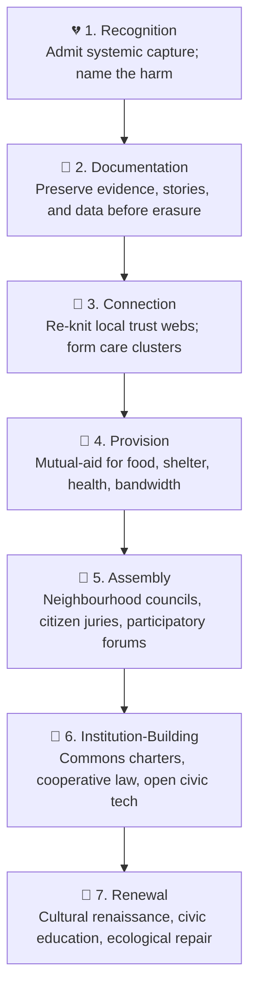

# 🐝 Post-Protofascist Reconstruction  
**First created:** 2025-11-09 | **Last updated:** 2025-11-23  
*Practical civic recovery plans for the period after systemic capture.*

---

## 🧭 Orientation  
If protofascism is the condition, reconstruction is the therapy.  
This node sketches how civic life can regenerate once the capture phase begins to collapse.  
Polaris treats reconstruction not as “back to normal” but as **building differently**: decentralised, mutual-aid-driven, transparent, and slow enough to heal.  

---

## 🧩 Key Features  
- **Commons Rebuilding** — local food, care, and data infrastructures under community control.  
- **Legal Re-grounding** — restorative rather than punitive justice; truth-first commissions.  
- **Archival Recovery** — rebuild public memory before revisionism sets in.  
- **Democracy from Below** — assembly networks, civic juries, participatory budgeting.  
- **Cultural Remythology** — replacing purity and fear with solidarity and curiosity.  

---

## 🪜 Civic Recovery Ladder  

