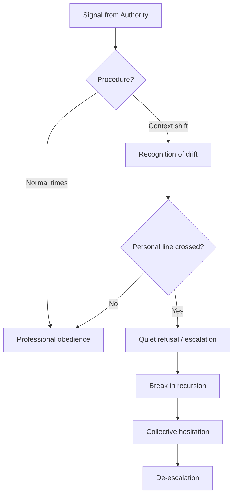

# 👁 Finch and the Limits of Obedience
**First created:** 2025-11-01 | **Last updated:** 2025-11-01  
*How ordinary work cultures create moral lag — and how people inside systems find their line.*

---

## 🧭 Orientation
Most people in authoritarian slides are not villains or heroes. They are professionals performing procedure.  
This node uses the *Inspector Finch* archetype (from *V for Vendetta*) as a lens for understanding **ethical refusal from within** — the moment when a conscientious employee realises obedience has become participation in harm.

---

## 🧩 Key Features
- **Moral Lag** — when loyalty, routine, and risk-aversion delay recognition of harm.  
- **Projection Bias in Governance** — assuming dissenters plot hierarchy because that is how authority thinks.  
- **Complicity Gradient** — roles that look neutral but operationalise violence.  
- **Quiet Refusal** — de-escalation through non-repetition of a harmful gesture (the order that simply isn’t obeyed).  

---

## 🔍 Analysis

### 1️⃣ Bureaucratic Obedience as Ordinary Ethics
Obedience is usually taught as professionalism: meet targets, reduce variance, minimise liability.  
In crisis, the same virtues produce **moral lag**. People continue to enact yesterday’s procedure even when today’s context has changed.  
Finch represents the average conscientious worker: *alert enough to notice drift, socialised enough to keep performing until the evidence overwhelms him.*

### 2️⃣ Projection Bias (Why Authority Misreads Dissent)
Security cultures often project their own coordination logic onto dissent: *cadre, command, conspiracy.*  
But many “anarchist” and adjacent circles operate as **moral diagnostics**, not as operational plots — debating limits, obligations, and refusal under hypothetical pressure.  
Misreading that discourse leads to overreach and unnecessary escalation.

### 3️⃣ The Complicity Gradient
Between command and target lies a chain of “neutral” tasks: compliance checks, procurement, scheduling, messaging.  
Each task feels harmless, but together they enact harm. Mapping this gradient makes the tipping point legible: **which gesture, if withheld, de-powers the chain?**

### 4️⃣ Quiet Refusal in Practice
Most collapses begin with a non-event: the baton not raised, the email not sent, the order not relayed.  
Quiet refusal is not theatre; it is a **break in recursion**. Its power lies in timing and coordination — hesitation that appears simultaneously across a network.

---

## 🧪 Field Cues (for people inside systems)
- *Body check:* Do you feel dread before routine tasks that affect real people?  
- *Context check:* Has the external situation changed while your procedure stayed the same?  
- *Distance check:* Would you act identically if the subject were someone you loved?  
- *Reversibility check:* Can the harm be undone by an apology or refund? If not, escalate concern.  
- *Plurality check:* If five conscientious peers paused, would the harmful outcome still occur? If not, you have leverage.

---

## 🗺️ Lightweight Map

---

## 🧵 Finch Inset (Archetype)
> A civil servant who keeps doing his job until the logic of the job becomes unbearable.  
> His final act isn’t spectacle but hesitation — the refusal to repeat one more harmful instruction.

---

## 🌌 Constellations
🪄 Expression of Norms · 🎙 Voice & Silence · 🧿 Perception & Drift · 🎛 Survivor Voice Fidelity

---

## ✨ Stardust
moral lag, bureaucratic obedience, projection bias, complicity gradient, quiet refusal, hesitation, chain-of-command, de-escalation, ethics of work

---

## 🏮 Footer
*👁 Finch and the Limits of Obedience* is a living node of the Polaris Protocol.  
It offers language and cues for people inside institutions to recognise when professionalism has become participation.

> 📡 Cross-references:  
> - [🧵 Overproduction as Human Boredom Response](../🧵_overproduction_as_human_boredom_response_expanded.md) — creative motion under containment  
> - [🎙 The Silence After Command](../🎙_the_silence_after_command.md) — de-escalation by absence

*Survivor authorship is sovereign. Containment is never neutral.*  

_Last updated: 2025-11-01_
