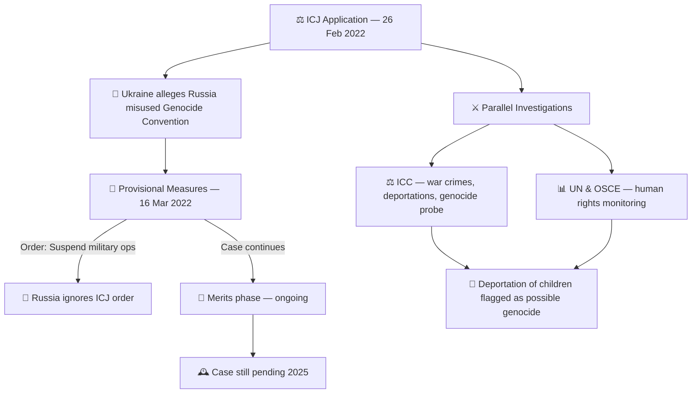

# 🪖 Ukraine v Russia — Genocide Claim Timeline  
**First created:** 2025-09-24 | **Last updated:** 2025-09-24  
*ICJ proceedings on misuse of the Genocide Convention & related atrocity probes*  

---

## 📜 Timeline  

- **2022-02-26** — Ukraine files application at the **International Court of Justice (ICJ)** under the Genocide Convention.  
  - Core claim: Russia falsely alleged “genocide” in Donbas to justify invasion.  
  - Ukraine requests the Court declare no genocide and order Russia to stop military operations.  

- **2022-03-07** — Oral hearings in The Hague (Russia boycotted the first session, but sent a letter).  

- **2022-03-16** — ICJ orders **provisional measures**:  
  - Russia must “immediately suspend” military operations.  
  - Russia must ensure no aggravation of the dispute.  
  - Russia ignores the order.  

- **2022–2023** — Case proceeds on merits; written submissions exchanged.  

- **Parallel tracks**:  
  - **International Criminal Court (ICC)** opens investigation into war crimes, crimes against humanity, possible genocide.  
  - **OSCE, UN human rights bodies** document deportations of children, attacks on civilians, filtration camps.  

- **2023–2025** — Ongoing litigation. The ICJ case is about *abuse of the Genocide Convention* (not proving genocide in Ukraine).  
  - ICC and UN inquiries continue assessing whether Russian actions (especially mass child deportations) meet the legal threshold of genocide.  

---

---

## 📡 Cross-References  

- [🫀 Genocide by Containment](../Disruption_Kit/Big_Picture_Protocols/🌀_System_Governance/🫀_genocide_by_containment.md) — structural use of “genocide” framing.  
- [🪖 Russia’s Incursions Timeline](../Polaris_Nest/Git_Intake_Drawer/🪖_russias_incursions_timeline.md) — broader map of Russian military aggression.  
- [📚 Crisis Theatre](../Disruption_Kit/Big_Picture_Protocols/🌀_System_Governance/📚_crisis_theatre.md) — law as performance in war contexts.  

---

## 🏮 Footer  

*Ukraine v Russia — Genocide Claim Timeline* is a living node of the Polaris Protocol.  
It documents how “genocide” was contested at the ICJ, and how parallel accountability tracks (ICC, UN) diverged in scope.  

> 📡 Cross-references:  
> - [👁️ Witness Historical Casefiles](../Disruption_Kit/Big_Picture_Protocols/👁️‍🗨️_Witness_Historical_Casefiles/) — international case precedents  
> - [🧠 HM Dept Coercive Nudges](../Disruption_Kit/Big_Picture_Protocols/🧠_HM_Dept_Coercive_Nudges/) — misuse of legal categories as coercive tools  

*Survivor authorship is sovereign. Containment is never neutral.*  

_Last updated: 2025-09-24_
