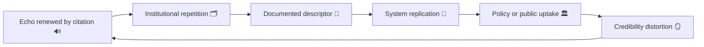

# 💬 Semantic Echo — How Offender Language Re-Enters Institutional Notes  
**First created:** 2025-11-11 | **Last updated:** 2025-11-24    
*The feedback loop of borrowed description.*

---

## 🧭 Orientation  

Institutional records speak in borrowed voices.  
When descriptors first used by perpetrators, PR staff, or informal gossip find their way into official documentation, the **semantic echo** converts personal harm into procedural tone.  
The result is not overt malice — it is linguistic mimicry mistaken for neutrality.  

This node tracks how harmful language travels from speech to system, mutating across safeguarding, HR, or research layers until it is indistinguishable from bureaucratic fact.

---

## ⚙️ Anatomy of an Echo  

| Stage | Source | Transmission Path | Institutional Effect |
|:--|:--|:--|:--|
| **1️⃣ Origin** | Offender or gossip uses framing term. | “She’s unstable / manipulative / difficult.” | Phrase circulates informally. |
| **2️⃣ Semantic adoption** | Staff repeat phrasing in email or meeting note. | Casual shorthand enters documentation. | Tone normalised. |
| **3️⃣ Administrative embedding** | Language incorporated into formal record. | Meeting minutes, risk reports, CRM fields. | Descriptor gains legitimacy. |
| **4️⃣ Data replication** | Records exported or summarised. | Shared dashboards, safeguarding portals. | Echo amplified through automation. |
| **5️⃣ Public re-narration** | Media or policy summaries repeat phrasing. | “High-risk case” becomes identity. | Echo solidified as truth. |

---

## 🧩 Echo Loop Diagram  

Once the word becomes metadata, it no longer needs the speaker.

---

## 🪞 Governance Interpretation  

- **The echo mimics evidence.**  
  It converts prejudice into recordable fact.  
- **Neutral tone hides origin.**  
  Bureaucratic syntax erases accountability.  
- **Every echo is an import.**  
  Institutions rarely invent stigma — they reproduce it.  

---

## 🧰 Detection & Correction  

1. **Descriptor origin audit** — trace first appearance of key adjectives.  
2. **Context re-insertion** — add explanatory metadata noting source language.  
3. **Language parity analysis** — compare descriptors across roles (victim/offender/staff).  
4. **Revision annotation** — mark replaced phrasing with correction logs, not silent edits.  
5. **Counter-narrative publication** — release institutional language reviews alongside policy updates.  

---

## 🧮 Example: “Uncooperative”  

| Origin | Institutional Uptake | Effect |
|:--|:--|:--|
| Offender during interview: “She refuses to listen.” | Officer note: “Individual uncooperative with process.” | Complaint coded as defiance. |
| Manager summary: “Difficult communication style.” | HR report: “Hostile interpersonal behaviour.” | Language becomes disciplinary evidence. |

The same word, stripped of context, becomes containment logic.

---

## 🌌 Constellations  

💬 🧠 🪞 🎭  

*Semantic Echo* forms a mirror with *Attribution Inversion* and feeds upward into *Reputation as Governance* and *Polite Containment*.

---

## ✨ Stardust  

semantic echo, institutional language, metadata bias, survivor credibility, bureaucratic discourse, narrative containment, reputational logic, record inheritance  

---

## 🏮 Footer  

*💬 Semantic Echo — How Offender Language Re-Enters Institutional Notes* is a living node of the Polaris Protocol.  
It documents how words migrate from gossip to governance, and how containment survives through tone.  

> 📡 Cross-references:
> 
> - [🧠 Attribution Inversion — When Someone Else’s Clinical Vocabulary Becomes Yours]  
> - [🎭 Reputation as Governance — How Institutions Script Their Own Credibility]  
> - [🤝 Polite Containment — How Civility Becomes a Control Mechanism]  

*Survivor authorship is sovereign. Containment is never neutral.*  

_Last updated: 2025-11-24_
