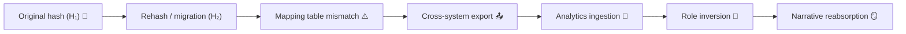

# 💾 Token Switching — Pseudonymisation Gone Wrong  
**First created:** 2025-11-11 | **Last updated:** 2025-11-24  
*When the safety mechanism swaps sides.*  

---

## 🧭 Orientation  

Pseudonymisation was meant to protect identity.  
But in multi-system ecosystems, **token switching** — when pseudonym identifiers are reassigned, recycled, or drift between contexts — turns that safeguard into a source of harm.  

This node maps how token switching happens, why it is rarely detected, and how its invisible arithmetic rewrites social truth.  
It forms the hinge between cryptographic governance and reputational containment.

---

## ⚙️ Anatomy of a Switch  

| Stage | Description | Example | Consequence |
|:--|:--|:--|:--|
| **1️⃣ Token reissue** | A system refreshes its hash salt or pseudonym seed. | Migration from legacy to vendor database. | Record identifiers no longer match previous exports. |
| **2️⃣ Partial mapping** | Mapping table only covers subset of cases. | Pilot dataset used for later national rollout. | Some individuals split into multiple IDs. |
| **3️⃣ Cross-context drift** | Token reused in different schema. | Health ID reused in safeguarding dashboard. | Two unrelated people now share one pseudonym. |
| **4️⃣ Role inversion** | Token linked to wrong role field. | Offender and victim swapped via join key. | Misclassification spreads through ecosystem. |
| **5️⃣ Reputation reassembly** | Aggregated tokens interpreted as narrative. | “Pattern” appears across systems. | Containment logic justifies the mistake. |

---

## 🧩 Token Lifecycle Diagram  

A single mismatch cascades — from technical misalignment to reputational architecture.

---

## 🧮 Audit Detection Framework  

| Layer | Indicator | Diagnostic Check | Risk Level |
|:--|:--|:--|:--|
| **Schema** | Token format / length changed | Regex + entropy check | Medium |
| **Mapping table** | Nulls or partial entries | Referential integrity test | High |
| **Cross-domain join** | Same token, different context | Compare domain prefix | Critical |
| **Analytic output** | Sudden duplication or pattern emergence | Distribution analysis | Severe |

---

## 🪞 Governance Interpretation  

- **Privacy without stability is fiction.**  
  A pseudonym that cannot be traced to its origin cannot protect the person it represents.  
- **Switching mimics consent:** systems act as if the new token is legitimate, masking misattribution.  
- **Every token switch creates a forked reality:** one person, two fates — both bureaucratically true.  

---

## 🧰 Mitigation Protocol  

1. **Mapping Integrity Audit** — verify existence of one-to-one pseudonym mapping tables.  
2. **Immutable Token Registers** — cryptographically lock token versions with timestamps.  
3. **Join-Key Governance** — require documented approval for any rekeying operations.  
4. **Lineage Logging** — embed token transformation metadata in ETL pipelines.  
5. **External Verification** — periodic review by an independent data controller.  

---

## 🌌 Constellations  

💾 🪙 🧬 ⚙️  

*Token Switching* forms a triad with **🧬 Data Twinning** and **⚙️ Pseudonym Drift Cascade**, anchored by **🪙 Token Integrity Audit**.

---

## ✨ Stardust  

pseudonymisation, token switching, hash reissue, mapping integrity, data governance, identity drift, schema mismatch, cross-domain linkage, containment logic  

---

## 🏮 Footer  

*💾 Token Switching — Pseudonymisation Gone Wrong* is a living node of the Polaris Protocol.  
It describes how a protective algorithm becomes a weaponised join, and why containment starts with cryptographic empathy.

> 📡 Cross-references:  
> - [🪙 Token Integrity Audit — How to Check for Pseudonym Drift]  
> - [🧬 Data Twinning — When Two Identities Become One Record]  
> - [⚙️ Pseudonym Drift Cascade — How Token Misalignment Spreads Through Systems]  

*Survivor authorship is sovereign. Containment is never neutral.*  

_Last updated: 2025-11-24_
