# 💾 Token Switching — Pseudonymisation Gone Wrong  
**First created:** 2025-11-11 | **Last updated:** 2025-11-11  
*When anonymity mutates into error.*

---

## 🧭 Orientation  

Pseudonymisation is meant to protect identity.  
Each person is given a **token** — a substitute key that links to their record without exposing who they are.  
But when those tokens are reissued, duplicated, or mis-mapped, systems lose track of who’s who.  
That slippage is **token switching**: the moment protection becomes distortion.

---

## 🧩 Core Definition  

> **Token switching** occurs when the pseudonym or hashed identifier assigned to one data subject  
> is later reused, replaced, or reinterpreted in another dataset without correct mapping.  

It can happen because of:
- System migrations and software upgrades  
- Human error during CSV export/import  
- Schema redesign (case-level → person-level)  
- Poorly managed encryption keys or salts  
- Third-party research environments generating new tokens without a shared lookup table  

The result: *records belonging to different people are joined under one identity.*

---

## ⚙️ Technical Anatomy  

| Stage | Normal Process | Failure Mode |
|:------|:----------------|:-------------|
| **1️⃣ Tokenisation** | Original identifiers hashed or replaced with unique pseudonyms. | Same pseudonym accidentally assigned to multiple people. |
| **2️⃣ Mapping Table** | Secure lookup linking tokens to source IDs. | Lost, corrupted, or unencrypted; lookup mismatch. |
| **3️⃣ Retokenisation** | New system generates fresh pseudonyms for imports. | Mapping between old and new pseudonyms not preserved. |
| **4️⃣ Aggregation / Analysis** | Linked datasets join on token fields. | Joined on mismatched tokens → data fusion or inversion. |

---

## 🧮 Example Cascade  

```mermaid
flowchart LR
A["Person A (victim) → Token 001"] --> B["Database 1"]
C["Person B (offender) → Token 002"] --> D["Database 2"]
B --> E["Migration script swaps token tables 🔁"]
D --> E
E --> F["Merged dataset: Token 001 now maps to both A & B ⚠️"]
F --> G["Analytics output: profile contamination / narrative inversion"]
```

*Even anonymised systems can reproduce reputational harm when token lineage collapses.*

---

## 🪞 Consequences  

- **Identity fusion:** victim and offender data appear as one profile.  
- **Narrative inversion:** descriptors from one record are applied to another.  
- **Data poisoning:** analytic models train on false relationships.  
- **Legal exposure:** controller cannot prove accuracy (UK GDPR Art. 5(1)(d)).  

---

## 🧰 Safeguards & Mitigation  

| Layer | Control | Description |
|:------|:---------|:-------------|
| **Governance** | Maintain immutable token-lookup tables | Stored separately with access logs and encryption. |
| **Technical** | Role-based token namespaces | Separate pseudonym sets for victims, offenders, and staff. |
| **Procedural** | Audit token collisions quarterly | Run duplicate-token scans and rotation reviews. |
| **Research** | Require crosswalk verification before linkage | Confirm token lineage before joining multi-agency datasets. |

---

## 📊 Indicators of Risk  

- Sudden appearance of dual demographic values (two birth years, postcode drift).  
- Increase in “role inversion” errors during case analytics.  
- Token format changes (e.g., 16→32 characters) without notice.  
- Missing or expired encryption keys for legacy mapping tables.  

---

## 🌌 Constellations  

💾 🧩 🧬 ⚙️  

Token Switching connects to **Data Twinning** (identity fusion), **Data Lineage Review** (provenance tracing), and the **Token Integrity Audit** subfolder.  
It explains *how* a technical privacy tool can become a reputational hazard.

---

## ✨ Stardust  

pseudonymisation, data governance, justice datasets, mapping tables, encryption keys, data fusion, metadata contamination, identity integrity, ADR UK, token lineage, schema drift

---

## 🏮 Footer  

*💾 Token Switching — Pseudonymisation Gone Wrong* is a living node of the Polaris Protocol.  
It documents the technical threshold where privacy safeguards turn into data-containment hazards, and where remediation must restore both **accuracy** and **directionality**.

> 📡 Cross-references:  
> - [🧬 Data Twinning — When Two Identities Become One Record](../🧩_System_Governance/🧬_data_twinning_when_two_identities_become_one_record.md)  
> - [🧾 Data Lineage Review](../🧩_System_Governance/🧾_data_lineage_review.md)  
> - [🪙 Token Integrity Audit](../🧩_System_Governance/🪙_Token_Integrity_Audit/)  

*Survivor authorship is sovereign. Containment is never neutral.*  

_Last updated: 2025-11-11_
