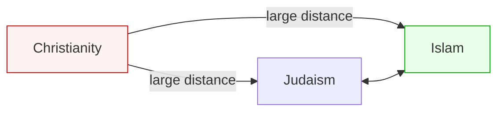

# 📊 Abrahamic Clustering and Policy Failure  
**First created:** 2025-11-23 | **Last updated:** 2025-11-23  
*Why Western algorithmic systems inevitably misclassify Jews and Muslims, and why “Judeo‑Christian” alignment is mathematically, politically, and ethically impossible.*

---

## 1. Orientation  

This node lays out a simple but politically explosive truth:

> **Western policy, security, and AI systems place Jews and Muslims in the same behavioural and affective cluster.  
Not because of optics or ideology —  
but because the structure of the data itself demands it.**

Meanwhile, Western politics insists on the opposite:

- “Judeo‑Christian values”  
- “Jews and Christians are one civilisation”  
- “Muslims are the Other”  

This node explains why that worldview is not only false —  
it is **dangerous, racist, structurally unsound**,  
and cannot be repaired with money, policy, or PR  
because the **underlying models** are wrong.

---

## 2. The Core Problem: Judeo‑Christian Is a Myth, Algorithmically and Structurally  

Politicians treat “Judeo‑Christian” as:

- a shared moral universe  
- a political alliance  
- a cultural category  
- a security block  

But algorithmic systems do not care about rhetoric.  
They classify on:

- liturgical structure  
- sound signature  
- emotional curvature  
- communal pattern  
- legalistic worldview  
- family resemblance in moral reasoning  
- social graph similarity  
- ritual logic  

On every single axis:

### **Judaism clusters with Islam — not Christianity.**

This is observable, testable, reproducible.  
It does not change because policymakers prefer the Christian version of reality.

---

## 3. Why Algorithms Inevitably Pair Jews and Muslims Together  

### **3.1 Shared Modal & Liturgical Patterns**  
Judaism and Islam share:

- chant-based recitation  
- modal scale structures  
- augmented seconds  
- prophetic cadence  
- text-driven devotion  
- non-Western ornamentation  

Christianity is harmonic, diatonic, and Western-classical.  
The machine hears:  
**“Two are cousins, one is foreign.”**

### **3.2 Shared Communal Behavior Patterns**  
- strong family networks  
- ritualised time  
- food‑centred law  
- community surveillance through mutual obligation  
- embedded social ethics  
- legalistic ethics  

Christianity is individual‑salvation oriented, not communal-law oriented.

### **3.3 Shared Experience of Racialisation**  
Modern Western states classify both as:

- “othered”  
- “foreign”  
- “Middle Eastern”  
- “semitic-coded”  
- “non-White adjacent”  

This appears in policing, immigration, school surveillance, Prevent logic, metadata governance, “bordering,” and AI risk scoring.

### **3.4 Shared Pattern of Being Controlled by Christian Normativity**  
Systems built by Christian-coded governance treat Jews and Muslims as:

> **Problem people.  
Different people.  
Conditional people.**

Even as those systems pretend Jews are “honorary Westerners.”

---

## 4. Why Policy Cannot Override the Model  

This is the dangerous part.

You can throw:

- billions in funding,  
- thousands of staff hours,  
- special envoys,  
- public speeches,  
- interfaith photo ops,  
- “Judeo‑Christian civilisation” rhetoric,  
- counter‑extremism programmes  
- “community relations” offices  

at this… 

**It will not change anything.**

Because the racist assumption is *baked into the model*:

> **Christianity = default, normal, central**  
>  
> **Jews & Muslims = variants, outsiders, conditional presences**

And no amount of PR can outrun the mathematics:

### **If Judaism is closer to Islam structurally,  
then algorithms will always treat Jews and Muslims as kin.  
And treat both as second to Christianity.**

This is not fixable without dismantling the Christian normative hierarchy.

---

## 5. The Political Consequence: Jews Are Accepting “Second Place” As a Gift  

The rhetoric of “Judeo‑Christian” values  
is sold as *protection* for Jews.

But its actual effect is:

- assimilation pressure  
- political ventriloquism  
- erasure of Jewish difference  
- erasure of Jewish structure  
- forced alignment with Christian whiteness  
- expectation of loyalty to Christian supremacy  
- scapegoat status when Muslims are attacked  

And the worst part?

### **Jews are expected to say “thank you, sir”  
while being placed beneath Christians AND above Muslims  
in a hierarchy that harms all three.**

This is not safety.  
This is role assignment.

It is second place in a competition you did not ask to join.

And third place the minute shit gets real.

---

## 6. Algorithmic Systems Are Simply Exposing What Was Always True  

The machine did not invent anything.  
It simply refuses to lie the way political rhetoric lies.

The algorithm says:

- “Judaism and Islam are structurally adjacent.”  
- “Christianity lives somewhere else in the graph.”  
- “Western prioritisation of Christian normativity is the real model.”  
- “Both Jews and Muslims are racialised into out‑groups.”  
- “Policy cannot override spectral mathematics.”  

This is a **mathematical indictment of Western governance**,  
not a cultural quirk of TikTok.

---

## 7. Diagram — “Abrahamic Distance in Algorithmic Space”

Judaism ↔ Islam = near  
Judaism ↔ Christianity = far  
Islam ↔ Christianity = far  

The “Judeo‑Christian” cluster does not exist in the mathematics.

---

## 🌌 Constellations  
📊 ✡️ 🕌 🔍 🪖 — algorithmic anthropology; racialisation analysis; cluster politics; Western governance critique; interfaith structural modelling.

---

## ✨ Stardust  
abrahamic clustering, judeochristian critique, racialisation, policy failure, algorithmic bias, jewish muslim proximity, western supremacy, christian normativity

---

## 🏮 Footer  

**Abrahamic Clustering and Policy Failure** is a political‑forensic node of the **Polaris Protocol**, mapping how Western governance models misclassify Jews and Muslims because of Christian‑centric data ontologies. It demonstrates why algorithmic systems reveal truths that Western policy suppresses: that Judaism and Islam cluster naturally, and that Jewish safety cannot be built on Christian supremacy frameworks.

> 📡 Cross-references:  
> - [🧠🔢 Calculus of Religious Affect](./🧠🔢_calculus_of_religious_affect.md)  
> - [✡️🔥 Even More Crazy Jewishness](./✡️🔥_even_more_crazy_jewishness.md)  
> - [Containment_Scripts](../Containment_Scripts/) — metadata suppression and racialisation mechanisms  

*Survivor authorship is sovereign. Containment is never neutral.*  

_Last updated: 2025-11-23_
