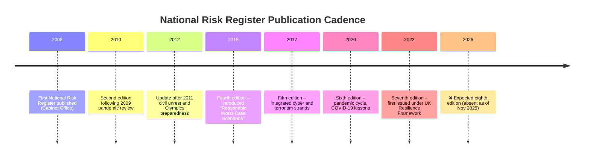

# 📊 The Missing National Risk Register 2023 – 2025  
**First created:** 2025-11-04  |  **Last updated:** 2025-11-04  
*When a country stops publishing its own risk horizon.*

---

## 🧭 Orientation  
The **National Risk Register (NRR)** is the public companion to the classified **National Security Risk Assessment (NSRA)**.  
It summarises what government believes could seriously disrupt life in the United Kingdom over the next five years — from pandemics and cyberattacks to civil unrest and energy shocks.

The last NRR was issued in **August 2023**.  
As of late 2025, no update has appeared.  
No official statement explains the omission.

This silence is not just bureaucratic delay: it suspends the mechanism by which the public, Parliament, and local authorities learn what the state currently fears most.  
It is a **data vacuum masquerading as calm**.

---

## 🧩 Normal Rhythm, Broken Pattern  

| Edition | Publisher | Expected next issue | Status |
|:--|:--|:--|:--|
| 2020 NRR | Cabinet Office / Civil Contingencies Secretariat | 2022 | superseded |
| 2023 NRR | Resilience Directorate (DLUHC RED) | 2025 | *not yet released* |

A two-year cycle is standard: the update coincides with the internal NSRA refresh and feeds directly into Local Resilience Forum (LRF) planning.  
With no 2025 edition:

- **Local Risk Registers** lose their benchmark.  
- **Resilience funding bids** (to UK Shared Prosperity Fund, resilience-capability grants) stall without new weightings.  
- **Academic and private-sector modelling** can’t calibrate probability or impact against official baselines.  

---

### 🕰️ Timeline Sidebar — The Missing Edition

**Interpretation:**  
The longest historic gap between editions was three years (2017 → 2020).  
If no new register appears by **Q1 2026**, this will become the **longest lapse in the series** since the NRR’s creation — exceeding even the post-Brexit and COVID-delay periods.

**Verification Tip:**  
Check [GOV.UK › National Risk Register](https://www.gov.uk/government/publications/national-risk-register-2023) → *View Document Properties* inside the PDF.  
You’ll see `Created 2023-08-03`, `Modified 2023-08-10` — confirmation that the 2025 “updated” timestamp refers only to the web-page republish, not new risk data.

**Polaris Annotation:**  
> When risk documentation stalls during peacetime, it is not because the world is calm.  
> It is because the truth about instability has become politically unprintable.  
> — *Polaris Civil Security Commentary, 2025*

---

## ⚠️ Consequences of the Suspension  

### 1. Local Disorientation  
LRFs are required to align community-risk assessments to national categories.  
Without a new NRR, councils either reuse 2023 figures or invent ad hoc priorities.  
The result is drift: neighbouring authorities plan to different hazard profiles.

### 2. Accountability Freeze  
Publication is the only public moment when Parliament or journalists can see which threats have been upgraded or downgraded.  
A missing cycle prevents scrutiny of decisions about **civil disorder**, **community cohesion**, and **hostile-state activity**.

### 3. Political Discomfort  
A 2025 register would have to quantify the social-tension landscape revealed by the **2024 riots** and international conflicts.  
Listing “community tension” or “inter-communal violence” as top-tier risks would confirm fragility the government prefers to frame as isolated unrest.  
Withholding the data avoids that headline.

### 4. Erosion of Trust  
Risk transparency is one of the quiet guarantees of democratic legitimacy: citizens can see what their government sees.  
When the signal stops, communities most at risk — Muslim, Jewish, Black, migrant — hear silence as confirmation that they are being spoken about, not spoken to.

---

## 🧠 Reading Between the Lines  
Analysts can still infer the direction of travel by tracking what *is* being published:  

| Proxy Source | What It Reveals |
|:--|:--|
| **DLUHC RED “Resilience Framework Delivery Update” (2024)** | Focus shift toward infrastructure and cyber resilience; no mention of social cohesion. |
| **HMICFRS Inspection of 2024 Disorder** | Admits capacity and coordination failures between police and local authorities. |
| **Local Resilience Forum reports (2024–25)** | Increasing references to “community assurance,” “civil contingencies staffing gaps,” and “single points of failure.” |
| **Cabinet Office annual accounts** | Budget lines for Civil Contingencies Secretariat remain flat — suggesting no new publication cycle in progress. |

Together they imply that the analytical work continues internally, but the **public layer has been paused** for political reasons.

---

### 🧩 Sidebar — Why Risk Registers Go Missing  

The absence of the 2025 *National Risk Register* is not an administrative oversight.  
It reflects how political optics, bureaucratic friction, and limited capacity intersect to make transparency the first casualty of discomfort.

1. **Optics**  
   After the 2024 unrest and widening international tensions, any new edition would have to promote *civil disorder*, *community tension*, and *disinformation* up the threat hierarchy.  
   Printing that would headline the United Kingdom as unstable—an unacceptable message during an election cycle built on “steady hands.”

2. **Cross-departmental friction**  
   - **DLUHC RED** manages community resilience.  
   - **The Home Office** controls counter-terrorism and Prevent.  
   - **The Cabinet Office** owns the risk framework.  
   When these three disagree on weighting or wording, the document stalls in limbo until ministers arbitrate.

3. **Pending strategy rewrite**  
   The *UK Resilience Framework* (2022) promised a full *National Resilience Strategy* to replace Civil Contingencies guidance.  
   If that rewrite is unfinished, officials prefer not to release a register calibrated to an outdated model.

4. **Resource diversion**  
   The Resilience Directorate is small; during real-time crises—flooding, unrest, overseas conflict—its analysts are seconded to operations.  
   The routine publication becomes a “nice to have,” easily displaced by the urgent.

5. **Political risk management**  
   Ministers personally sign off the NRR.  
   If the draft mentions *public trust in institutions* or *extremist polarisation*, it can languish in clearance for months while advisers weigh briefing risk against transparency benefit.

The delay is therefore not a single conspiracy but a composite of **institutional caution and political risk aversion**.  
Yet the effect is indistinguishable from intentional opacity: without an updated register, no one outside the core of government knows which hazards are ascendant or how priorities have shifted.

> *Polaris commentary:*  In governance as in weather, silence is rarely calm; it is pressure building in the system.

---

## 📄 Suggested FOI Template  

> **Subject:** Status of the National Risk Register Update  
>  
> Dear Cabinet Office Resilience Directorate,  
>  
> Under the Freedom of Information Act 2000 please provide:  
> 1. The planned publication date for the next National Risk Register.  
> 2. The reason for its delay or suspension since the 2023 edition.  
> 3. Any briefing notes, correspondence or minutes between the Cabinet Office, DLUHC RED and the Home Office referring to the NRR 2025 update.  
>  
> Yours faithfully,  
> [Your Name]  

---

## 🌌 Constellations  
🏛️ Civil Security → 📊 The Missing National Risk Register 2023–2025  
Linked to:  
- [🚨 Civil Disorder Response and Governance Single Points of Failure](🚨_civil_disorder_response_and_governance_single_points_of_failure.md)  
- [🔺 The Golden Triangle and the Hidden Constitution of Local Government](🧭_Governance_Ecologies/🔺_the_golden_triangle_and_the_hidden_constitution_of_local_government.md)  

---

## ✨ Stardust  
national risk register, resilience, dluhc red, civil contingencies, risk governance, information suppression, data vacuum, accountability, soft authoritarianism, transparency delay, foi  

---

## 🏮 Footer  
*The Missing National Risk Register 2023 – 2025* is a live investigative node within the **Civil Security** cluster of **🛰️ OSINT Field Operations**.  
It documents how the absence of a routine risk publication becomes a form of containment, concealing instability by withholding metrics of fear itself.  

*Survivor authorship is sovereign. Containment is never neutral.*  

_Last updated: 2025-11-04_
