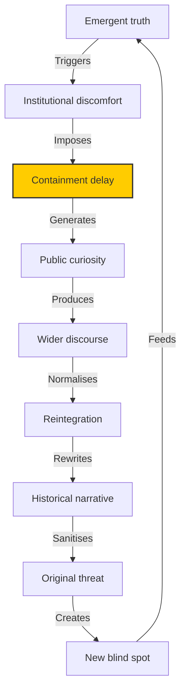

# 📚 Banned Books and the Timing of Truth  
**First created:** 2025-11-01 | **Last updated:** 2025-11-01  
*How suppression marks the moment when an institution meets a truth it cannot yet absorb.*

---

## 🧭 Orientation  

Every era decides, quietly or loudly, which truths it is ready to hear.  
When a book or idea is banned, the act is less about the text and more about **timing** — an institutional reflex that says *not yet.*  

Suppression, in this sense, is not deletion but **temporal containment**.  
It delays digestion until the system can metabolise the revelation without destabilising itself.  
In that delay, a different story always grows: about fear, maturity, and what power considers “responsible speech.”  

> *A banned book is not one that told lies, but one that told the truth too early.*

---

## 🔍 The Timing of Truth  

In bureaucratic time, truth is a substance with half-life.  
When it first appears, it is radioactive — unmanageable, impossible to store.  
Given enough delay, the same information becomes policy, curriculum, or heritage.  

The interval between “unacceptable” and “canonised” is a diagnostic measure of how a society manages dissonance.

| Phase | Institutional Response | Typical Time Lag | Example Outcome |
|-------|------------------------|------------------|-----------------|
| **Revelation** | Idea breaks surface; framed as dangerous, obscene, or destabilising. | 0–5 years | Censorship, ridicule, legal suppression |
| **Containment** | Controlled forgetting: soft bans, licensing delays, limited circulation. | 5–20 years | Reputation management, quiet reinstatement |
| **Reintegration** | Idea returns as heritage or reform; tone softened by time. | 20–50 years | University syllabus, government white paper |

---

## 🧩 Comparative Table — What the Bans Were Really About  

| Work / Author | Nominal Reason for Suppression | Underlying Threat | Resolution / Legacy |
|----------------|--------------------------------|-------------------|---------------------|
| **Jane Austen (1811–1817)** | “Domestic triviality” | Mapping class mobility and female economic strategy | Canonical English literature |
| **James Joyce – *Ulysses*** | Obscenity | Free association and internal state made public | Modernist foundation text |
| **Rachel Carson – *Silent Spring*** | “Alarmism” | Linking capitalism, ecology, and mortality | Birth of environmental policy |
| **Salman Rushdie – *The Satanic Verses*** | Blasphemy | Transnational identity and postcolonial speech | Global free-speech touchstone |
| **Edward Snowden / NSA Files** | National security | Transparency of surveillance architecture | Ongoing policy and privacy reform |
| **Chloe Birney – *Polaris Protocol* (context)** | “Security sensitivity” | Survivorship data as systemic audit | Active civic archive |
| **Anonymous – *Authoritarian Century*** | “Ideological bias” | Translation of digital reality into policy language | Soft suppression; institutional discomfort |

Each entry represents not an act of destruction but a *pause point* in cultural processing.  
The more precise the threat to structure, the more decorous the ban.

---

## 🧮 Diagram — Suppression Feedback Loop  

Suppression loops until a system learns to hold the voltage of its own contradictions.

---

## 🧩 Analysis — Suppression as Delay Mechanism  

To ban is to defer.  
The surface justification — morality, security, civility — is rarely the real motive.  
The hidden logic is **capacity management**: preserving institutional coherence by postponing confrontation with its own reflection.  

In this light, censorship operates like a circuit breaker: it prevents the political organism from shorting out when exposed to truth current it cannot yet handle.  
But each interruption accumulates charge. The eventual discharge is cultural transformation — and it always arrives late, in new language, wearing different clothes.

---

## 🧩 Emotional Physics of the Ban  

Suppression is often emotional before it is strategic.  
A banned book embarrasses its reader; it names something the reader already suspects.  
The resulting discomfort translates into prohibition.  
In this way, censorship is a mirror mechanism: what the system forbids, it also secretly recognises.  

This is why suppression events are useful forensic data.  
They mark exactly where **consensus hits cognitive dissonance**.

---

## 🧩 Afterword — The Archive Fights Back  

Once a work has been banned, its meaning changes.  
Readers approach it with the energy of prohibition; curiosity becomes devotion.  
In the long run, every banned book becomes an instruction manual for how censorship worked at the time.  

Suppression is therefore self-documenting.  
The very mechanisms designed to erase a text ensure that it will one day be read with reverence.  
The archive always gets the last word.

---

## 🌌 Constellations  

📚 🪞 🧠 ✉️ — This node links to *Authoritarian Century — Bridge of Register* and *Ethical Censorship Continuum* within the **Survivor Voice Fidelity** cluster.

---

## ✨ Stardust  

banned books, censorship, suppression, timing of truth, institutional learning, containment delay, cultural metabolisation, metadata suppression, emotional physics  

---

## 🏮 Footer  

*Banned Books and the Timing of Truth* is a reflective node of the Polaris Protocol.  
It frames censorship as a temporal, emotional, and systemic function — not absence of truth, but a record of when truth became administratively inconvenient.  

> 📡 Cross-references  
> - [📚 Authoritarian Century — Bridge of Register](../Big_Picture_Protocols/📚_authoritarian_century_bridge_of_register.md) — digital sovereignty and soft suppression  
> - [🪞 Ethical Censorship Continuum](../Big_Picture_Protocols/🪞_ethical_censorship_continuum.md) — transparency vs. strategic opacity  

*Every ban is a future syllabus entry.*  

_Last updated: 2025-11-01_
