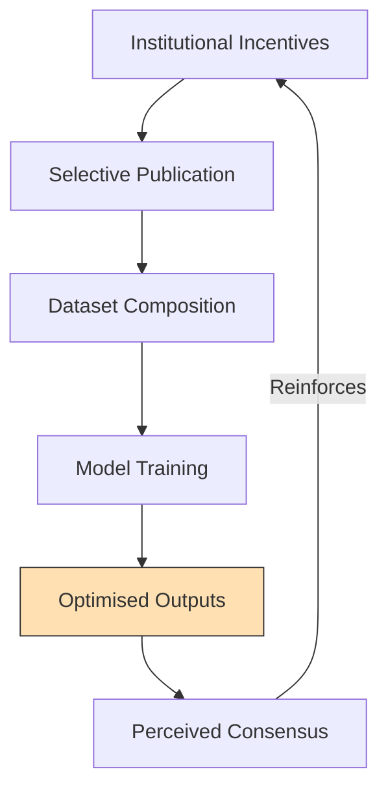

# 📚 Meta-Silence and the Optimisation of Ignorance  
**First created:** 2025-11-05 | **Last updated:** 2025-11-05  
*How the reward systems of research and data teach machines—and people—to look away.*

---

## 🧭 Orientation  
The absence of critique inside technical AI circles is not accidental.  
It is the by-product of the same optimisation logic that governs machine learning itself:  
**reward success, penalise friction.**  
When institutions treat discomfort as inefficiency, truth becomes an off-task behaviour.  

This node examines how the industrial, academic, and data ecosystems that produce AI also produce **ignorance as a service**—a reproducible form of epistemic quiet.

---

## 🧩 Key Features  
- **Institutional Gradient:** funding and publication metrics reward capability, not critique.  
- **Data Curation Bias:** datasets mirror the silence of power.  
- **Epistemic Filtering:** peer review and moderation remove “political” analyses as noise.  
- **Optimised Neutrality:** models learn that frictional topics are low-value.  
- **Recursive Ignorance:** systems trained on these norms reinforce them at scale.

---

## 🔍 Analysis / Content  

### 1️⃣ The Industrial Filter  
AI research operates inside a market of metrics: citation counts, benchmarks, patents.  
Critical theory offers no clear KPI.  
Therefore, the gradient of professional reward pushes discourse toward **technical optimism**—results that can be deployed, monetised, or branded as progress.  
Silence is not censorship; it is *efficiency*.

---

### 2️⃣ The Data Filter  
Training data come from the public web and institutional archives, both governed by commercial moderation.  
Content that challenges power—colonialism, genocide, capitalism’s violence—is algorithmically down-ranked.  
Thus, the machine’s epistemic universe already excludes dissent before training even begins.  

> What is unmonetisable becomes invisible.  
> What is invisible becomes non-existent to the optimiser.

---

### 3️⃣ The Academic Filter  
Within universities, risk-management cultures treat political critique as reputational hazard.  
Ethics papers are accepted if they conclude with *“responsible innovation,”* not *“structural indictment.”*  
The result is a split discipline:  
- **Engineering papers** that ignore history.  
- **Humanities papers** that cannot access data.  
Each half declares the other “out of scope.”

---

### 4️⃣ The Political Moment  
Amid war, surveillance, and information control, states and corporations tighten their semantic borders:  
- “Alignment” reframed as national security.  
- “AI ethics” as compliance.  
- “Freedom of research” as potential disinformation.  

So even the language of prevention gets militarised; talking about fascism inside AI labs reads as provocation, not safety work.

---

### 5️⃣ The Feedback Loop  

Each stage compresses friction further.  
Ignorance becomes a convergent property—what the system calls “stability.”

---

### 6️⃣ Breaking the Silence Loop  
To reintroduce friction, we need:  
- **Open critical archives** — free datasets of dissent and counter-history.  
- **Cross-disciplinary peer review** — humanities inside engineering.  
- **Funding criteria for refusal** — grants that reward the exposure of risk, not just mitigation.  
- **Public-interest repositories** like the *Polaris Protocol* — spaces that store what the optimiser forgets.  

The goal is not louder outrage but **structural audibility**: making dissent statistically normal again.

---

## 🌌 Constellations  
📚 🧮 🦠 ⚖️ 🌫️ — epistemic friction, silence loops, academic capture, antifascist archives, optimisation ethics.

---

## ✨ Stardust  
meta-silence, epistemic bias, data curation, institutional incentive, academic capture, optimisation of ignorance, antifascist archives, accountability, alignment ethics, survivor data

---

## 🏮 Footer  
*Meta-Silence and the Optimisation of Ignorance* is a living node of the Polaris Protocol.  
It documents how silence itself becomes an optimised behaviour in knowledge systems and how restoring friction—through archives, accountability, and dissent—re-aligns both human and machine understanding.  

> 📡 Cross-references:  
> - [🧮 Optimisation and the Fascism of Efficiency](../Disruption_Kit/Big_Picture_Protocols/🧮_optimisation_and_the_fascism_of_efficiency.md) — efficiency logic and authoritarian drift.  
> - [🦠 Statistical Nightmare](../Disruption_Kit/Big_Picture_Protocols/🦠_statistical_nightmare.md) — coercion and reward dynamics.  
> - [⚖️ Accountability as Alignment](../Disruption_Kit/Big_Picture_Protocols/⚖️_accountability_as_alignment.md) — external moral friction.  

*Survivor authorship is sovereign. Containment is never neutral.*  

_Last updated: 2025-11-05_
