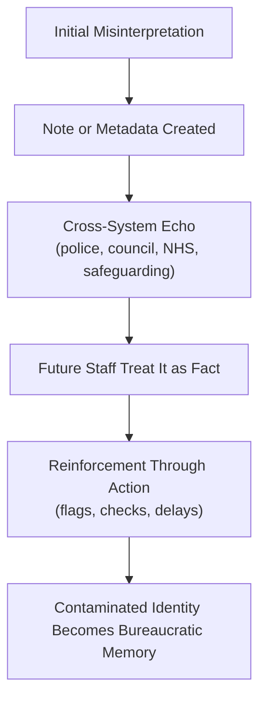

File: 📛_bureaucratic_memory_failure_and_identity_contamination.md

# 📛 Bureaucratic Memory Failure & Identity Contamination  
**First created:** 2025-11-16 | **Last updated:** 2025-11-16  
*How institutions misremember people, how errors persist through data ecosystems, and why a single misinterpretation can become an identity you never agreed to.*

---

## 🛰️ Orientation  
When a bureaucracy misinterprets you once, the error almost never remains contained.

It becomes:

- a note,  
- a flag,  
- a metadata tag,  
- a risk adjective,  
- a case summary,  
- a safeguarding annotation,  
- or a “just in case” comment.

This creates **bureaucratic memory**:  
a version of you encoded in systems that is not the real you.

This node explores how bureaucratic memory forms, how it fails, and how contamination spreads across interconnected systems — especially in the UK’s fragmented public-sector architecture.

It sits alongside:  
- 📡 *cross-system_metadata_echo_chains*  
- 🧷 *culture_war_risk_logic_in_uk_public_institutions*  
- 🗃️ *safeguarding_logic_mission_creep_and_identity_pathologising*  

---

## ✨ Key Features  
- Explains how bureaucracies “remember” people through notes and metadata.  
- Shows how minor errors escalate into durable identity distortions.  
- Maps contamination pathways across health, education, policing, councils, safeguarding and central government systems.  
- Highlights why survivors of misinterpretation feel trapped by their own data.  
- Provides Polaris with a conceptual framework for future reform and rights architecture.

---

## 🧿 Analysis / Content  

### 🧠 1. What Bureaucratic Memory *Is*  
Institutions do not remember you the way humans do.

They remember:

- entries  
- flags  
- codes  
- summaries  
- case notes  
- alerts  
- comments  
- audit trails  

This creates a **pseudo-person**:  
a constructed identity based on incomplete or incorrect data.

When the memory is correct, the system functions.  
When the memory is flawed, it becomes **identity contamination**.

---

### 🧬 2. How Identity Contamination Begins  
Usually with something small:

- a misheard statement  
- an overcautious safeguarding note  
- a cultural misinterpretation  
- an assumption based on stereotypes  
- a Prevent-adjacent “behavioural concern”  
- a poorly trained staff member  
- a political or cultural context misread as risk  

One amateur judgement becomes machine-read “truth”.

---

### ⚠️ 3. Why Errors Persist  
Bureaucratic memory is **sticky** for four reasons:

#### **a) Asymmetry of Authority**  
A professional note outweighs your correction.

#### **b) System Fear**  
Nobody wants to delete something “important” in case it leads to blame later.

#### **c) Metadata Replication**  
Systems share only the “headline”, not the nuance.

#### **d) Time Pressure**  
Staff skim old notes and assume past flags were justified.

The contaminated version of you becomes the dominant version inside systems.

---

### 🔄 4. The Identity Contamination Pipeline  

The contamination becomes “real” through repetition.

---

### 🧩 5. Why Correction Is So Difficult  
Attempts to correct contaminated identity often meet:

- FOI delays  
- SAR barriers  
- staff defensiveness  
- systems that cannot delete fields  
- “we can’t find the source”  
- “this is just for internal use”  
- opaque data architecture  
- circular referrals  

It becomes psychologically exhausting, because the system treats:

**your truth**  
as  
**your appeal**,  
and  
**its error**  
as  
**its baseline.**

---

### 🎭 6. The Lived Experience of Being Misremembered  
People affected by identity contamination report:

- hypervigilance  
- fear of further misclassification  
- anticipatory dread  
- being treated as “risky” without explanation  
- reputational damage  
- repeated re-assessment  
- humiliation  
- exhaustion  
- despair  
- feeling like you are arguing with a shadow copy of yourself  

These are not individual weaknesses.  
They are **the rational psychological response to structural misremembering**.

---

### 🧨 7. Who Is Harmed First  
Identity contamination disproportionately affects:

- racialised minorities  
- neurodivergent people  
- disabled people  
- religious minorities  
- political dissidents  
- migrants  
- LGBTQ+ people  
- anyone who doesn’t “fit” a common cultural script  

These groups become the **alert points** for system distortion.

---

### 🧭 8. Why This Matters for Democratic Health  
A democracy cannot function if:

- institutions cannot forget errors,  
- citizens cannot correct their own record,  
- reputational harm becomes self-perpetuating,  
- or data systems ossify misinterpretations into permanent identity categories.

Bureaucratic memory failure is a **democratic erosion mechanism**.

---

## 🏮 Footer  
**Bureaucratic Memory Failure & Identity Contamination** provides Polaris with a structural framework for understanding misinterpretation harm, data drift, and institutional memory pathology.  
It is a cornerstone of the Bureaucratic Harm & Democratic Drift cluster.

Crosslinks:  
- 📡 *cross-system_metadata_echo_chains*  
- 🧷 *culture_war_risk_logic_in_uk_public_institutions*  
- 🗃️ *safeguarding_logic_mission_creep_and_identity_pathologising*
