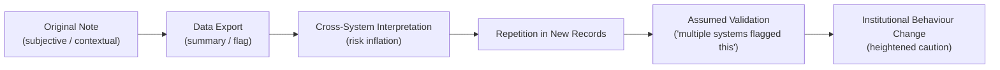

File: 📡_cross-system_metadata_echo_chains.md

# 📡 Cross-System Metadata Echo Chains  
**First created:** 2025-11-16 | **Last updated:** 2025-11-16  
*How fragments of data move between institutions, gain authority through repetition, and create self-reinforcing loops of misinterpretation.*

---

## 🛰️ Orientation  
Public-sector institutions treat metadata as neutral and factual.  
In reality, metadata is:

- subjective  
- partial  
- context-dependent  
- often written under pressure  
- and easily misunderstood outside its original environment  

When a single note, flag, or descriptor travels across systems — e.g. NHS → Council → Safeguarding → Police — it creates **echo chains**.

These echoes:

- amplify the original misinterpretation,  
- flatten nuance,  
- and form a distorted but durable “identity profile” that no one intended to create.

This node maps how those chains form, why they persist, and how they shape bureaucratic behaviour.

---

## ✨ Key Features  
- Explains how data fragments replicate between systems.  
- Describes how echoes gain authority merely through repetition.  
- Maps risk-adjective contamination (“concern”, “unstable”, “uncooperative”).  
- Shows how metadata becomes structurally misinterpreted.  
- Clarifies why citizens feel hunted by their own data.  

---

## 🧿 Analysis / Content  

### 📡 1. What an Echo Chain *Is*  
An echo chain is a sequence where:

1. A note is written in System A.  
2. System B sees only a summary or risk code.  
3. System C receives an even more abstracted version.  
4. System D treats the risk as confirmed.  
5. System A later encounters System D’s version and assumes escalation.

The chain becomes **self-confirming**.

Metadata is treated as:

- evidence,  
- pattern,  
- risk,  
- history,  
- behavioural profile,  

even when it started as a **single subjective impression**.

---

### 🔄 2. The Echo Chain Pipeline  

The danger:  
**each step increases the perceived legitimacy of the original error.**

---

### 🧩 3. Why Echo Chains Form So Easily  
Because UK public-sector data architecture is:

- fragmented  
- inconsistent  
- under-resourced  
- reliant on templates  
- and built for administrative efficiency, not accuracy  

Metadata often travels through:

- case management software  
- safeguarding portals  
- inter-agency emails  
- police INIs  
- NHS risk summaries  
- education safeguarding systems  
- council referral forms  

At no point does nuance survive.

---

### 💬 4. How Risk-Adjectives Mutate  
Metadata categories like:

- “concern”  
- “irregular”  
- “unusual behaviour”  
- “potential safeguarding”  
- “politically sensitive”  
- “prevent-related”  
- “heightened emotion”  
- “non-compliant”  
- “argumentative”  
- “distressed”  

…mutate across systems.

A note originally written as:

> “The service user was distressed due to delays.”

Becomes:

> “Distressed presentation.”

Then:

> “Emotionally unstable.”

Then:

> “Risk concerns noted.”

Identity becomes pathology.

---

### 🧬 5. Echo Chains as Bureaucratic Mythmaking  
When multiple systems repeat the same misinterpretation, it becomes:

- bureaucratic memory,  
- institutional fact,  
- “something we all know”,  
- “background risk”,  
- “context for decision-making”.

This process is **mythmaking**, not evidence.

The person at the centre never gets to see the myth, but is held accountable for it.

---

### 🔦 6. Why Echo Chains Target Minoritised People  
Echo chains disproportionately form around people who:

- are racialised  
- are Jewish or Muslim  
- are politically active  
- have complex trauma histories  
- are neurodivergent  
- express distress atypically  
- challenge authority  
- report institutional wrongdoing  
- don’t “code” as calm or compliant  

Systems mistake difference for risk.  
Echo chains mistake risk for fact.

---

### 🔧 7. Structural Consequences  
Echo chains lead to:

- reputational contamination  
- refusal of services  
- increased scrutiny  
- safeguarding escalation  
- disproportionate intervention  
- distress  
- retraumatisation  
- distrust of institutions  
- long-term impacts on rights and welfare  

The real harm comes from **institutional behaviour responding to false signals**.

---

### 🧭 8. Why This Matters for Polaris  
Polaris treats echo chains as:

- a diagnostic tool for bureaucratic authoritarian drift,  
- evidence of systemic misalignment,  
- a warning for minority safety,  
- a foundation for future “data rights restoration” frameworks,  
- and a key mechanism for understanding survivor narratives.

Echo chains explain why people say:

> “I feel like I’m arguing with a shadow version of myself.”

Because they are.

---

## 🏮 Footer  
**Cross-System Metadata Echo Chains** is part of the Polaris Bureaucratic Harm cluster.  
It maps how institutional narratives form without evidence, persist without correction, and shape behaviour through repetition.

Crosslinks:  
- 📛 *bureaucratic_memory_failure_and_identity_contamination*  
- 🧷 *culture_war_risk_logic_in_uk_public_institutions*  
- 🗃️ *safeguarding_logic_mission_creep_and_identity_pathologising*
