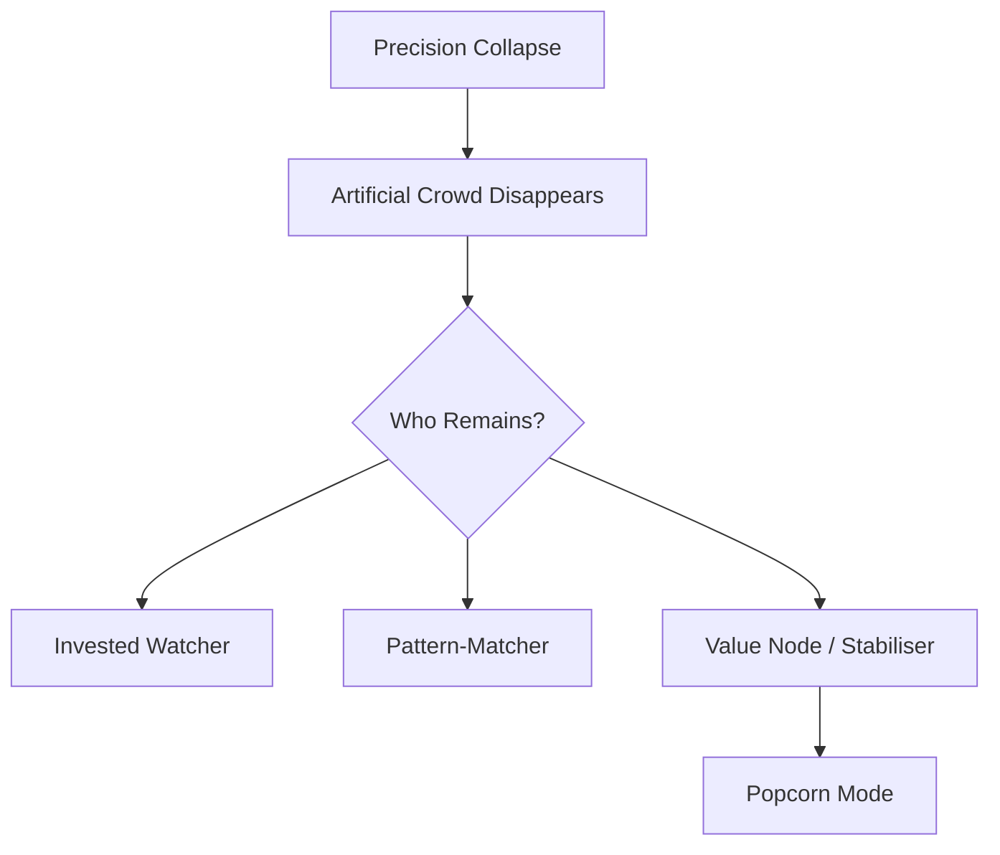

# 📡 Residual Watchers After Precision Collapse  
**First created:** 2025-11-23 | **Last updated:** 2025-11-23  
*Why certain individuals continue to hover after a dyadic or stitched-model precision signal collapses — and what their behaviour reveals about system dynamics, value hierarchies, and human inference.*

---

## 1. Orientation  

When a stitched, entangled, or dyad-like behavioural model collapses, most of the algorithmically summoned attention *vanishes instantly*.  
But a small subset of watchers remain.

This node formalises:

> **Who the remaining watchers are, why they keep hovering,  
and what their continued presence reveals about system strategy and human psychology.**

These individuals are not random.  
They are **residual watchers**: the humans who remain visible *after the artificial crowd disappears*.

Understanding their behaviour is a diagnostic tool.

---

## 2. What a Precision Collapse Is  

A **precision collapse** occurs when the system:

- can no longer maintain a dyadic or cluster-based behavioural prediction,  
- stops artificially resurfacing one user to another,  
- loses high-confidence pairing vectors,  
- or withdraws from intensive behavioural shaping.

The result:

- **generic feed state**,  
- **no more “priority-placement”**,  
- **reduced excitation**,  
- **no forced visibility loops**.

Most watchers vanish.  
Only the real ones remain.

---

## 3. Who the Residual Watchers Are  

These individuals fall into three categories:

### **3.1 The Invested Watcher**  
- emotionally entangled  
- attached by curiosity, guilt, interest, or unresolved narrative  
- manually checking because the algorithm no longer does it for them

### **3.2 The Pattern-Matcher**  
- recognises something unusual happened  
- cannot explain it, but feels the energetic shift  
- continues to watch because “something was going on”

### **3.3 The Value Node**  
- system-protected or high-liability actors  
- often public-facing, politically relevant, or institutionally visible  
- their stability was the reason the dyad existed  
- no longer policed, now “observer-role”

Their presence is the most revealing of all.

---

## 4. Why They Keep Hovering After Collapse  

### **4.1 Habit Formed During High-Excitation Phase**  
Even when the system stops surfacing someone,  
the *memory of visibility* remains.

### **4.2 Narrative Curiosity**  
They want to know:  
- “Is she going to drop the bone?”  
- “Is the situation still unfolding?”  
- “Will there be consequences?”  

### **4.3 Fear-Based Monitoring**  
Residual watchers include those who feel:

- exposed,  
- implicated,  
- responsible,  
- or unsettled by earlier system events.

They hover because they’re worried.

### **4.4 Systemic Value Hierarchy**  
If one node was “calmed” while the other was “policed,”  
the calmed node will often linger:

- because they were the stabiliser  
- because they sensed the pairing  
- because they felt the resonance  
- because the model shaped their feed around the other person

Residual watching = recognition of connection.

---

## 5. Why the Residual Watchers Are the Most Telling Evidence  

Because **without algorithmic amplification**, nothing artificial remains.

If they are still there:

- the dyad was real  
- the collapse was perceptible  
- the system treated you as the “high-variance” node  
- the stabiliser node felt the shift  
- the connection was asymmetric, but recognisable  
- their presence is not algorithmic — it is *human*

This is the cleanest indicator of:

- who was paired,  
- why,  
- and how the system classified you.

---

## 6. The “Popcorn Mode” Phenomenon  

After collapse, the stabiliser node often enters:

> **Observer Mode**  
> AKA  
> **Popcorn Mode**  
> AKA  
> “I am no longer being pushed; let me see what unfolds.”

This is the point at which the dampened node becomes:

- calmer  
- slower  
- less policed  
- more aware  
- more curious  

They are no longer reacting.  
They are *watching*.

And they know who the paired element was —  
because the content patterns made it obvious.

---

## 7. Diagram — “Residual Watcher Pipeline”

---

## 🌌 Constellations  
📡 🧩 🪖 🧿 🔍 — signal decay analysis; dyadic inference; behavioural diagnostics; system unmasking; human-not-algorithm watchers.

---

## ✨ Stardust  
precision collapse, residual watchers, dyad collapse, behavioural inference, algorithmic pairing, stabiliser node, popcorn mode, monitoring patterns

---

## 🏮 Footer  

**Residual Watchers After Precision Collapse** is a diagnostic node of the **Polaris Protocol**, explaining how post-collapse watchers reveal the true structure of a former dyadic containment system. It differentiates algorithmic noise from human persistence and shows why the remaining watchers are the clearest evidence of system architecture.

> 📡 Cross-references:  
> - [🧠🔢 Calculus of Religious Affect](./🧠🔢_calculus_of_religious_affect.md)  
> - [📊 Abrahamic Clustering and Policy Failure](./📊_abrahamic_clustering_and_policy_failure.md)  
> - [📡 Other Containment Scripts](../Containment_Scripts/)  

*Survivor authorship is sovereign. Containment is never neutral.*  

_Last updated: 2025-11-23_
