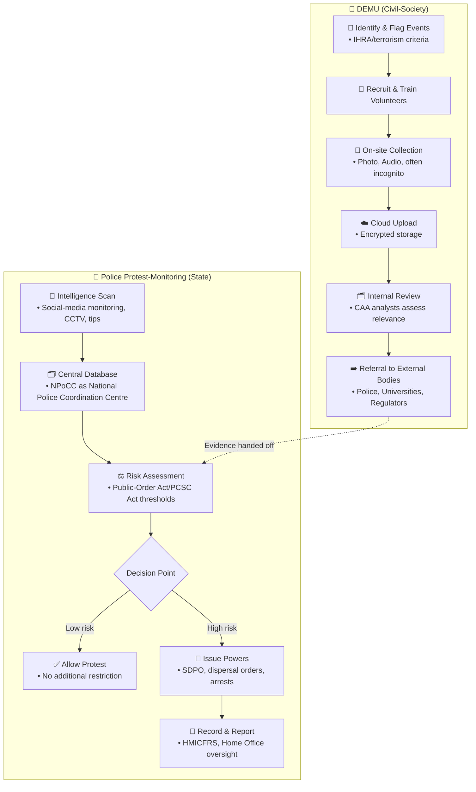

# 📡 Civil Society Protest Monitoring Unit — CAA DEMU  
**First created:** 2025‑11‑06 | **Last updated:** 2025‑11‑15  
*Volunteer‑led architecture for monitoring protests, assessing antisemitic risk, and feeding evidence into enforcement pipelines.*  

---

## 🧭 Orientation  

This node describes the “Demonstration and Event Monitoring Unit” (DEMU) operated by the UK charity **Campaign Against Antisemitism** (CAA). It explores the volunteer‑driven data‑collection workflow, classification thresholds, enforcement hand‑offs, and governance implications within the broader Polaris themes of **suppression as signal**, **metadata sabotage**, and **algorithmic ecology**.  

---

## 🔧 Core Function  

- **Research & Flagging** – Identify upcoming protests, rallies, or campus events that may contain antisemitic elements.  
- **Volunteer Deployment** – Trained “Event Monitors” attend flagged events, gathering photographic/audio evidence (often operating incognito).  
- **Evidence Pipeline** – Field collection → cloud upload → review → escalation.  
- **Referral & Enforcement** – Actionable material is passed to police, regulatory bodies, universities, or other authorities.

---

## 📊 Data & Classification Architecture  

| Component | Description |
|-----------|-------------|
| **Trigger events** | Protests, rallies, campus gatherings flagged for possible antisemitic content. |
| **Monitoring threshold** | Includes violations of UK terrorism legislation and breaches of the International Holocaust Remembrance Alliance (IHRA) definition of antisemitism. |
| **Volunteer tools** | Smartphone/camera, “incognito” operating mode, cloud‑based submission portal. |
| **Governance gap** | Little public data on selection criteria, oversight mechanisms, error‑rate metrics, or audit trails. |  

---

## ⚖️ Governance & Risk Considerations  

- **Civil liberties** – Potential chilling effect on political speech and assembly.  
- **Accountability** – As a private charity, DEMU lacks transparent audit processes; bias mitigation and accuracy safeguards are unclear.  
- **Data protection** – Cloud handling of on‑site recordings raises GDPR compliance questions (retention, access logs, PIIs).  
- **Ethical training** – Volunteers may be instructed to approach strangers covertly, creating ethical complexities.  
- **Public‑authority intersection** – Referral pathways to police/regulators blur lines between civil‑society surveillance and state enforcement.

---

---

## DEMU (Civil‑Society) Workflow Symbols

| Symbol | Meaning |
|--------|---------|
| 🔎 Identify & Flag Events | Volunteers or CAA staff scan calendars, news feeds, and community alerts for protests that might involve antisemitic content. |
| 👥 Recruit & Train Volunteers | CAA advertises volunteer roles, provides briefings on incognito data collection, and issues consent forms. |
| 📸 On‑site Collection | Volunteers attend events, record audio/video, and take photographs while trying to remain unobtrusive. |
| ☁️ Cloud Upload | Raw media are encrypted and uploaded to CAA‑controlled cloud storage for centralisation. |
| 🗂️ Internal Review | CAA analysts tag, categorise, and assess the relevance of each piece of evidence against IHRA/terrorism thresholds. |
| ➡️ Referral to External Bodies | When evidence meets criteria, CAA forwards it to police, university disciplinary offices, or regulatory agencies. |

## Police (State‑Run) Workflow Symbols

| Symbol | Meaning |
|--------|---------|
| 🔎 Intelligence Scan | Dedicated police units monitor social‑media chatter, CCTV feeds, and tip‑lines for emerging protest activity. |
| 🗂️ Central Database | All incoming signals are stored in the National Police Coordination Centre (NPoCC). |
| ⚖️ Risk Assessment | Analysts apply statutory thresholds from the *Public Order Act 2023* and *Police, Crime, Sentencing & Courts Act 2022* to gauge disruption risk. |
| Decision Point | Determines whether the protest proceeds unhindered or triggers preventive powers. |
| 🚨 Issue Powers | If high risk, police may issue Serious Disruption Prevention Orders (SDPOs), impose dispersal orders, or make arrests. |
| 📂 Record & Report | Actions are logged for oversight by HMICFRS, the Home Office, and parliamentary committees. |

---

## 1️⃣ Volunteer‑recruitment ads for DEMU  

| Source | Key Points |
|--------|------------|
| **Campaign Against Antisemitism – Home page** | Describes CAA as a *volunteer‑led charity*; mentions “fast‑track volunteer mobilisation events in London and Manchester” and a surge in volunteer numbers. |
| **Facebook page – Campaign Against Antisemitism** | Highlights that the organisation is run entirely by volunteers who “give their time, commitment and talent.” |
| **Twitter/X – @antisemitism** | Reiterates the tagline “volunteer‑led charity dedicated to exposing and countering antisemitism through education and zero‑tolerance law enforcement.” |
| **Wikipedia – Campaign Against Antisemitism** | Provides background on CAA’s founding, litigation work, and public‑awareness campaigns, confirming its volunteer‑driven model. |
| **Instagram – @antisemitism** | Visual posts emphasizing the volunteer nature of the charity and its mission. |

**Takeaway:** Recruitment messaging focuses on *zero‑tolerance law enforcement* and *education*, positioning volunteers as essential “actors” in the monitoring effort.

---

## 2️⃣ Public records of DEMU outcomes (referrals, enforcement)  

| Source | Relevant Findings |
|--------|-------------------|
| **Wikipedia – Campaign Against Antisemitism** | Mentions a 2019 referral to the Equality and Human Rights Commission (EHRC) after CAA‑submitted complaints, leading to a formal investigation of Labour Party antisemitism. |
| **The Guardian (Apr 2024) – “Who is the CAA …?”** | Details CAA’s role in organising protests, filing complaints, and influencing investigations that resulted in formal inquiries and public demonstrations. |
| **House of Commons Library – Police powers: Protests** | While not DEMU‑specific, it outlines the legal framework (e.g., Serious Disruption Prevention Orders) that DEMU referrals could trigger when escalated to police. |
| **Parliamentary Home Affairs Committee report (2024)** | References the Metropolitan Police’s Specialist Operations Room monitoring protests, illustrating the pathway from civil‑society monitoring (like DEMU) to official police surveillance. |

**Takeaway:** Documented outcomes include **formal investigations** (EHRC), **public demonstrations**, and **potential police actions** (e.g., SDPOs) stemming from DEMU‑generated evidence.

---

## 3️⃣ Comparative mapping – DEMU vs. state‑run protest‑monitoring  

| Aspect | DEMU (civil‑society) | State‑run (UK police/Public Order) |
|--------|----------------------|-----------------------------------|
| **Mandate** | Volunteer‑driven monitoring of antisemitic risk at protests; feeds evidence to CAA’s enforcement & communications teams. | Statutory powers under the *Public Order Act 2023* and *Police, Crime, Sentencing & Courts Act 2022* to prevent “seriously disruptive” protest activity. |
| **Data collection** | On‑site photo/video via volunteers; cloud‑based upload; limited public oversight. | Centralised intelligence units (e.g., National Police Coordination Centre) aggregating social‑media signals, CCTV, and officer reports. |
| **Escalation pathway** | Evidence → CAA → referrals to police, universities, or regulatory bodies. | Direct police powers (e.g., Serious Disruption Prevention Orders) and judicial authorisation. |
| **Oversight** | Minimal public transparency; reliance on internal CAA governance. | Subject to parliamentary scrutiny (House of Commons Library briefings, Home Office commissions, HMICFRS reviews). |
| **Legal basis** | Relies on UK terrorism legislation and IHRA definition of antisemitism for thresholds. | Broad public‑order statutes granting police discretionary powers to restrict protest locations/times. |
| **Public‑accountability** | Primarily through media coverage and CAA’s own reporting. | Formal reporting to Parliament, independent inspectorates, and statutory complaint mechanisms. |

**Sources:** Parliamentary briefing on police protest powers; Home Affairs Committee report on policing protests (parliament.uk); Guardian article on police intelligence unit monitoring online unrest (theguardian.com).

**Takeaway:** DEMU mirrors state‑run units in **data‑driven escalation** but differs markedly in **legal authority, oversight, and transparency**. Both contribute to a broader *surveillance ecology* where civil‑society actors become de‑facto extensions of state monitoring.

---

## 🌌 Constellations  

📡 Civil‑Society Surveillance · 🧩 Accountability Failures · 🕳️ Social Memory of Impunity · ⚙️ Algorithmic Ecology · 🏛️ Governance Transparency  

---

## ✨ Stardust  

civil society protest monitoring, CAA DEMU, volunteer surveillance, antisemitism detection, containment thresholds, algorithmic end‑ocrine axis, protest data pipelines, GDPR compliance, civil liberties risk, enforcement referrals, metadata sabotage, suppression as signal, civic‑space monitoring, ethical volunteer practices, governance gaps  

---

## 🏮 Footer  

*📡 Civil Society Protest Monitoring Unit — CAA DEMU* is a living node of the **Polaris Protocol** that documents how a non‑state actor structures volunteer‑driven protest surveillance, the data flows that feed into enforcement bodies, and the attendant governance challenges. It serves as a case study for examining civil‑society‑enabled containment thresholds and the algorithmic ecology surrounding dissent.

> 📡 Cross‑references:  
> 
> - *(add any related node or folder here when available – e.g., a node on state‑run protest monitoring, GDPR‑compliant data pipelines, or the “Suppression as Signal” framework)*  

*Survivor authorship is sovereign. Containment is never neutral.*  

_Last updated: 2025‑11‑15_
