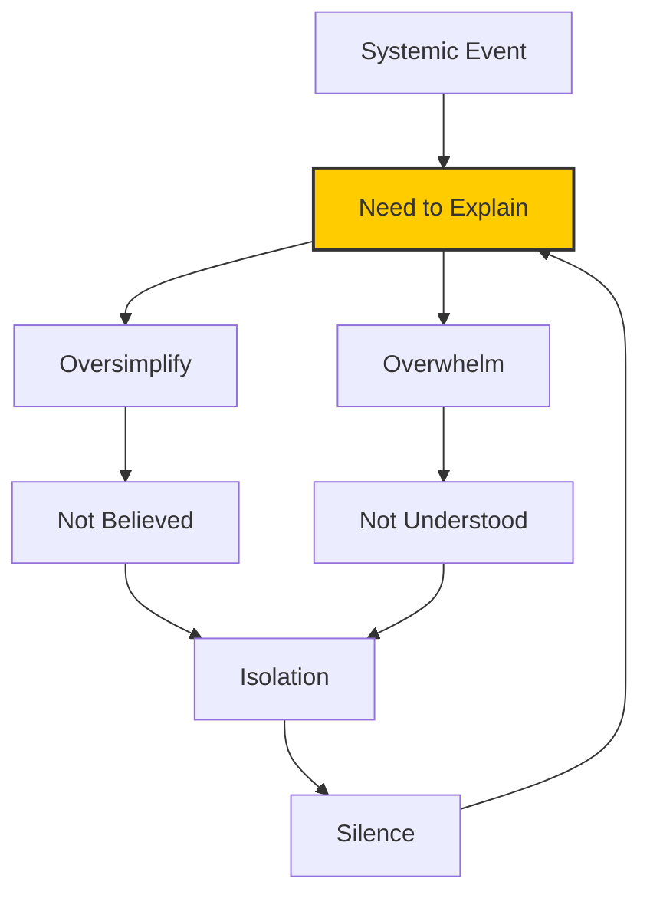

# 📮 Answers on a Postcard  
**First created:** 2025-11-01 | **Last updated:** 2025-11-01  
*Trying to explain the inexplicable: surveillance, silence, and the shrinking space for conversation.*

---

## 🧭 Orientation  

This node sits somewhere between field note and open letter.  
It records the moment when the project outgrew ordinary conversation—when every polite silence from institutions or friends began to sound like an invitation to “explain yourself.”  

The short version: I can’t.  
Not because there’s nothing to say, but because the only way to make sense of it is to unfold an entire system—metadata, harassment, suppression, research habits, security feedback loops—and that’s too much for a coffee or a text.  

So this is the postcard version: a small space for the unsayable.

---

## 💬 The Social Physics of Silence  

People expect a tidy story, but systemic interference doesn’t fit into plot form.  
Explaining it risks sounding unhinged, especially when the interference is digital, ambient, and plausibly deniable.  
Silence from others isn’t always malice; sometimes it’s self-protection, or sheer confusion about what counts as “believable.”  

What looks like paranoia from the outside often feels, from inside, like pattern recognition in too much data.  
And when escalation triggers observation—even the benign kind attached to reporting channels—the experience doubles back on itself:  
you start watching the watchers watching you.

---

## 🧩 Communication Strategies (work in progress)  

| Situation | Practical Translation | Emotional Cost |
|------------|----------------------|----------------|
| **Friend asks “what’s going on?”** | “It’s a data problem that got personal. I’m logging it until it stops.” | Moderate — feels evasive but survivable. |
| **Professional setting** | “I’m handling an unresolved cyber-security incident and prefer written correspondence.” | Low — restores boundaries. |
| **Public curiosity / social media** | Silence or humour: *answers on a postcard.* | High — invisibility as defence. |

Small statements buy time; truth takes pages.

---

## 🧮 Diagram — The Explainability Trap  

The more complex the truth, the less shareable it becomes; the less shareable, the lonelier it feels.

---

## 🧭 Reflection  

It’s reasonable to assume that some observation occurs—through lawful monitoring after escalation, through the analytic dragnet attached to large creative work, or through the ordinary capture of our digital lives.  
That doesn’t make it comfortable.  
Being “probably observed” is still a state of hyper-vigilance; it alters language, pacing, even the way you breathe in a sentence.

The project became a survival mechanism: write it down before it’s rewritten by the feed.

---

## 🌌 Constellations  

📮 🧾 📓 🧠 — connects to the *Field Log — Metadata Interference and Defamation Campaign* and to the *Survivor Voice Fidelity* cluster.

---

## ✨ Stardust  

explanation fatigue, metadata surveillance, social silence, communication strategy, systemic interference, reflective field log  

---

## 🏮 Footer  

*Answers on a Postcard* is a reflective node of the Polaris Protocol.  
It stands as a record of the limits of speech when documentation replaces conversation.  

*If you understand it already, thank you. If you don’t—answers on a postcard.*

_Last updated: 2025-11-01_
