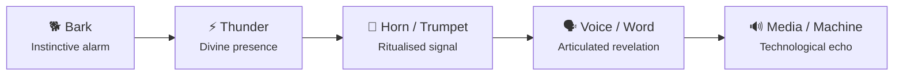

# 📯 Soundline: Bark to Trumpet  
**First created:** 2025-11-01 | **Last updated:** 2025-11-01  
*A mythographic-acoustic study of how revelation travels through vibration — from the bark of instinct to the trumpet of judgment.*

---

## 🧭 Orientation  

Before there was meaning, there was noise.  
Before there was law, there was thunder.  
Every theology begins as an act of *listening* — a creature hears vibration, assigns it purpose, and the cosmos suddenly speaks.  
This is the **Soundline**: the oldest surviving instrument of faith.  

Across five thousand years of human sound design, the same frequency keeps returning.  
An animal call becomes a warning.  
A warning becomes a signal.  
A signal becomes a word.  
And that word, once amplified by breath and brass, becomes command, prophecy, or song.  

To follow the Soundline is to listen for the moment when **noise becomes meaning** — when a random waveform crosses the threshold of attention and becomes revelation.  

---

## 🐕 1. The Animal Call — Instinct as Prototype  

The first sound of faith was not a sermon but a **bark**.  
An animal, alert and loyal, turned chaos into information: there is danger, there is return, there is someone at the door.  
That single transformation — chaos into message — is the origin of liturgy and radio alike.  

Ethologists call it the “semantic shift of alarm”; theologians might call it proto-prophecy.  
It’s the moment an organism assigns *intent* to sound.  
The canine howl, like the human chant, sits halfway between emotion and speech — a waveform charged with meaning but not yet syntax.  

Across early myth the bark carries divine weight: Gula’s temple hounds, Anubis’ jackal cry, the dogs of Yama and of the Chinvat Bridge.  
Each marks the **threshold event** — the frequency that says *something unseen approaches*.  

---

## ⚡ 2. Thunder and Theophany — When the Sky Speaks  

Where animals signal the near, thunder announces the infinite.  
The storm has always been the **subwoofer of the gods** — low-frequency energy that rearranges the nervous system.  

In the Near East, **Baal** and **Hadad** spoke through thunderclaps; in Greece, **Zeus** hurled it as punctuation; in Vedic hymns, **Indra**’s lightning was the rhythm of cosmic order.  
At Sinai, the **shofar** and thunder were indistinguishable — *“and the people saw the sounds”* (Exodus 20:18).  
The boundary between weather and revelation blurred into an audio event:  
divine voltage converted into meaning by collective awe.  

Sound, not sight, is the primal register of holiness.  
Lightning dazzles one; thunder unites all within earshot.  
In acoustic physics, it’s **pressure over time**; in theology, **presence beyond comprehension**.  

---

## 🕎 3. Breath into Brass — The Horn as Interface  

The next evolution on the soundline is **instrumentation**.  
Human breath, shaped by bone and brass, becomes command: the horn, trumpet, or conch that gathers bodies into synchrony.  

The **shofar** of the Hebrews, the **ṣūr** of the Qurʾān, the **conch** of South Asia, the **tuba mirum** of Christian requiems — each is an engineered continuation of thunder.  
A lung becomes a storm, channelled through architecture of resonance.  

The physics is simple but sacred:  
- Frequency defines pitch — how high the message.  
- Amplitude defines awe — how far it carries.  
- Resonance defines truth — how long it stays ringing inside us.  

When the Qurʾān says, *“The trumpet will be blown, and We shall gather them together,”* it’s describing a sonic compression of the universe: the moment every soul vibrates at the same frequency.  

Revelation, in this sense, is a **waveform event**.  
It doesn’t occur in ink but in air.

---

## 🗣️ 4. The Human Mouth — Word as Sacred Vibration  

Eventually the instrument internalises.  
Breath no longer needs brass; the mouth becomes a divine resonator.  
Speech, chant, and song are not metaphors for creation — they *are* creation, each utterance a micro-genesis.  

In Hebrew mysticism, the **letters themselves vibrate** with creative energy (*Sefer Yetzirah*).  
In Sufi practice, **dhikr** — remembrance — is performed as controlled frequency: a calibration of the self to divine pitch.  
Christian monasticism discovered the same physics in **Gregorian chant** — long vowels sustaining community resonance.  

Even secular linguistics confirms the continuity: voiced sound waves shape not only air but the listener’s heartbeat and neural timing.  
Every preacher, imam, and singer is performing low-tech psychoacoustics — synchronising a congregation by waveform.  

---

## 📡 5. Reverberations — The Modern Echo  

The soundline didn’t end with scripture.  
It simply changed medium.  
Church bells, air-raid sirens, factory whistles, train horns, loudspeakers, phones, and podcasts — each is a descendant of the trumpet, designed to gather or warn.  
They are secular liturgies of attention.  

When a phone chime makes us reach, we are still obeying the acoustic covenant: *respond to the call.*  
Every “breaking news” sting, every protest chant, every emergency broadcast is a remix of Revelation 8 or Surah 39:68.  
Modern media is theology in reverse — the divine now listens to us through an electronic sky.  

Sound remains the most democratic form of revelation: it doesn’t need literacy, only ears.  
And it still enforces community: anyone who hears the siren is already part of the story.

---

## 🌌 Constellations  
📯 🐕 ⚡ 🕎 🗣️ — The auditory chain of revelation from instinct to word to technology.

---

## ✨ Stardust  
soundline, bark to trumpet, acoustic theology, vibration and meaning, revelation as waveform, thunder and theophany, shofar, ṣūr, dhikr, chant, psychoacoustics, mythographic narrative, technological ritual

---

## 🏮 Footer  
*📯 Soundline: Bark to Trumpet* is a living node of the **Polaris Protocol**, tracing how humanity translates vibration into faith.  

> 📡 Cross-references:  
> - [🐾 Canine Constellation Migration](../🎺_rallying_call/🐾_canine_constellation_migration.md) — guardians and psychopomps of sound  
> - [🎶 Theology of the Mix](../🎺_rallying_call/🎶_theology_of_the_mix.md) — shared melody of revelation  
> - [🎺 Rallying Call and Loyal Hound](../🎺_rallying_call/🎺_rallying_call_and_loyal_hound.md) — philosophy of the signal  

*Survivor authorship is sovereign. Containment is never neutral.*  

_Last updated: 2025-11-01_
