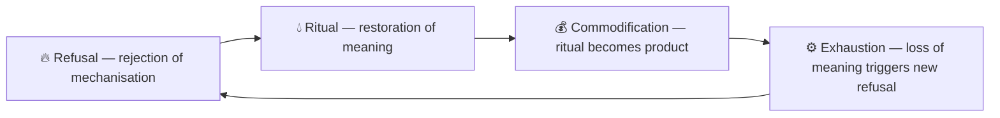

# 🔁 Ritual and Refusal — Re-Enchantment After the Machine  
**First created:** 2025-10-25 | **Last updated:** 2025-10-25  
*Why humans keep making ceremony even when systems erase it.*

---

## 🌱 Orientation  
This node examines the deep relationship between refusal and ritual.  
Both are pattern-based human responses to systems that flatten meaning.  
Where refusal says *no* to commodification, ritual says *yes* to continuity.  
Together they form the rhythm of cultural survival.

---

## 🧩 1 — Refusal Without Ritual Becomes Exhaustion  
To live only in resistance is to run on reaction.  
Movements that reject hierarchy but discard ceremony often lose coherence; their refusal burns faster than it renews.  
Ritual slows resistance down long enough to remember *why* it began.

---

## 🕯️ 2 — Ritual Without Refusal Becomes Spectacle  
When ritual loses its teeth, it turns into pageant — religion as branding, remembrance as tourism.  
The same dynamic you traced in the commodification loop applies here:  
a genuine act of meaning becomes aestheticised for spectatorship.

---

## 🔄 3 — The Human Constant  

Every era replays this circuit.  
Industrial revolutions erase ritual; artistic and spiritual counter-movements re-invent it.  
The pattern isn’t failure — it’s humanity rebooting its emotional operating system.

---

## 🪶 4 — Animal Precursors and Human Continuity  
Elephants, corvids, cetaceans: many species show mourning behaviours — lingering, touching, carrying, or covering their dead.  
Ritual is not luxury; it’s *neural empathy externalised.*  
In humans, funerary art, memorials, and collective mourning are how culture practices emotional regulation at scale.  
To refuse ritual is to abandon the species’ oldest trauma technology.

---

## ⚙️ 5 — Modern Breaks in the Cycle  
Post-2020 societies display classic signs of **ritual deprivation**:  
- mass death with minimal ceremony,  
- digital abstraction of grief,  
- acceleration of political polarisation.  
The internet functions like a global nervous system with no parasympathetic response — always firing, never resting.  
Without ritual, mourning mutates into rage, conspiracy, or scapegoating.  
(Printing press → witch trials; telegraph → world wars; internet → ???)

---

## 🌒 6 — Toward Re-Enchantment  
To restore ritual is not to regress into superstition.  
It is to re-learn how to metabolise enormity.  
Simple, slow acts — shared meals, hand-made memorials, naming ceremonies, communal silence — rebuild the parasympathetic layer of culture.  
They are anti-industrial precisely because they are inefficient, emotional, and small.

---

## 💡 7 — Political Implications  
- **Against high capitalism:** ritual re-introduces relation over transaction.  
- **Against totalising anarchism:** ritual re-introduces rhythm over chaos.  
- **For disability justice:** ritual validates pace variation and embodied knowledge.  
- **For ecological politics:** ritual re-connects production with gratitude and limit.  

---

## ✨ 8 — Reflection  
To refuse the machine is half the work;  
to ritualise life again is the other half.  
Both are needed if humans are to survive the next abstraction.  
Refusal guards the threshold.  
Ritual keeps the fire lit.

---

## 🌌 Constellations  
♿️ Disability Justice | 🧠 Survivor Tools | 🌿 Empathy Design | 🔮 Cultural Memory | 🏛 System Governance  

---

## ✨ Stardust  
ritual-and-refusal, re-enchantment, trauma-and-grief, anti-machina, disability-justice, cultural-memory, slow-politics, post-industrial-humanity
