# 🔗 Engagement Spillover — How One Post Creates a Niche by Accident  
**First created:** 2025-11-02 | **Last updated:** 2025-11-02  
*When one link jumpstarts a feedback micro-ecosystem across multiple platforms.*

---

## 🧭 Orientation  
A single outbound link can behave like a catalyst.  
Post it once, and a quiet corridor between platforms lights up.  
Clicks turn into cohorts; cohorts turn into a niche.  
This node maps how cross-platform telemetry transforms ordinary engagement into **resonant amplification** — the “ping-pong effect” that inflates a topic until it looks like a trend.

---

## 🧩 Key Features  
- **Cross-platform resonance:** a burst of clicks on one site creates content gravity on others.  
- **Cohort mirroring:** every participant becomes an amplifier for the rest.  
- **Ad-tech permeability:** shared tracking layers link “professional” and “social” ecosystems.  
- **Accidental genre formation:** a transient micro-field emerges around the post.

---

## 🔍 Analysis  

### 1. The trigger  
You share a link — perhaps to a Polaris node.  
LinkedIn records high-quality outbound engagement: long dwell, focused clicks, professional network context.  
This is premium data.  
Ad-tech IDs travel with the users who clicked, broadcasting “these people interact intensely with X-type content.”

### 2. The bridge  
When those same users open another platform (TikTok, YouTube, Threads), shared cookies and SDK identifiers whisper across systems.  
The new platform infers a common interest vector and begins showing adjacent material — not just to them, but to *you*.  
The feedback loop closes.

### 3. Ping-pong resonance  
Each participant’s later activity confirms the pattern for everyone else.  
The effect feels psychic — you post once, and related content blooms around you — but it’s simply distributed confirmation bias at machine scale.  
Engagement has become a **standing wave** bouncing between networks.

### 4. The illusion of organic growth  
Creators notice the spike and start producing near-copies.  
Recommendation models detect momentum and upscale the topic.  
What began as a handful of curious clicks becomes an apparent *movement*.

### 5. Dry observation  
> One thoughtful post, a few dozen clicks, and suddenly the algorithm thinks a new culture has been born.  
> You didn’t go viral; you were replicated.

---

## 🧮 Diagram — Ping-Pong Amplification  

```mermaid
flowchart LR
A[Original Post 🔗] --> B[Clicks & Cohort Formation]
B --> C[Cross-Platform Tracking Layer]
C --> D[Secondary Platform Feed Adjustment]
D --> E[Increased Related Content ↔ New Engagement]
E -->|Reinforces| B
```

---

## 🌌 Constellations  
🔗 🗣️ 🧠 🪞 — connection, voice, cognition, reflection.

## ✨ Stardust  
engagement loop, cross-platform resonance, ad-tech bridge, accidental niche, ping-pong amplification, data permeability, network contagion, dry humour

---

## 🏮 Footer  

*🔗 Engagement Spillover — How One Post Creates a Niche by Accident* is a living node of the **Polaris Protocol.**  
It documents how minor bursts of attention can spawn whole micro-genres through cross-platform telemetry and shared audience identifiers.

> 📡 Cross-references:  
> - [🗣️ Data Majority as Narrative Voice — Voting by Volume](../Big_Picture_Protocols/🗣️_data_majority_as_narrative_voice_voting_by_volume.md) — on how the loudest signals become the narrator.  
> - [🧬 Containment Thresholds — Emotional Data That Can’t Be Unmixed](../Big_Picture_Protocols/🧬_containment_thresholds_emotional_data_that_cant_be_unmixed.md) — when these resonances fossilise into structure.  

*Survivor authorship is sovereign. Containment is never neutral.*  

_Last updated: 2025-11-02_
