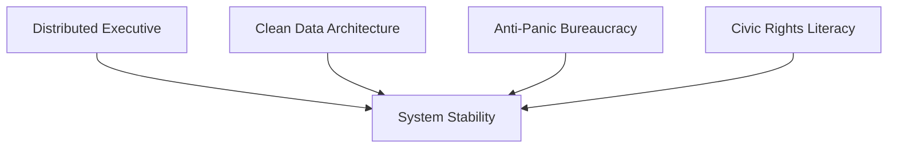

File: 🔧_democratic_resilience_architecture_for_21st_century_britain.md

# 🔧 Democratic Resilience Architecture for 21st Century Britain  
**First created:** 2025-11-16 | **Last updated:** 2025-11-16  
*A structural design model for a democracy capable of resisting authoritarian drift, bureaucratic distortion, political panic, and systemic misinterpretation.*

---

## 🛰️ Orientation  
This node outlines a **structural blueprint** for democratic resilience.  
Not about “better leaders”, “better voters”, or “better morals” —  
but **better architecture**.

21st-century Britain faces overlapping stressors:

- information overload  
- Prevent drift and identity pathologising  
- culture-war manipulation  
- hyper-centralised executive power  
- fragile data systems  
- opaque bureaucratic memory  
- economic instability  
- low-trust institutions  

Democracy can’t survive these pressures without a redesign.

Polaris proposes a **resilience architecture**:  
a constitutional, bureaucratic, and civic structure able to absorb stress *without* drifting authoritarian.

This node links tightly to:  
- 🧩 *distributed_executive_governance*  
- 🧠 *political_black_box_logic*  
- 🧷 *culture_war_risk_logic_in_uk_public_institutions*  

---

## ✨ Key Features  
- Defines “democratic resilience” as a **systems property**, not a moral one.  
- Outlines a multi-layered architecture: executive, bureaucratic, data, and civic.  
- Introduces Polaris’ “Four Pillars of Democratic Stability”.  
- Provides new models for executive design, data integrity, and public rights.  
- Centres the citizen’s experience of misinterpretation as a diagnostic signal.  

---

## 🧿 Analysis / Content  

### 🧱 1. Why Democracy Needs Resilience Architecture  
Democracies don’t fail because:

- leaders become evil  
- citizens become apathetic  
- institutions “turn authoritarian”  

They fail because:

- **systems buckle under stress**,  
- **inputs overwhelm human cognition**,  
- **bureaucracies misinterpret data**,  
- **centralised executives collapse psychologically**,  
- **culture war narratives distort priorities**,  
- **feedback loops amplify small errors**,  
- **no mechanism exists to course-correct in real time**.

Resilience architecture gives a democracy the **shock absorbers** it currently lacks.

---

### 🩻 2. The Four Pillars of Democratic Stability  
Polaris defines democratic stability based on **structural durability**, not vibes.

#### **Pillar 1 — Distributed Power**  
A democracy must dilute executive load:

- multi-person executive  
- shared portfolios  
- mutual veto  
- deliberative consensus  
- rotating chairs  
- anti-cult-of-personality design  

See: 🧩 *distributed_executive_governance*.

---

#### **Pillar 2 — Clean Data Systems**  
A system cannot be fair if it cannot remember or forget correctly.

Resilience requires:

- repairable records  
- deletion rights  
- transparent metadata  
- trauma-informed data notes  
- anti-contamination design  
- cross-system sync clarity  
- auditability  

See:  
- 📛 *identity_contamination*  
- 📡 *echo_chains*

---

#### **Pillar 3 — Bureaucratic Anti-Panic Mechanisms**  
Public bodies must not act on:

- tabloid pressure  
- ministerial signalling  
- culture war agitation  
- reputational fear  
- misinterpreted safeguarding narratives  

Resilience demands:

- panic brakes  
- proportionality safeguards  
- independence rules  
- “slow down” protocols  
- public reasoning requirements  
- insulation from hostile media cycles  

---

#### **Pillar 4 — Civic Robustness & Rights Literacy**  
Citizens must:

- understand their rights  
- recognise misinterpretation  
- know when to push back  
- have access to ombuds, tribunals, and correction routes  
- engage in dissent without fear  

Democracy fails when citizens fear being seen.

---

### 🧬 3. The Resilience Architecture Model  

All four pillars must operate together.  
Weakness in one creates stress in the others.

---

### 🧨 4. Britain’s Current Structural Weaknesses  
Britain is unusually vulnerable to drift because:

- the PM holds too much concentrated power  
- data infrastructure is fragmented and leaky  
- Prevent logic creates suspicion ecosystems  
- culture-war pressure distorts decision-making  
- institutions lack emotional and operational buffers  
- no right-to-correction architecture exists  
- FOI/SAR systems are overwhelmed  
- civil service incentives favour caution over accuracy  

This is not a moral condemnation.  
It is a **design diagnosis**.

---

### 🔧 5. What a Resilient UK Would Look Like  

#### **1. A Multi-Executive Cabinet (“Executive Council”)**  
- 5–7 elected executives  
- shared authority  
- portfolio specialisation  
- mutual accountability  
- constitutional balance  
- explicit anti-drift function  

#### **2. A National Data Integrity Framework**  
- each resident has the right to correct the record  
- deletion pathways  
- metadata standardisation  
- cross-system clarity  
- annual “identity integrity” audits  

#### **3. Panic Brakes for Public Institutions**  
- mandatory proportionality reviews  
- standardised de-escalation logic  
- bans on politically motivated crackdown orders  
- anti-culture-war firewalls  
- whistleblower protection  

#### **4. Civic Navigation Support**  
- rights navigators  
- ombuds expansion  
- SAR support centres  
- trauma-informed governance training  

---

### 🌐 6. Why This Matters for Survivors of Bureaucratic Harm  
Survivors notice drift before anyone else.  
Their experience is:

- diagnostic  
- early-warning  
- politically valuable  

A resilient democracy listens to these signals and adjusts structure, rather than blaming individuals.

---

## 🏮 Footer  
**Democratic Resilience Architecture for 21st Century Britain** anchors Polaris’ constitutional design work.  
It reframes democratic health as a *systems engineering problem*, offering a structural blueprint to stabilise governance and protect citizens from misinterpretation, panic, and authoritarian drift.

Crosslinks:  
- 🧩 *distributed_executive_governance*  
- 🧠 *political_black_box_logic*  
- 🧷 *culture_war_risk_logic_in_uk_public_institutions*
