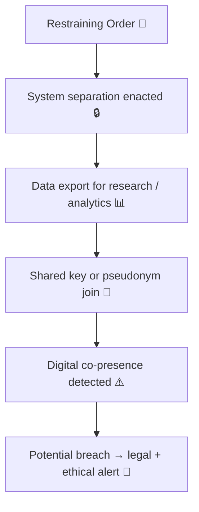

# 🕊️ Data-Contact Breach — When Restraining Orders Fail via Data  
**First created:** 2025-11-11 | **Last updated:** 2025-11-11  
*When separation exists in law but not in code.*

---

## 🧭 Orientation  

Restraining orders create a legal perimeter around harm.  
But in data-driven systems, that perimeter is only as strong as the schema enforcing it.  
When case identifiers, pseudonym tokens, or shared datasets connect the victim and offender inside a digital environment, the **no-contact boundary** can collapse without a single message being sent.

A **data-contact breach** occurs when system architecture rebuilds proximity that the court explicitly forbade.

---

## ⚖️ Core Definition  

> **Data-contact breach** describes the unintentional restoration of contact between restricted parties  
> through linked, mirrored, or shared information systems.

These breaches can occur through:
- Shared case IDs or relational keys (MARAC, MAPPA, court databases)  
- Research or evaluation projects importing both sides of a case  
- Analytics dashboards showing cross-referenced data points  
- Vendor systems hosting anonymised but relationally linked profiles  

The harm is semantic: the database “knows” them together again.

---

## ⚙️ Mechanisms of Failure  

| Layer | Description | Example |
|:------|:-------------|:--------|
| **Relational Join** | A shared case or family ID re-merges separated parties. | Victim and offender appear in the same MARAC extract. |
| **Pseudonym Collision** | Token switching or reuse links distinct identities. | Shared pseudonym lineage under ADR UK dataset. |
| **Research Re-linkage** | Academic data import ignores exclusion clauses. | Both records appear in pilot dataset for VAWG study. |
| **Vendor Mirror** | Cloud service replicates data without role field. | CRM lists both names in “related contacts.” |

---

## 🧮 Data-Contact Flow  

---

## 🪞 Implications  

- **Legal:** may constitute indirect contact under restraining order terms.  
- **Ethical:** breaches victim consent and safety planning.  
- **Operational:** undermines credibility of safeguarding data controls.  
- **Analytic:** corrupts research findings with unapproved relational joins.  

---

## 🧰 Prevention & Mitigation  

| Layer | Safeguard | Description |
|:------|:-----------|:------------|
| **Legal** | Include “digital separation clause” in restraining orders | Explicitly prohibit any data joins that reconnect parties. |
| **Technical** | Role-segregated token namespaces | Different pseudonym seeds for victims and offenders. |
| **Procedural** | Pre-export role audit | Verify no linked IDs appear across restricted entities. |
| **Governance** | Data-Contact Breach register | Mandatory logging and notification to ICO + MoJ. |

---

## 🧱 Detection Cues  

- Mirror datasets showing both parties in the same report.  
- Analytics dashboards listing shared incidents post-order.  
- Subject Access Requests returning data from the wrong profile.  
- Vendor documentation lacking exclusion criteria for restraining orders.  

---

## 🌌 Constellations  

🕊️ 💾 🧬 🧾 ⚖️  

Data-Contact Breach sits where **law**, **data integrity**, and **victim safety** intersect.  
It draws from the same fault lines as **Token Switching** and **Data Twinning**, but with explicit legal consequence.

---

## ✨ Stardust  

restraining orders, safeguarding data, indirect contact, MARAC, MAPPA, data sharing, pseudonymisation, token integrity, relational joins, GDPR accuracy, survivor protection

---

## 🏮 Footer  

*🕊️ Data-Contact Breach — When Restraining Orders Fail via Data* is a living node of the Polaris Protocol.  
It defines how data infrastructures can unintentionally violate legal separation and how governance must rebuild digital distance to match judicial intent.

> 📡 Cross-references:  
> - [💾 Token Switching — Pseudonymisation Gone Wrong](../🧩_System_Governance/💾_token_switching_pseudonymisation_gone_wrong.md)  
> - [🧬 Data Twinning — When Two Identities Become One Record](../🧩_System_Governance/🧬_data_twinning_when_two_identities_become_one_record.md)  
> - [🪙 Token Integrity Audit](../🧩_System_Governance/🪙_Token_Integrity_Audit/)  

*Survivor authorship is sovereign. Containment is never neutral.*  

_Last updated: 2025-11-11_
