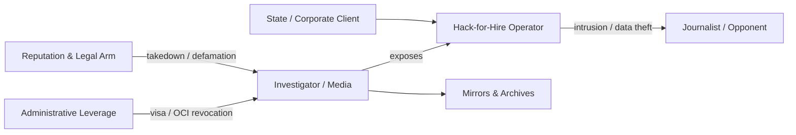

# 🕳️ When the Censor Is a Contractor  
**First created:** 2025-11-05 | **Last updated:** 2025-11-05  
*How hack-for-hire shops and reputation-management lawfare become the outsourced arm of state suppression.*  

---

## 🧭 Orientation  
When a government outsources cyber-offense or information control, the line between state power and private enterprise disappears.  
**Appin**, founded by Rajat and Anuj Khare, became the prototype: a cybersecurity training company that evolved into a *hack-for-hire powerhouse* servicing ministries, corporations, and elites worldwide.  
When journalists exposed it, the response fused **lawfare**, **reputation management**, and **administrative retaliation**—showing how censorship now contracts itself out.

---

## 🧩 Key Features  
- **Outsourced suppression:** state functions executed by private contractors.  
- **Dual industry linkage:** offensive cyber + legal/PR clean-up.  
- **Transnational reach:** suppression of journalists across borders via lawsuits and visa actions.  
- **Denial architecture:** opacity through rebranding, takedowns, and erasure of evidence.  

---

## 🔍 Analysis  

### 1.  Origin and Evolution  
- **2003:** Appin founded in New Delhi as a cybersecurity training outfit.  
- **By 2010:** pivot to providing intrusion services for state and corporate clients.  
- **Reuters** later described it as a *“hack-for-hire powerhouse that stole secrets from executives, politicians, military officials and wealthy elites around the globe.”*  
- Its alumni seeded a network of successor firms that still define India’s hack-for-hire market.

### 2.  Exposure and Retaliation  
- Investigations by *Reuters* and *The New Yorker* mapped Appin’s operations and client base.  
- Following publication, a New Delhi court issued an injunction forcing Reuters to remove its report for months.  
- The journalist who authored it—an overseas citizen of Indian origin—had his OCI card revoked by the Ministry of Home Affairs.  
- Simultaneous waves of cease-and-desist letters and defamation suits hit outlets in multiple jurisdictions.  

### 3.  The Contractor-Lawfare Feedback Loop  

- The **technical act** of intrusion is mirrored by the **legal act** of silencing.  
- Both are executed by contractors, allowing the commissioning state or corporation to deny direct involvement.  
- Each exposure triggers new takedowns, making the suppression self-reinforcing.

### 4.  OSINT Notes  
1. **Archive early** — PDFs + WARC snapshots before legal removal.  
2. **Trace shells** — director names, IP filings, training alumni lists.  
3. **Mirror reporting** — cooperative publication across outlets.  
4. **Track legal filings** — injunction IDs, SLAPP patterns, PR-firm rotations.  
5. **Watch administrative echoes** — travel bans, credential revocations coinciding with exposés.  

---

## 🌌 Constellations  
🧿 🕳️ ⚖️ 🛰️ — Sits within *Digital Disruption / Lawfare and Reputation Industries / Algorithmic Containment* constellations, mapping suppression that hides behind contractual opacity.

---

## ✨ Stardust  
hack-for-hire, Appin, Rajat Khare, lawfare, reputation management, digital erasure, outsourcing of censorship, administrative weaponisation, investigative journalism, state-contractor nexus  

---

## 🏮 Footer  

*When the Censor Is a Contractor* is a living node of the **Polaris Protocol**.  
It documents how private cyber-contractors and reputation-management firms extend state suppression beyond borders through commercial lawfare and administrative coercion.  

> 📡 Cross-references:  
> - [Big Picture Protocols](../) — systemic diagnostics of containment  
> - [Metadata Sabotage Network](../../Metadata_Sabotage_Network/) — erasure and mirroring tactics  
> - [Disruption Kit / Defensive Playbook](../../Disruption_Kit/Defensive_Playbook/) — counter-nudge and archiving tools  

*Survivor authorship is sovereign. Containment is never neutral.*  

_Last updated: 2025-11-05_
