# 🕸️ Prevent ↔ VAWG Overlap — Shared Safeguarding Infrastructures  
**First created:** 2025-11-11 | **Last updated:** 2025-11-11  
*Where counter-terrorism and care data meet in the same database.*

---

## 🧭 Orientation  

The UK’s **Prevent Duty** (Counter-Terrorism and Security Act 2015) and **Violence Against Women and Girls (VAWG)** strategies were designed for different purposes — one to prevent radicalisation, the other to protect against gender-based harm.  
Yet in practice, they share infrastructure: the same local authority servers, the same safeguarding boards, often even the same analysts and vendors.  

This node maps the **data entanglement** between Prevent and VAWG programmes — the point where counter-terror and domestic-abuse logic collide inside a single data environment.

---

## ⚖️ Structural Adjacency  

| Domain | Legislative Base | Primary Data Channels | Typical Data Controllers |
|:--------|:-----------------|:----------------------|:-------------------------|
| **Prevent** | Counter-Terrorism and Security Act 2015 | Channel panels, local Prevent boards, police referrals | Home Office / Local Authorities |
| **VAWG** | Domestic Abuse Act 2021, Serious Violence Duty 2022 | MARAC boards, CSP dashboards, police + health data | Home Office / MoJ / Local Authorities |

Both rely on **safeguarding exemptions** that allow information sharing “to prevent crime or protect welfare.” 
Those identical clauses make database co-location legally convenient — and operationally dangerous.

---

## 🧩 Shared Infrastructure Points  

| Layer | Description | Example |
|:------|:-------------|:--------|
| **Local Governance** | Channel and MARAC boards often share data officers. | A single analyst runs both dashboards. |
| **Vendor Platforms** | Shared procurement of case-management or analytics systems. | ECINS, Mosaic, LiquidLogic used by both sectors. |
| **Metrics & Risk Models** | Similar “vulnerability” indicators (age, behaviour, network). | One predictive model classifies both extremism and coercive control. |
| **Cross-Referrals** | Prevent cases flagged to VAWG panels and vice versa. | A domestic-abuse case coded as “radicalisation vulnerability.” |

---

## 🧮 Data Flow Convergence  

```mermaid
flowchart TD
A["Prevent Referral"] --> B["Local Authority Safeguarding Server 🗄️"]
C["VAWG Case / MARAC Record"] --> B
B --> D["Shared Analytics Dashboard 📊"]
D --> E["Cross-sector outputs (policy briefings, research feeds)"]
E --> F["Feedback loop → future risk scoring 🔁"]
```

Shared infrastructure turns discrete safeguarding into a **closed analytic ecosystem** — one where context collapses and narrative tags migrate between domains.

---

## 🪞 Risks of Conflation  

- **Category Drift:** “Vulnerability” becomes universal currency, detached from cause.  
- **Role Confusion:** Victims flagged as potential risks if they resist institutional framing.  
- **Algorithmic Amplification:** Machine learning retrains on mixed datasets.  
- **Community Mistrust:** Marginalised groups perceive safeguarding as surveillance.  

---

## 🧰 Governance Recommendations  

| Level | Action | Purpose |
|:------|:--------|:---------|
| **Policy** | Define clear data boundaries between Prevent and VAWG schemes. | Prevents lawful but unethical cross-use. |
| **Technical** | Use isolated token namespaces for each domain. | Stops pseudonym collisions across panels. |
| **Procedural** | Joint DPIAs with reciprocal veto powers. | Ensures both programmes can halt unsafe linkage. |
| **Audit** | Annual cross-scheme data separation review. | Detects schema drift and duplicate identifiers. |

---

## 🧱 Indicators of Overlap  

- Datasets using identical “vulnerability index” fields.  
- Meeting minutes referencing both Prevent and VAWG within one dashboard.  
- Joint Home Office / MoJ projects labelled “safeguarding analytics.” 
- FOI or DPIA documents naming shared vendors or “multi-purpose” systems.  

---

## 🌌 Constellations  

🕸️ ⚖️ 🧩 🧮  

Prevent ↔ VAWG Overlap sits where **security governance**, **care governance**, and **procurement containment** meet.  
It links to **Data-Contact Breach**, **Token Integrity Audit**, and **Cross-Agency Data Integrity** as part of the broader *Safeguarding Architecture* constellation.

---

## ✨ Stardust  

prevent duty, vawg, safeguarding data, counter-terrorism, data sharing, community safety partnerships, MARAC, channel panels, pseudonymisation, cross-governance risk, schema drift

---

## 🏮 Footer  

*🕸️ Prevent ↔ VAWG Overlap — Shared Safeguarding Infrastructures* is a living node of the Polaris Protocol.  
It documents how adjacent policy ecosystems merge in practice, creating hybrid datasets that blur the line between protection and surveillance.

> 📡 Cross-references:  
> - [🕊️ Data-Contact Breach — When Restraining Orders Fail via Data](../⚖️_Legal_&_State_Governance/🕊️_data_contact_breach_when_restraining_orders_fail_via_data.md)  
> - [🪙 Token Integrity Audit](../🧩_System_Governance/🪙_Token_Integrity_Audit/)  
> - [💾 Token Switching — Pseudonymisation Gone Wrong](../🧩_System_Governance/💾_token_switching_pseudonymisation_gone_wrong.md)  

*Survivor authorship is sovereign. Containment is never neutral.*  

_Last updated: 2025-11-11_
