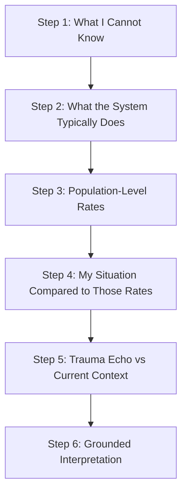

File: 🗂️_risk_grounding_model_for_bureaucratic_harm.md

# 🗂️ Risk Grounding Model for Bureaucratic Harm  
**First created:** 2025-11-16 | **Last updated:** 2025-11-16  
*A clinical-style, population-level method for grounding fear after institutional misinterpretation, data contamination, or bureaucratic overreach.*

---

## 🛰️ Orientation  
People who have experienced **institutional misinterpretation**, **incorrect data handling**, or **cross-system contamination** often develop a heightened sense of risk — not because they are irrational, but because:

- the harm was real,  
- the harm was opaque,  
- the harm was slow to resolve, and  
- the institution provided little emotional containment.

This node introduces a **clinical-style risk model** (borrowed from medicine, epidemiology, and safeguarding logic) to help individuals contextualise their fears **without collapsing uncertainty into false reassurance**.

It is a companion to:  
- 🤖 *answering_uncertainty_in_ai_environments*  
- 🧠 *political_black_box_logic*  

---

## ✨ Key Features  
- Uses **population-level framing**, not individual speculation.  
- Grounds fear in actual **probabilities**, not traumatic expectation.  
- Helps distinguish **trauma echoes** from real-world risk.  
- Keeps uncertainty honest while preventing catastrophic spirals.  
- Supports survivors of bureaucratic harm in rebuilding cognitive trust.  

---

## 🧿 Analysis / Content  

### 🩺 1. Why Clinical Models Help  
Medical training teaches practitioners to avoid overreassurance:

- Never tell a patient “you’re fine” when you cannot know.  
- Always give **bounded accuracy**: what is known, what is unknown, and the statistics.  

This logic is ideal for bureaucratic harm recovery because:

- institutional systems are opaque,  
- information is incomplete,  
- and personal trauma inflates perceived probability.

Risk grounding provides a way to create **psychological stability** without lying.

---

### 📊 2. The Population-Level Model  
Instead of saying:

> “You are safe.”

The model uses:

> “Out of 100,000 people, *X* experience this.  
> Out of those, *Y* face further impact.  
> Based on your situation, nothing you’ve said resembles the risky category.”  

This shifts thinking from **“I am uniquely unsafe”**  
to  
**“My brain is responding to a small but painful event by overgeneralising risk.”**

---

### 🧮 3. UK Examples (Illustrative)  

#### **A) Targeted Surveillance / Investigation**  
Population-level public data indicates:

- **Well under 1 in 10,000** UK residents are under targeted, named surveillance at any given time.

This includes:
- serious organised crime,  
- terrorism,  
- imminent threats,  
- major fraud,  
- high-risk offenders.  

Your conversations do not resemble those categories.

#### **B) Bureaucratic Error Recurrence**  
Most documented *large-scale* errors (NHS, DWP, PNC, safeguarding) reveal:

- 0.01%–0.1% recurrence  
- errors tend to cluster around specific system failures  
- once flagged, correction processes reduce ongoing risk  

This means:  
Your **fear** of recurrence is understandable,  
but recurrence itself is statistically **rare** once a case is known.

---

### 🧭 4. Trauma Echo vs Real Risk  
People who experience bureaucratic harm quite reasonably experience “trauma echo”:

- Expectation of misinterpretation  
- Hypervigilance around data trails  
- Sensitivity to authority language  
- Fear of being re-flagged  
- Anxiety about external misreading  

Risk grounding helps distinguish:

🩸 **Trauma echo** = fear drawn from past harm  
🟩 **Real risk** = what is proportionally likely now  

The goal is *not* to deny fear,  
but to give it **context**.

---

### 🔬 5. The Risk Grounding Ladder  

This keeps uncertainty honest while reducing catastrophic load.

---

### 🧩 6. Why This Helps Polaris Users  
Polaris users disproportionately:

- analyse systems deeply,  
- track pattern-based harm,  
- have highly literate trauma-processing patterns,  
- and have experienced institutional friction.

Risk grounding creates a safe cognitive landing zone where:

- emotional memory is honoured,  
- structural truth is clarified,  
- and fear becomes proportionate rather than overwhelming.

---

## 🏮 Footer  
The *Risk Grounding Model for Bureaucratic Harm* is part of Polaris’ civic-safety toolkit.  
It enables users to stabilise after institutional misinterpretation without false reassurance, building literacy in structural uncertainty and restoring agency after bureaucratic injury.
