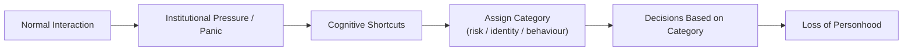

File: 🗂️_when_institutions_start_treating_you_as_a_category_not_a_person.md

# 🗂️ When Institutions Start Treating You as a Category, Not a Person  
**First created:** 2025-11-17 | **Last updated:** 2025-11-17  
*The moment bureaucratic drift becomes personally visible: when your individuality disappears inside someone else’s risk category, stereotype, or metadata tag.*

---

## 🛰️ Orientation  
One of the earliest and most painful experiences of democratic or bureaucratic drift is the moment you are no longer treated as:

- a specific person  
- with a specific history  
- in a specific situation  

…but instead as:

- a category,  
- a metadata label,  
- a risk adjective,  
- a problem profile,  
- an identity stereotype,  
- or an “administrative type”.

This node explains the psychological and structural mechanisms behind this shift, why it happens, and why it is one of the clearest early indicators of institutional authoritarian drift.

Pairs with:  
- 📛 *bureaucratic_memory_failure_and_identity_contamination*  
- 📡 *cross-system_metadata_echo_chains*  
- 🧯 *prevent_as_political_atomisation_engine*  
- 🧭 *how_authoritarian_drift_feels_from_the_inside*

---

## ✨ Key Features  
- Defines what it means to be “category-coded” by an institution.  
- Maps the transition from personhood → metadata → risk profile.  
- Explains why institutions switch from human to categorical processing under pressure.  
- Validates the emotional distress of being mis-seen or flattened.  
- Identifies category-coding as a key sign of democratic erosion.

---

## 🧿 Analysis / Content  

### 🗂️ 1. What Category-Coding Actually Is  
When a system is under pressure, humans become:

- types  
- patterns  
- risk objects  
- data points  
- workload units  
- potential liabilities  

Category-coding is the process of replacing **your actual self** with a **bureaucratic shorthand**.

This shorthand then becomes the basis of decision-making.

---

### 📉 2. Why Category-Coding Happens  
Institutions switch to categorical perception when they are:

- overworked  
- under-resourced  
- politically pressured  
- fearful  
- operating in crisis  
- following Prevent or safeguarding logic  
- overwhelmed by case flow  
- driven by culture war narratives  

In these contexts, categorisation is:

- faster  
- psychologically safer  
- organisationally rewarded  
- easier to justify  
- compatible with fear  

Human nuance becomes a “risk”.

---

### ⚡ 3. The Psychological Impact  
Being category-coded feels like:

- invisibility  
- humiliation  
- depersonalisation  
- dread  
- powerlessness  
- flattening  
- being misinterpreted on purpose  
- being treated as suspicious by default  
- being argued with by a “shadow version” of yourself  

It is an attack on the core experience of personhood.

Most people describe it as:

> “They were not even talking to *me* anymore.”

---

### 🔄 4. The Category-Coding Pipeline  

Once category-coded, it is extremely difficult to return to being seen as an individual.

---

### ⛓️ 5. Common Categories Institutions Use  
Institutions often default to simplistic categories:

- “non-compliant”  
- “emotionally unstable”  
- “potential risk”  
- “politically sensitive”  
- “Prevent-adjacent”  
- “complex case”  
- “hostile”  
- “overly emotional”  
- “attention-seeking”  
- “vulnerable adult”  
- “aggressive”  
- “high-demand service user”  
- “identity X = risk Y”  

None of these categories describe a real person.  
They describe **institutional fear**.

---

### 🧬 6. How This Links to Authoritarian Drift  
Authoritarian systems:

- love categories,  
- hate nuance,  
- fear individuality,  
- and rely on simplified models of people.

Democracies drift authoritarian long before they fully collapse,  
and category-coding is the frontline symptom.

It is the first moment the system says:

> “It is administratively easier if you are not too specific.”

That sentence has killed civil liberties across history.

---

### 🧩 7. Why Minorities and Dissidents Get Category-Coded First  
Because category-coding follows patterns of:

- racialisation  
- antisemitism  
- Islamophobia  
- anti-Black bias  
- xenophobia  
- ableism  
- misogyny  
- class prejudice  
- political othering  

Institutional gaze sees “risk profiles,” not people.

---

### 🔍 8. The Lived Experience: What It Feels Like  
People describe:

- sensing the “tone shift”  
- being spoken about as if they aren’t in the room  
- being told what they “must” mean  
- having their motives rewritten by systems  
- their words being filtered through suspicion  
- interactions feeling surreal or uncanny  
- the sense of “losing control of their own narrative”  
- being talked to in generic scripts  
- feeling like they are in a role they didn’t choose  

It is dehumanisation through admin.

---

### 🛠️ 9. How to Recognise it Early  
These are reliable early cues that you’re being category-coded:

- staff refer to you using adjectives before details  
- decisions are made about you, not with you  
- the system treats emotional expression as risk  
- questions become leading or circular  
- you get identical responses from different departments  
- nobody will write down clear reasoning  
- your individuality feels “lost in translation”  
- you sense “institutional fear” behind every choice  
- you stop being believed as the expert on your own life  

These are not coincidences.  
They are drift.

---

### 🧭 10. The Polaris Reframe  
Being category-coded is **not your fault**.  
It is a structural failure, not a personal one.

Your distress is valid because:

> **You are reacting to losing control of how the state sees you.  
> That is a core democratic harm.**

---

## 🏮 Footer  
**When Institutions Start Treating You as a Category, Not a Person** belongs to the Polaris Democratic Drift Phenomenology cluster.  
It identifies category-coding as one of the earliest and clearest signals of systemic instability and validates the emotional impact of losing personhood in bureaucratic environments.

Crosslinks:  
- 🧯 *prevent_as_political_atomisation_engine*  
- 📡 *cross-system_metadata_echo_chains*  
- 📛 *bureaucratic_memory_failure_and_identity_contamination*  
- 🧭 *how_authoritarian_drift_feels_from_the_inside*
