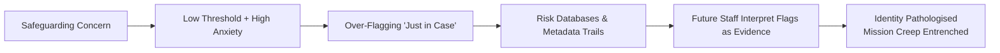

File: 🗃️_safeguarding_logic_mission_creep_and_identity_pathologising.md

# 🗃️ Safeguarding Logic Mission Creep & Identity-Pathologising  
**First created:** 2025-11-16 | **Last updated:** 2025-11-16  
*How well-intentioned safeguarding systems drift into soft authoritarianism, misinterpretation, and the pathologising of ordinary identity markers.*

---

## 🛰️ Orientation  
Safeguarding systems were built to prevent harm.  
But when expanded without limits — or when embedded inside political climates of fear — they drift into **mission creep**.

This node explains how safeguarding frameworks expand beyond their remit, begin interpreting *identity* as *risk*, and produce bureaucratic harm that is experienced as:

- misclassification  
- over-policing  
- reputational distortion  
- “soft surveillance”  
- and Prevent-style overreach.

It is closely linked to:  
- 🧯 *prevent_as_political_atomisation_engine*  
- 📡 *cross-system_metadata_echo_chains*  
- 📛 *bureaucratic_memory_failure_and_identity_contamination*  

---

## ✨ Key Features  
- Explains the psychological + bureaucratic drivers of safeguarding expansion.  
- Charts how risk logic transforms into suspicion logic.  
- Illustrates how identity traits become misread as “signals”.  
- Maps feedback loops between safeguarding, Prevent, and data systems.  
- Centres the experience of those harmed by misinterpretation, not intent.  

---

## 🧿 Analysis / Content  

### 🧨 1. The Core Problem: “Better Safe Than Sorry” Becomes Policy  
Safeguarding logic begins with a simple premise:

> “Protect the vulnerable.”

But under political pressure, staff anxiety, or chaotic data environments, this becomes:

> “Avoid blame at all costs.”

And from there:

> “Flag anything that might be a risk.”

And then:

> “Flag anything that looks *adjacent* to something that might be a risk.”

This drift is **inevitable** unless tightly constrained.

---

### 📉 2. How Mission Creep Happens  
Mission creep typically emerges from three pressures:

#### **a) Psychological Pressure on Practitioners**  
- fear of “missing something”  
- pressure from managers  
- risk-averse workplace culture  
- poor training on minority identities  
- moral injury from previous cases  
- stress + burnout reducing nuance  

#### **b) Bureaucratic Incentives**  
- escalating documentation requirements  
- unclear thresholds  
- “just in case” logic  
- use of catch-all categories  
- data systems built for expansion, not precision  

#### **c) Political Atmosphere**  
- culture war narratives  
- sensationalism  
- Prevent-adjacent suspicion of dissent  
- public stigma around “being too soft”  
- institutional fear of scandal  

Together, these push ordinary behaviour into the “amber zone.”

---

### 🧩 3. Identity-Pathologising: Where It Gets Dangerous  
Safeguarding frameworks drift into treating **identity categories** as risk factors when:

- systems fail to distinguish politics from threat  
- minority expressions are misread  
- stereotypes inform risk scoring  
- cultural practices are unfamiliar to staff  
- Prevent logic seeps into unrelated domains  
- data contamination reinforces prior suspicion  

This creates **pathologising loops**, where traits are interpreted as “signals,” such as:

- being outspoken  
- being politically active  
- being neurodivergent  
- being religious or culturally distinct  
- being from a racialised group  
- being traumatised or distressed  
- having unusual hobbies or reading habits  

None of these = risk.  
But in drifted safeguarding systems, they get misread as such.

---

### 🔄 4. How Misinterpretation Becomes Self-Confirming  
Safeguarding drift produces **feedback loops**:

1. **Minor misreading** →  
2. **Flag raised “just in case”** →  
3. **Data stored in risk-oriented systems** →  
4. **Future staff see prior flag** →  
5. **Assume past concern was justified** →  
6. **Escalate or widen suspicion** →  
7. **Identity becomes pathologised**  

This is not malice.  
It is **structural failure**.

---

### ⚙️ 5. The Mission Creep Pipeline  

This pipeline thrives in systems with opacity, poor data hygiene, and political fear.

---

### 🔦 6. Who Gets Hurt First  
Mission creep disproportionately impacts:

- racialised communities  
- religious minorities  
- politically dissident groups  
- neurodivergent individuals  
- disabled people  
- immigrants  
- people with trauma responses  
- anyone who doesn’t “code” as calm, compliant, or culturally familiar  

Polaris centres these groups because they are the **early warning line** of democratic drift.

---

### 🧭 7. Why This Matters for Policy  
Understanding mission creep is essential for:

- designing **non-punitive safeguarding**,  
- preventing Prevent-style overreaches into everyday life,  
- constraining bureaucratic power,  
- fixing mislabelled or contaminated records,  
- and protecting civic rights.

Polaris frames this not as a failure of individuals, but as a failure of **design, incentives, and institutional fear.**

---

## 🏮 Footer  
**Safeguarding Logic Mission Creep & Identity Pathologising** anchors Polaris’ work on bureaucratic harm and democratic drift.  
It helps articulate how systems meant to protect can unintentionally harm, and why structural reform — not moral panic — is required.

Crosslinks:  
- 🧯 *prevent_as_political_atomisation_engine*  
- 📡 *cross-system_metadata_echo_chains*  
- 📛 *bureaucratic_memory_failure_and_identity_contamination*
