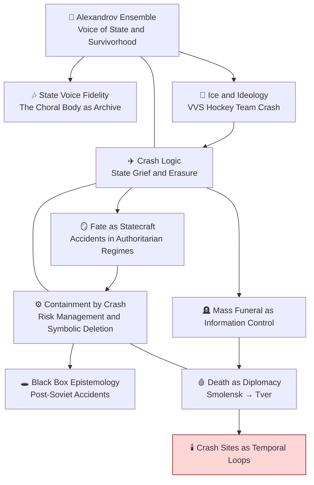

# 🗺️ Crash Constellation Mermaid Diagram
**First created:** 2025-11-06  |  **Last updated:** 2025-11-06  
*Visual map of inter-node relations within the Crash Constellation.*

---

---

## 🌌 Constellations  
🗺️ ✈️ 🎶 🕯️ — Cartographic node linking ritual, system, and voice.  

---

## ✨ Stardust  
mermaid diagram, constellation map, crash series, systems mapping, node flow  

---

## 🏮 Footer  

*🗺️ Crash Constellation Mermaid Diagram* is a living visual companion to the Polaris Crash Constellation.  
It diagrammatically represents how the ten nodes circulate between testimony, system, and myth.  

> 📡 Cross-references:  
> - [🛰️ Crash Constellation Overview](./🛰️_crash_constellation_overview.md) — index companion  
> - [Big Picture Protocols](../Disruption_Kit/Big_Picture_Protocols/) — analytical host  

*Survivor authorship is sovereign. Containment is never neutral.*  

_Last updated: 2025-11-06_
