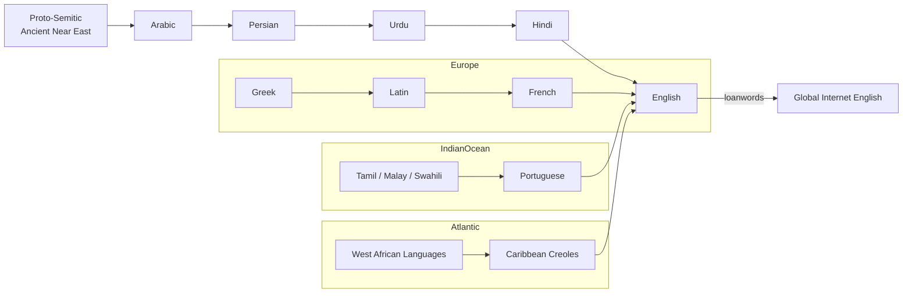

# 🗺️ Linguistic Silk Road — How Words Travel  
**First created:** 2025-11-07 | **Last updated:** 2025-11-07  
*A cultural-linguistic map tracing how trade, empire, and human curiosity turned language into a network rather than a lineage.*  

---

## 🧭 Framing — Language as Trade Route  

Languages do not evolve like trees; they drift like caravans.  
Every empire, migration, and market leaves behind a small cargo of words.  
What we call *English*, *Arabic*, or *Hindi* is not a family tree but a web of trade routes, jokes, prayers, and recipes.  

The **Linguistic Silk Road** shows how Semitic, Indo-European, and colonial trade lines intertwined, producing the mixed, beautiful chaos of modern vocabulary.

---

## 🪶 Corridors of Exchange  

1. **Semitic ↔ Persian ↔ Indo‑Aryan**  
   - Arabic → Persian → Urdu → Hindi → English  
   - Carried religious and scholarly language through empire and court culture.  
   - Words: *shukran*, *sugar*, *cotton*, *algebra*, *coffee*.  

2. **Mediterranean & European Corridor**  
   - Greek → Latin → French → English  
   - Ecclesiastical, legal, and scientific terminology: *philosophy*, *justice*, *biology*.  

3. **Indian Ocean & Colonial Currents**  
   - Malay, Tamil, Swahili, and Polynesian routes → Portuguese → English  
   - Words: *taboo*, *bungalow*, *pyjama*, *curry*, *shampoo*.  

4. **Atlantic Creole Pathways**  
   - African and Caribbean languages → English via plantation and diaspora exchange.  
   - Words: *okra*, *jazz*, *gumbo*, *voodoo*.  

5. **Digital Age Drift**  
   - English now re‑absorbs global slang via the internet — memes as new Silk Road goods.  

---

## 🗺️ Mermaid Diagram — The Flow of Words  

The arrows show not conquest but conversation: trade, translation, and theft as cultural DNA.  

---

## 📚 Mini‑Lexicon of Travellers  

| Word | Route | Root Meaning | Notes |
|------|--------|--------------|-------|
| **Shukran** | Arabic → Persian → Urdu/Hindi | “to thank” | Heard from Morocco to Mumbai |
| **Sugar** | Sanskrit *śarkarā* → Arabic *sukkar* → Latin *succarum* → English | “sweetness, grit” | Global commodity and metaphor |
| **Coffee** | Arabic *qahwa* → Turkish *kahve* → Italian *caffè* → English | “wine of the bean” | Each stop alters the taste and name |
| **Bungalow** | Hindi *bangla* (“Bengali‑style house”) → English | — | Colonial architecture meets domestic comfort |
| **Taboo** | Tongan *tapu* → English via Captain Cook | “sacred, forbidden” | One of the first Pacific loanwords |
| **Jazz** | African American Vernacular English → Global English | “energy, vitality” | Born from diaspora improvisation |

---

## 🧠 Interpretation — The Mechanism Behind the Myth  

The myth of *pure* languages is a modern fantasy.  
Mechanically, every language is an **archive of contact**: colonisation, resistance, love, and plagiarism.  
“Standardisation” was a bureaucratic project — a way to stabilise empire and schooling — not a natural evolution.  

Linguistic purity is an illusion; hybridity is the rule.  
Each borrowed word is both a record of exploitation and a proof of human curiosity.  

---

## 🎭 Irony & Cultural Reflection  

Humour is the truest translator.  
When you joke about language — about its thefts, its awkward spellings, its colonial hangovers — you restore proportion.  
The joke becomes a map of power, revealing who could name and who had to be renamed.  

---

## 🌌 Constellations  

🧩 Myth vs Mechanism — the myth of linguistic purity as institutional power  
🧭 Redacted Civic Cohesion Overlay — language politics in community management  
🧾 Filling the Transparency Gap — words as data traces of empire  
🕵️‍♀️ OSINT Guide — how to follow linguistic evidence like any other dataset  

---

## ✨ Stardust  

linguistics, etymology, trade routes, Semitic languages, Indo‑European languages, empire, colonialism, hybridity, cultural exchange, humour and language  

---

## 🏮 Footer  

*Linguistic Silk Road — How Words Travel* is a Polaris cultural‑forensics node.  
It follows etymology as evidence of encounter, showing that every sentence in English is a small archive of world history.  

*Survivor authorship is sovereign. Containment is never neutral.*  

_Last updated: 2025‑11‑07_
